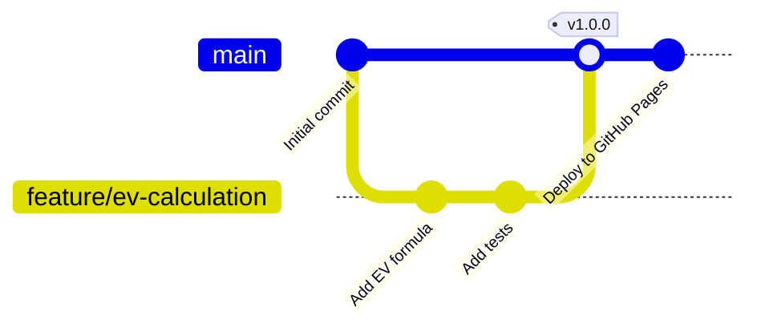
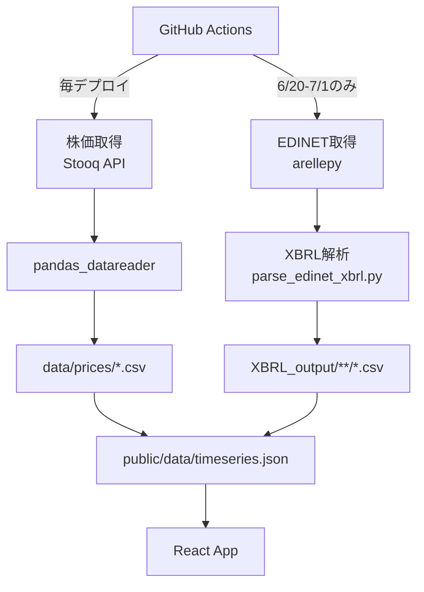
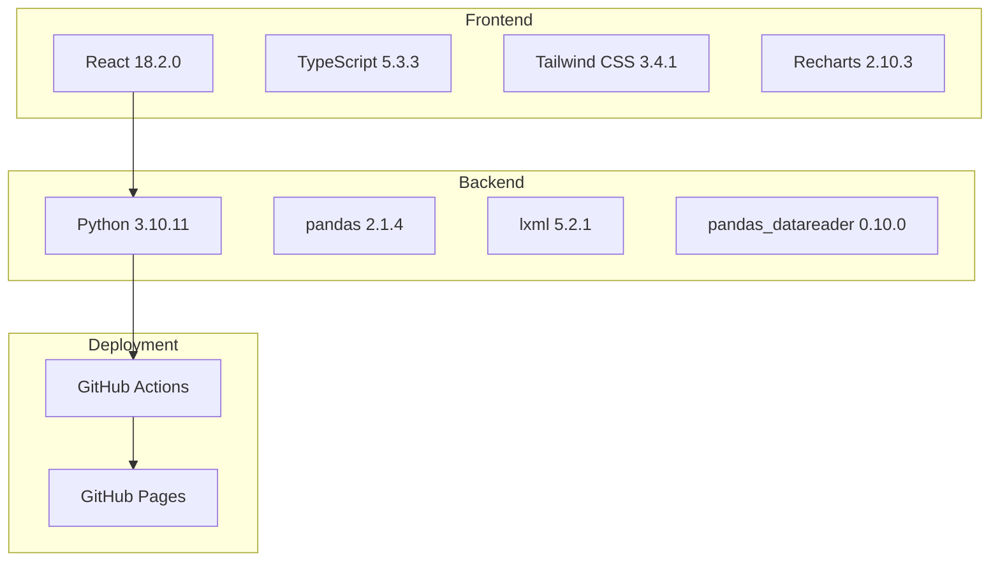
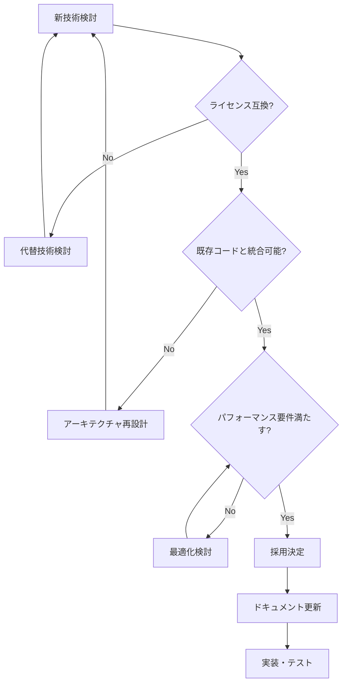
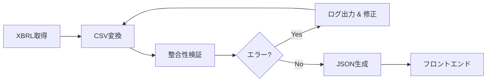
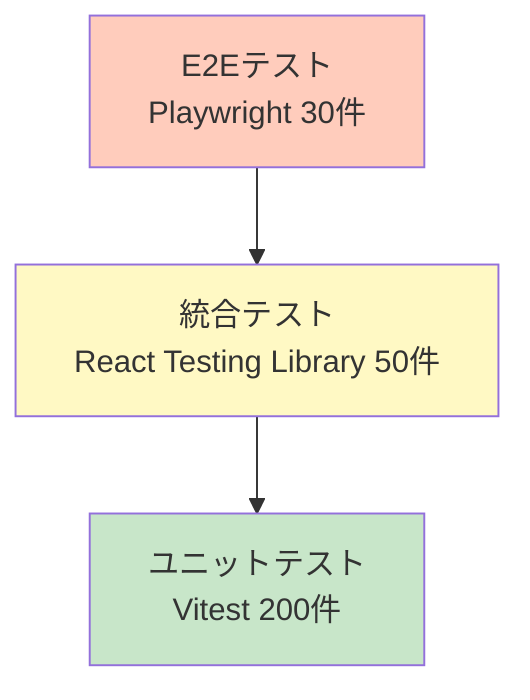
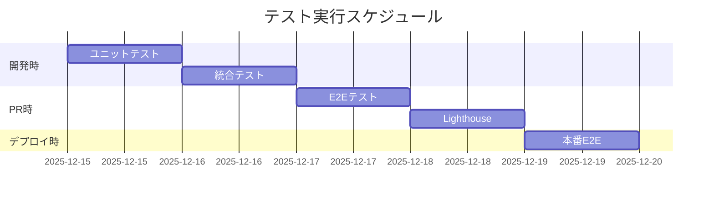
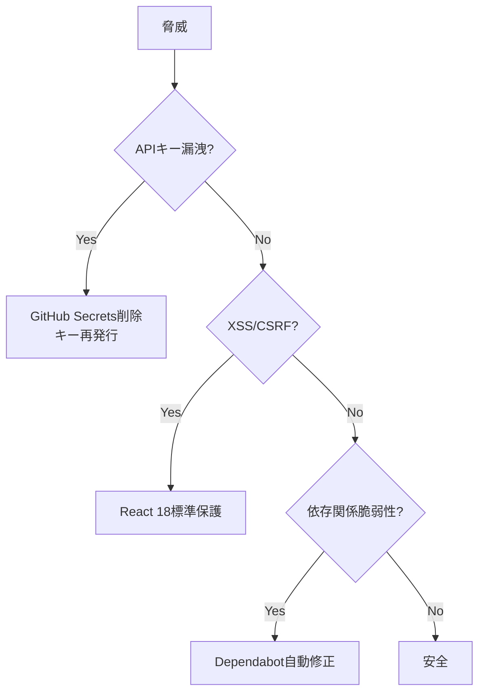
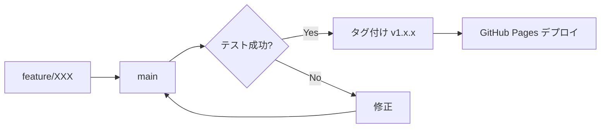
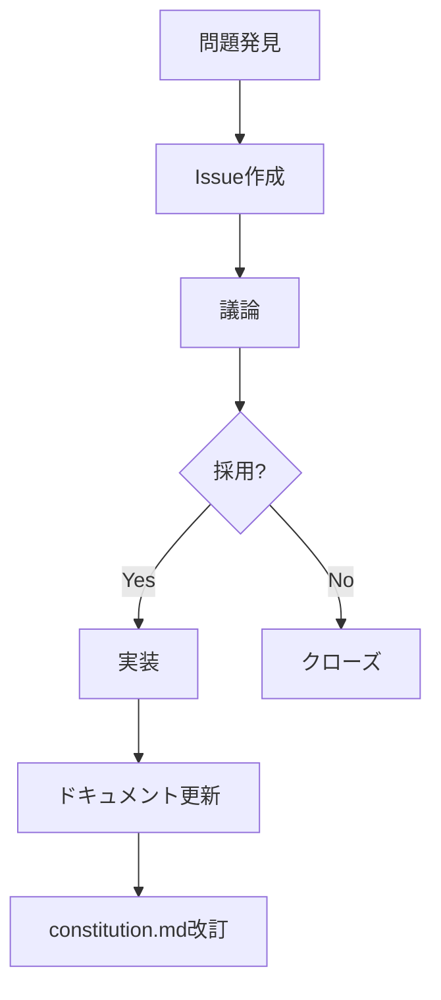

# ValueScope プロジェクト憲法 (Constitution)

**バージョン**: 1.0.0  
**作成日**: 2025-12-15  
**ステータス**: Production  
**リポジトリ**: https://github.com/J1921604/ValueScope

---

## 1. プロジェクト憲法とは

この憲法は、ValueScopeプロジェクトのすべての意思決定、実装、レビューにおいて**最優先される不変の原則**を定義します。追加・変更・削除のすべてがこの憲法に準拠する必要があります。

---

## 2. 7つのコア原則

### 原則I: テスト駆動開発(TDD)を徹底し、仕様に対する証明を必須とする

**要件**: すべての機能は、テスト可能であり、テストされている必要がある。

**基準**:

- **TR-001**: ユニットテストカバレッジ ≥ 80%
- **TR-002**: E2E主要フロー 100%カバー
- **TR-003**: テスト実行時間 < 30秒
- **TR-004**: 新機能追加時は必ずテストを先に記述
- **TR-005**: Pull Requestマージ前にすべてのテストが通過

**実装例**:

```typescript
// 良い例: テストファースト
describe('ValuationTable', () => {
  it('should display EV for all companies', () => {
    const { getByText } = render(<ValuationTable />);
    expect(getByText('TEPCO')).toBeInTheDocument();
    expect(getByText('CHUBU')).toBeInTheDocument();
    expect(getByText('JERA')).toBeInTheDocument();
  });
});
```

**検証方法**:

```powershell
npm run test:coverage
```

**ゲート条件**: カバレッジ80%未満の場合、Pull Requestマージ拒否

---

### 原則II: セキュリティ基準を機能基準より優先する

**要件**: セキュリティは後付けではなく、設計段階から組み込まれる。

**基準**:

- **SR-001**: EDINET APIキーは環境変数管理(`.env` → GitHub Secrets)
- **SR-002**: 外部入力検証(XBRL/CSVバリデーション)
- **SR-003**: 依存関係脆弱性スキャン(GitHub Dependabot有効化)
- **SR-004**: CORS設定厳格化(定義クライアント限定実行)
- **SR-005**: 個人情報は一切保存・送信しない

**実装例**:

```python
# 良い例: APIキーを環境変数から取得
import os
api_key = os.getenv('EDINET_API_KEY')
if not api_key:
    raise ValueError("EDINET_API_KEY is not set")
```

```yaml
# .github/workflows/deploy-pages.yml
env:
  EDINET_API_KEY: ${{ secrets.EDINET_API_KEY }}
```

**検証方法**:

```powershell
# Dependabot脆弱性チェック
gh repo view --json securityVulnerabilities
```

**ゲート条件**: 高リスク脆弱性が存在する場合、デプロイ拒否

---

### 原則III: パフォーマンス閾値を実証確保し、後回し禁止に組み込む

**要件**: パフォーマンスは主観ではなく、測定可能な数値目標で定義される。

**基準**:

- **PR-001**: LCP(Largest Contentful Paint) ≤ 2.5秒
- **PR-002**: TTI(Time to Interactive) ≤ 2.0秒
- **PR-003**: 初期バンドルサイズ gzip後 < 200KB
- **PR-004**: チャート再描画 < 200ms
- **PR-005**: Lighthouseスコア ≥ 90

**実装例**:

```typescript
// 良い例: 遅延ロード
const FinancialStatements = lazy(() => import('./components/FinancialStatements'));

<Suspense fallback={<Loading />}>
  <FinancialStatements />
</Suspense>
```

**検証方法**:

```powershell
# Lighthouseスコア測定
npm run lighthouse

# バンドルサイズ確認
npm run build -- --analyze
```

**ゲート条件**: Lighthouseスコア90点未満の場合、Pull Requestマージ拒否

---

### 原則IV: データ堅牢の保証と実データのみの使用

**要件**: 推定値・補完値は一切使用せず、XBRL実データのみを信頼する。

**基準**:

- **DQ-001**: XBRL/CSV解析(1社分) ≤ 60秒
- **DQ-002**: 財務項目検証(完整性) ≤ 10秒
- **DQ-003**: データ検証 < 5秒
- **DQ-004**: スキーマ欠損時はデプロイ中止
- **DQ-005**: 分母ゼロ計算は `null` 返却、エラー発生禁止

**実装例**:

```python
# 良い例: 実データのみ使用
def calculate_per(market_cap, net_income):
    if net_income == 0:
        return None  # 分母ゼロはnull
    return market_cap / net_income

# 悪い例: 推定値使用
def calculate_per(market_cap, net_income):
    if net_income == 0:
        net_income = 1000  # 推定値使用は拒否
    return market_cap / net_income
```

**検証方法**:

```powershell
py -3.10 scripts/validate_thresholds.py
```

**ゲート条件**: スキーマ欠損または異常値検出時、デプロイ拒否

---

### 原則V: API/ライブラリ仕様の遵守とレート制限の厳守

**要件**: 外部APIの仕様は絶対であり、無限に変更してはならない。

**基準**:

- **API-001**: EDINET API v2準拠
- **API-002**: レート制限1秒あたり10リクエスト厳守
- **API-003**: 年1回のみ実行(6/20-7/1)
- **API-004**: Stooq API無制限だが頻繁使用
- **API-005**: リトライロジック実装(503エラー時)

**実装例**:

```python
# 良い例: レート制限厳守
import time

for doc_id in doc_ids:
    fetch_edinet_document(doc_id)
    time.sleep(0.1)  # 10リクエスト/秒 = 0.1秒間隔
```

**検証方法**:

```yaml
# .github/workflows/deploy-pages.yml
- name: Check if EDINET update is needed
  run: |
    CURRENT_MONTH=$(date +%m)
    CURRENT_DAY=$(date +%d)
    if [ "$CURRENT_MONTH" = "06" ] && [ "$CURRENT_DAY" -ge "20" ] && [ "$CURRENT_DAY" -le "30" ]; then
      echo "edinet_update=true" >> $GITHUB_OUTPUT
    elif [ "$CURRENT_MONTH" = "07" ] && [ "$CURRENT_DAY" -eq "01" ]; then
      echo "edinet_update=true" >> $GITHUB_OUTPUT
    else
      echo "edinet_update=false" >> $GITHUB_OUTPUT
    fi
```

**ゲート条件**: レート制限欠損時、API アクセス即時停止

---

### 原則VI: バージョン固定とメンテナンス性の確保

**要件**: 依存関係は明確にバージョン指定し、曖昧な自動変更を避ける。

**基準**:

- **VER-001**: package.jsonはメジャー・マイナー固定(例: `"react": "18.2.0"`)
- **VER-002**: requirements.txtは完全バージョン指定(例: `pandas==2.1.4`)
- **VER-003**: 月次依存関係更新レビュー
- **VER-004**: Python 3.10.11標準実行環境
- **VER-005**: Node.js 20.x標準実行環境

**実装例**:

```json
// 良い例: package.json
{
  "dependencies": {
    "react": "18.2.0",
    "recharts": "2.10.3",
    "tailwindcss": "3.4.1"
  }
}
```

```text
# 良い例: requirements.txt
pandas==2.1.4
lxml==5.2.1
pandas_datareader==0.10.0
```

**検証方法**:

```powershell
# Dependabot自動更新確認
gh pr list --label "dependencies"
```

**ゲート条件**: メジャーバージョン更新は手動承認必須

---

### 原則VII: 仕様と実装の分離によるレビュープロセスの確立

**要件**: 仕様書は実装とは独立した、価値ある独立文書であり、実装前に同期される。

**基準**:

- **DOC-001**: 仕様書3点セット必須(spec.md, plan.md, tasks.md)
- **DOC-002**: 新機能追加時は仕様書を先に作成
- **DOC-003**: Pull Requestに「Constitution Check」セクション必須
- **DOC-004**: AI再利用完全仕様書(完全仕様書.md)継続
- **DOC-005**: リンクはローカルではなくGitHubリポジトリURL使用

**実装例**:

```markdown
# Pull Request テンプレート

## Constitution Check

- [ ] TR-001: ユニットテストカバレッジ ≥ 80%
- [ ] SR-001: APIキー環境変数管理
- [ ] PR-005: Lighthouseスコア ≥ 90
- [ ] DQ-004: スキーマ検証通過
- [ ] VER-001: バージョン固定
```

**検証方法**:

```powershell
# 仕様書リンクチェック
grep -r "docs/" specs/
```

**ゲート条件**: Constitution Check未完了でPull Requestマージ拒否

---

## 2.1 開発フロー

### 作業順序


### ブランチ戦略



---

## 2.2 データ取得方針



### 2.2.1 株価データ

| 項目 | 内容 |
|---|---|
| API | Stooq (pandas_datareader) |
| 取得頻度 | 毎デプロイ時 |
| データソース | https://stooq.com |
| 対象銘柄 | TEPCO(9501.JP), CHUBU(9502.JP), JERA(非上場) |
| 実行スクリプト | scripts/fetch_stock_prices.py |

### 2.2.2 財務データ

| 項目 | 内容 |
|---|---|
| API | EDINET API v2 |
| 取得頻度 | 年1回(6/20-7/1) |
| 対象企業 | E04498(TEPCO), E04502(CHUBU), E34837(JERA) |
| 実行スクリプト | scripts/fetch_edinet.py, parse_edinet_xbrl.py |

---

## 3. 技術ガバナンス

### 3.1 技術スタック



### 3.2 技術選定フローチャート



---

## 4. データガバナンス

### 4.1 EDINET API実行スケジュール

| 期間 | 実行 | 理由 |
|---|---|---|
| 6/20-7/1 | ✅ | 有価証券報告書提出期間 |
| その他 | ❌ | 年1回 |

### 4.2 データ整合性チェック



**検証項目**:

- 総資産 = 負債 + 純資産
- 営業CF + 投資CF + 財務CF = 現金増減
- PER = 時価総額 / 当期純利益(分母ゼロ時null)

---

## 5. テスト戦略

### 5.1 テストピラミッド



### 5.2 テスト実行タイミング



---

## 6. セキュリティガバナンス

### 6.1 脅威モデル



### 6.2 セキュリティチェックリスト

- [ ] EDINET APIキーがGitHub Secretsに登録済み
- [ ] `.env`ファイルが`.gitignore`に追加済み
- [ ] Dependabotが有効化済み
- [ ] npm auditでCritical/High脆弱性なし
- [ ] Content Security Policyヘッダー設定済み

---

## 7. リリースプロセス

### 7.1 バージョニング

**セマンティックバージョニング**: `MAJOR.MINOR.PATCH`

- **MAJOR**: 後方互換性のない変更
- **MINOR**: 後方互換性のある機能追加
- **PATCH**: 後方互換性のあるバグ修正

### 7.2 リリースフロー



---

## 8. ドキュメント規約

### 8.1 必須ドキュメント

| ドキュメント | 目的 | 更新者 |
|---|---|---|
| constitution.md | プロジェクト憲法 | プロジェクトリーダー |
| spec.md | 機能仕様書 | プロダクトオーナー |
| plan.md | 実装計画書 | テックリード |
| tasks.md | タスクリスト | 開発者 |
| README.md | プロジェクト概要 | 全員 |

### 8.2 ドキュメントリンク規約

**必須**: すべてのリンクはGitHubリポジトリURLを使用

```markdown
<!-- 良い例 -->
[仕様書](https://github.com/J1921604/ValueScope/blob/main/specs/001-ValueScope/spec.md)

<!-- 悪い例 -->
[仕様書](../spec.md)
```

---

## 9. コードレビュー基準

### 9.1 Constitution Checkリスト

- [ ] **TR-001**: ユニットテストカバレッジ ≥ 80%
- [ ] **SR-001**: APIキー環境変数管理
- [ ] **PR-005**: Lighthouseスコア ≥ 90
- [ ] **DQ-004**: スキーマ検証通過
- [ ] **API-002**: レート制限遵守
- [ ] **VER-001**: バージョン固定
- [ ] **DOC-001**: 仕様書3点セット完備

---

## 10. 継続的改善

### 10.1 憲法違反時の対処

| レベル | 条件 | 対処 |
|---|---|---|
| 1: 警告(Warning) | カバレッジ79%, Lighthouse89点 | Pull Requestコメントで警告、次回必達 |
| 2: ブロック(Blocking) | カバレッジ75%, Lighthouse85点 | Pull Requestマージ拒否、修正必須 |
| 3: 緊急停止(Critical) | 高リスク脆弱性検出 | デプロイ即時停止、緊急パッチリリース |

### 10.2 改善提案プロセス



---

## 11. ライセンス

本プロジェクトは**MIT License**の下で公開される。すべての依存関係もMIT互換ライセンスを使用すること。

---

## 12. 関連ドキュメント

- [機能仕様書](https://github.com/J1921604/ValueScope/blob/main/specs/001-ValueScope/spec.md): 機能の詳細定義
- [実装計画書](https://github.com/J1921604/ValueScope/blob/main/specs/001-ValueScope/plan.md): 技術選定と実装計画
- [タスクリスト](https://github.com/J1921604/ValueScope/blob/main/specs/001-ValueScope/tasks.md): 実装タスク管理
- [データモデル仕様書](https://github.com/J1921604/ValueScope/blob/main/specs/001-ValueScope/data-model.md): データ構造定義
- [クイックスタートガイド](https://github.com/J1921604/ValueScope/blob/main/specs/001-ValueScope/quickstart.md): 開発環境構築
- [技術調査レポート](https://github.com/J1921604/ValueScope/blob/main/specs/001-ValueScope/research.md): 技術選定の根拠

---

## 13. この憲法の意義

> **"Data is sacred. Tests are mandatory. Performance is measurable."**  
> (データは神聖である。テストは必須である。パフォーマンスは測定可能である。)

この憲法は、ValueScopeプロジェクトが**高品質・高信頼性・高パフォーマンス**な財務価値分析ダッシュボードであり続けるための魂です。

---

**最終更新**: 2025-12-15  
**次回レビュー予定**: 2026-03-31
