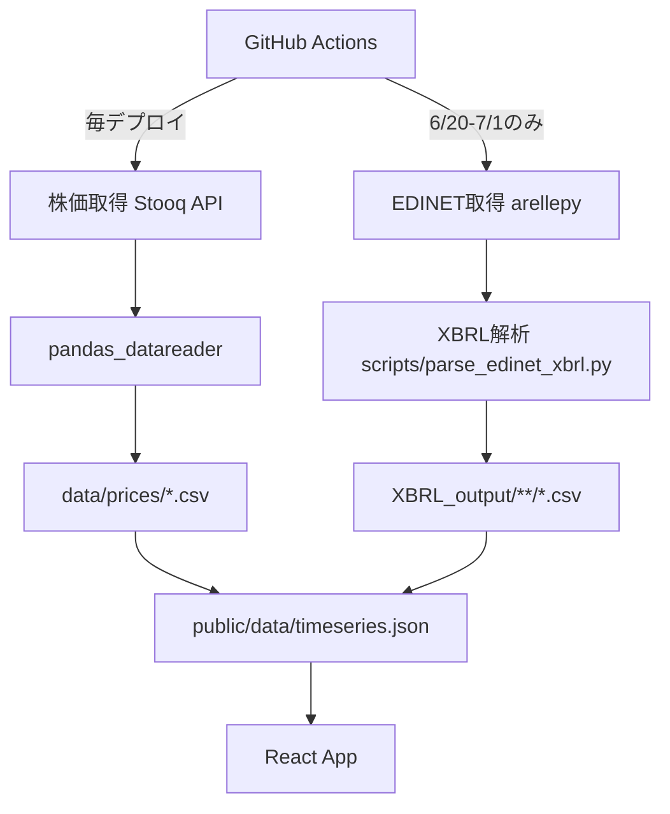
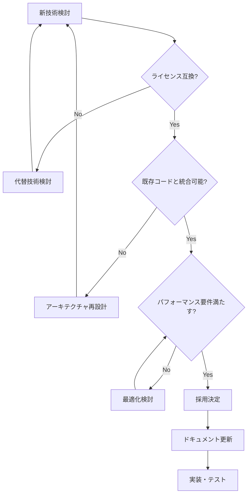
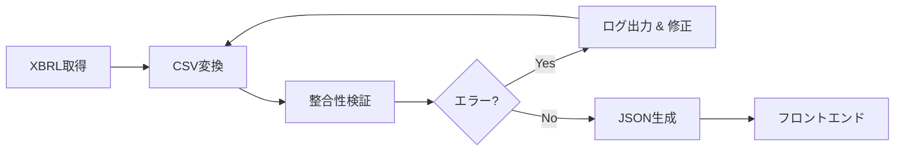
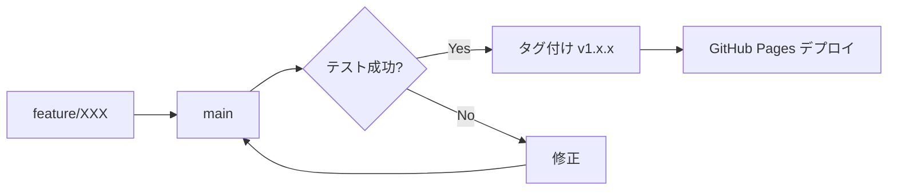
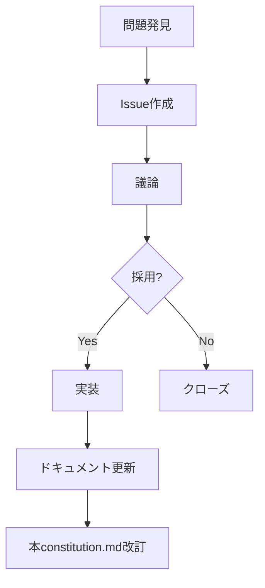
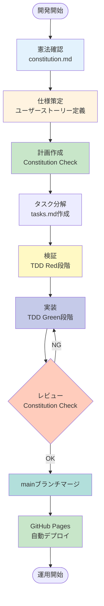
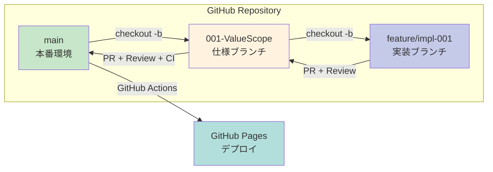

# ValueScope プロジェクト憲法

**バージョン**: 1.0.0
**最終更新**: 2025-12-15
**リポジトリ**: https://github.com/J1921604/ValueScope

---

## 1. プロジェクト理念

ValueScopeは、電力事業者（東京電力HD、中部電力、JERA）の財務・非財務情報を統合的に可視化し、企業価値評価を支援するWebアプリケーションです。

### 1.1 コアバリュー

- **透明性**: EDINET XMLデータに基づく信頼性の高い財務情報
- **比較可能性**: 3社横並び比較による相対評価
- **アクセシビリティ**: GitHub Pagesによる無料公開
- **拡張性**: Python + React/TypeScriptによるモダンアーキテクチャ

### 1.2 目標ユーザー

- 電力業界アナリスト
- 投資家・株主
- 政策立案者
- 研究者・学生

---

## 2. 技術憲法

### 2.1 技術スタック

| レイヤー       | 技術           | バージョン | 理由                     |
| -------------- | -------------- | ---------- | ------------------------ |
| フロントエンド | React          | 18.2.0     | コンポーネント再利用性   |
| 型システム     | TypeScript     | 5.3.3      | 型安全性・保守性         |
| ビルドツール   | Vite           | 5.0.8      | 高速開発体験             |
| UIライブラリ   | Tailwind CSS   | 3.x        | ユーティリティファースト |
| データ処理     | Python         | 3.10.11    | XBRL解析・データ生成     |
| テスト         | Playwright     | 1.40+      | E2Eテスト自動化          |
| デプロイ       | GitHub Actions | latest     | CI/CD自動化              |

### 2.2 データ取得方針



#### 2.2.1 株価データ

- **API**: Stooq
- **更新頻度**: 毎デプロイ時
- **対象銘柄**: 9501.T（東京電力HD）、9502.T（中部電力）
- **ツール**: `pandas_datareader`

#### 2.2.2 財務データ

- **ソース**: EDINET API
- **更新頻度**: 年1回（6月20日～7月1日）
- **認証**: GitHub Secretsで管理
- **データ形式**: XBRL → CSV → JSON

### 2.3 コーディング規約

#### 2.3.1 TypeScript/React

```typescript
// ✅ Good: 型安全な関数コンポーネント
interface Props {
  data: FinancialData[];
  selectedYear: number | null;
}

export const FinancialTable: React.FC<Props> = ({ data, selectedYear }) => {
  // useMemoで計算処理を最適化
  const filteredData = useMemo(() => 
    data.filter(d => d.fiscal_year === selectedYear),
    [data, selectedYear]
  );
  
  return <table>{/* ... */}</table>;
};

// ❌ Bad: any型の使用
const processData = (data: any) => { /* ... */ };
```

#### 2.3.2 Python

```python
# ✅ Good: 型ヒント + docstring
def extract_xbrl_field(
    xbrl_root: ET.Element,
    tag_name: str,
    namespaces: dict[str, str]
) -> str | None:
    """XBRLツリーから指定タグの値を抽出
  
    Args:
        xbrl_root: XBRLドキュメントのルート要素
        tag_name: 検索するタグ名（例: 'NetSales'）
        namespaces: XML名前空間マッピング
  
    Returns:
        タグの値（存在しない場合はNone）
    """
    elem = xbrl_root.find(f'.//jpcrp_cor:{tag_name}', namespaces)
    return elem.text if elem is not None else None

# ❌ Bad: 型ヒントなし
def extract_field(root, tag):
    return root.find(tag).text
```

### 2.4 ファイル構造規約

```
07_ValueScope/
├── src/                      # Reactアプリケーション
│   ├── components/          # UIコンポーネント
│   │   ├── ComparisonFinancialTable.tsx  # 財務3表比較（PL/BS/CF）
│   │   ├── ComparisonTable.tsx           # EV分析比較
│   │   ├── MetricTooltip.tsx             # XBRLツールチップ
│   │   └── xbrlTagMap.ts                 # 全488項目XBRLマップ
│   ├── hooks/               # カスタムフック
│   └── utils/               # ユーティリティ
├── scripts/                 # データ生成スクリプト
│   ├── parse_edinet_xbrl.py         # XBRL→CSV変換
│   ├── build_timeseries.py          # 時系列JSON生成
│   ├── generate_xbrl_map.py         # XBRLマップ自動生成
│   └── fetch_stock_prices.py        # 株価取得（Stooq）
├── public/data/             # 静的データ（JSONファイル）
├── XBRL_output/             # XBRL解析結果（CSV）
├── specs/001-ValueScope/    # 仕様書
└── .github/workflows/       # GitHub Actions
```

---

## 3. 意思決定プロセス

### 3.1 重要決定の記録

| 決定事項                   | 日付       | 理由                    | 影響範囲                           |
| -------------------------- | ---------- | ----------------------- | ---------------------------------- |
| 全488項目XBRL tooltips追加 | 2025-12-15 | ユーザービリティ向上    | ComparisonFinancialTable.tsx       |
| EDINET取得を年1回に制限    | 2025-12-15 | API利用制限遵守         | .github/workflows/deploy-pages.yml |

### 3.2 技術選定フローチャート



---

## 4. データガバナンス

### 4.1 データソース信頼性

| データ種別 | ソース         | 信頼性     | 更新頻度   |
| ---------- | -------------- | ---------- | ---------- |
| 財務諸表   | EDINET XBRL    | ★★★★★ | 年1回      |
| 株価       | Stooq          | ★★★★☆ | 毎デプロイ |
| KPI閾値    | 手動設定       | ★★★☆☆ | 手動更新   |
| 従業員数   | 有価証券報告書 | ★★★★★ | 年1回      |

### 4.2 データ整合性チェック



**検証項目**:

- 総資産 = 負債 + 純資産
- 現金及び預金 > 0
- 従業員数の異常値検出（前年比±50%超）

---

## 5. 品質保証

### 5.1 テスト方針

| テスト種別 | ツール     | カバレッジ目標     | 実行タイミング |
| ---------- | ---------- | ------------------ | -------------- |
| E2Eテスト  | Playwright | 100%（主要フロー） | Git push前     |
| 単体テスト | Vitest     | 80%（ロジック）    | 開発中         |
| 型チェック | TypeScript | 100%               | ビルド時       |

### 5.2 E2Eテストシナリオ

```typescript
// tests/e2e/financial-statements.spec.ts
test('財務3表の全項目にXBRLツールチップが表示される', async ({ page }) => {
  await page.goto('/');
  await page.click('text=財務3表');
  
  // PL 256項目
  const plTooltips = await page.locator('[data-xbrl-tag^="jpcrp_cor:"]').count();
  expect(plTooltips).toBeGreaterThanOrEqual(200);
  
  // BS 233項目
  await page.click('text=貸借対照表');
  const bsTooltips = await page.locator('[data-xbrl-tag^="jpcrp_cor:"]').count();
  expect(bsTooltips).toBeGreaterThanOrEqual(200);
  
  // CF 70項目
  await page.click('text=キャッシュフロー');
  const cfTooltips = await page.locator('[data-xbrl-tag^="jpcrp_cor:"]').count();
  expect(cfTooltips).toBeGreaterThanOrEqual(60);
});
```

---

## 6. セキュリティポリシー

### 6.1 機密情報管理

| 情報種別       | 保存場所           | アクセス制限         |
| -------------- | ------------------ | -------------------- |
| EDINET APIキー | GitHub Secrets     | リポジトリ管理者のみ |
| ビルド成果物   | GitHub Pages       | 公開                 |
| ソースコード   | GitHub Public Repo | 公開                 |

### 6.2 依存ライブラリ脆弱性管理

```bash
# 毎月1回実行
npm audit
py -3.10 -m pip check
```

**対応フロー**:

1. Dependabotアラート確認
2. セキュリティパッチ適用
3. テスト実行
4. デプロイ

---

## 7. バージョン管理

### 7.1 セマンティックバージョニング

**フォーマット**: `v{MAJOR}.{MINOR}.{PATCH}`

- **MAJOR**: 破壊的変更（例: API構造変更）
- **MINOR**: 後方互換性のある機能追加（例: 新指標追加）
- **PATCH**: バグ修正（例: 計算ロジック修正）

### 7.2 リリースフロー



---

## 8. ドキュメント規約

### 8.1 必須ドキュメント

| ファイル        | 用途                       | 更新頻度         |
| --------------- | -------------------------- | ---------------- |
| README.md       | プロジェクト概要           | 機能追加時       |
| constitution.md | プロジェクト憲法（本文書） | 意思決定時       |
| spec.md         | 技術仕様                   | 実装変更時       |
| plan.md         | 開発計画                   | スプリント開始時 |
| tasks.md        | タスク管理                 | 毎日             |

### 8.2 Mermaid図表標準

```markdown
## データフロー図

\`\`\`mermaid
flowchart TD
    A[データソース] --> B[処理]
    B --> C[出力]
\`\`\`

## スケジュール図

\`\`\`mermaid
gantt
    title 開発スケジュール
    dateFormat YYYY-MM-DD
    section Phase 1
    基本実装 :2025-12-25, 5d
\`\`\`
```

---

## 9. コントリビューションガイドライン

### 9.1 プルリクエスト規約

1. **ブランチ命名**: `feature/機能名` または `fix/バグ名`
2. **コミットメッセージ**: `.github/copilot-commit-message-instructions.md` に従う
3. **レビュー**: テスト100%パス必須
4. **マージ**: Squash mergeを推奨

### 9.2 禁止事項

- ❌ 機密情報のハードコード
- ❌ `any`型の多用
- ❌ テストのないロジック変更
- ❌ ドキュメント更新なしの仕様変更

---

## 10. 継続的改善

### 10.1 定期レビュー

| 項目               | 頻度       | 担当      |
| ------------------ | ---------- | --------- |
| 技術スタック見直し | 四半期     | Tech Lead |
| パフォーマンス監査 | 毎リリース | 開発者    |
| ドキュメント更新   | 毎機能追加 | 実装者    |

### 10.2 改善提案プロセス



---

## 11. ライセンス

本プロジェクトは **MIT License** の下で公開されています。

- ソースコード: [https://github.com/J1921604/ValueScope](https://github.com/J1921604/ValueScope)
- ドキュメント: CC BY 4.0

---

## 12. 連絡先

- **リポジトリ**: https://github.com/J1921604/ValueScope
- **Issues**: https://github.com/J1921604/ValueScope/issues
- **Pull Requests**: https://github.com/J1921604/ValueScope/pulls

---

**変更履歴**

| バージョン | 日付       | 変更内容                                                  |
| ---------- | ---------- | --------------------------------------------------------- |
| 1.0.0      | 2025-12-15 | 初版作成 |

---

## コア原則

### 原則I: テスト駆動開発（TDD）を徹底し、仕様に対する検証を必須とする

**原則内容**:

- すべての機能実装の前に、対応するテストを作成しなければならない
- テストは「Red（失敗）→ Green（成功）→ Refactor（リファクタリング）」のサイクルで実施する
- ユニットテストカバレッジは80%以上を目標とし、E2Eテストは主要フローを100%カバーする
- テスト実行時間は30秒以内に収める
- 実装前にユーザーストーリーごとの受入基準（Acceptance Criteria）を明確化する

**根拠**:
テスト駆動開発により、仕様と実装の乖離を防ぎ、リグレッションを早期発見できる。企業価値分析という重要な財務データを扱うアプリケーションにおいて、計算ロジックの正確性とデータ整合性を保証するため、TDDは非交渉的な要件である。

**テスト要件 (TR)**:

- TR-001: ユニットテストカバレッジ ≥ 80%
- TR-002: E2E主要フロー 100%
- TR-003: テスト実行時間 < 30秒

---

### 原則II: セキュリティ要件を機能要件より優先する

**原則内容**:

- APIキーおよび機密情報は環境変数（`.env`）またはGitHub Secretsで管理し、コードベースには平文で含めてはならない
- 外部から取得したデータ（EDINET API、株価API）は必ずバリデーションとサニタイゼーションを実施する
- 依存関係の脆弱性スキャンをGitHub Dependabotで自動実行し、Critical/High脆弱性は即座に対応する
- XBRLなどの外部データ解析時は、不正なタグや過大なデータサイズを検出し、処理を中断する機構を設ける
- CORS設定は不要（完全クライアント側実行のため）

**根拠**:
財務データは企業情報として機密性が高く、セキュリティ侵害は法的リスク・信頼性喪失につながる。セキュリティは後付けできない基盤要件であり、すべての機能開発に先立って確保しなければならない。

**セキュリティ要件 (SR)**:

- SR-001: EDINET APIキーは環境変数管理（.env → GitHub Secrets）
- SR-002: 外部入力検証（XBRL/CSVバリデーション）
- SR-003: 依存関係脆弱性スキャン（GitHub Dependabot）
- SR-004: CORS設定不要（完全クライアント側実行）

---

### 原則III: パフォーマンス閾値を定量化し、受入基準に組み込む

**原則内容**:

- Largest Contentful Paint (LCP) は2.5秒未満を必須とする
- Time to Interactive (TTI) は2.0秒未満を必須とする
- 初期バンドルサイズはgzip圧縮後200KB未満を保つ
- チャート再描画は200ms以内に完了する
- Lighthouse スコアは90点以上を維持する
- XBRL/CSV解析（2社分）は60秒以内、企業価値計算（全指標）は10秒以内、データ検証は5秒以内に完了する

**根拠**:
企業価値分析ダッシュボードは意思決定者が迅速に財務状況を把握するために使用される。遅延はユーザー体験を著しく損なうため、パフォーマンスは定量化された受入基準として明示し、ビルドおよびデプロイのゲート条件とする。

**パフォーマンス要件 (PR)**:

- PR-001: LCP（Largest Contentful Paint）< 2.5秒
- PR-002: TTI（Time to Interactive）< 2.0秒
- PR-003: 初期バンドルサイズ gzip後 < 200KB
- PR-004: チャート再描画 < 200ms
- PR-005: Lighthouseスコア ≥ 90

**データ処理パフォーマンス要件 (DQ)**:

- DQ-001: XBRL/CSV解析（2社分）< 60秒
- DQ-002: 企業価値計算（全指標）< 10秒
- DQ-003: データ検証 < 5秒
- DQ-004: スキーマ違反時はデプロイ中止

---

### 原則IV: データ品質の保証と実データのみの使用

**原則内容**:

- すべての財務指標計算は**XBRL実データのみ**を使用し、推定値・補完値・仮定値は一切使用してはならない
- データ欠損時は `null`または `0`を返し、推定による補完は行わない
- 分母がゼロの計算はスキップし、結果を `null`とする
- JSONスキーマ検証を必須とし、不正なデータ構造を検出した場合はデプロイを中止する
- 異常値検出（外れ値、負の値の妥当性チェック）を実施し、警告ログを出力する
- データ更新失敗時にはGitHub Issueを自動起票する

**根拠**:
企業価値分析は投資判断や経営分析に使用されるため、データの正確性と信頼性は最優先事項である。推定値や補完値を含めると、結果の信頼性が損なわれ、誤った意思決定を招く可能性がある。データ品質の保証は、アプリケーションの存在価値そのものである。

**データソース一覧**:

| 指標           | 計算式                                        | データソース（XBRL項目）                                                                                                                     | 推定値の有無 |
| -------------- | --------------------------------------------- | -------------------------------------------------------------------------------------------------------------------------------------------- | ------------ |
| ROE            | 当期純利益 / 自己資本 × 100                  | PL.csv `ProfitLossAttributableToOwnersOfParent` ÷ BS.csv `Equity`                                                                       | ❌ なし      |
| 自己資本比率   | 自己資本 / 総資産 × 100                      | BS.csv `Equity` ÷ BS.csv `TotalAssets`                                                                                                  | ❌ なし      |
| DSCR           | 営業CF / (1年内返済予定の固定負債 + 支払利息) | CF.csv `NetCashProvidedByUsedInOperatingActivities` ÷ (BS.csv `CurrentPortionOfNoncurrentLiabilities` + PL.csv `InterestExpensesNOE`) | ❌ なし      |
| 時価総額       | 決算日株価 × 発行済株式数                    | `data/prices/{証券コード}.csv` × BS.csv `TotalNumberOfIssuedSharesSummaryOfBusinessResults`                                             | ❌ なし      |
| 純有利子負債   | 有利子負債 - 現金及び預金                     | (BS.csv `BondsPayable` + `LongTermLoansPayable` + `ShortTermLoansPayable`) - BS.csv `CashAndDeposits`                                | ❌ なし      |
| 企業価値（EV） | 時価総額 + 純有利子負債                       | 時価総額 + 純有利子負債                                                                                                                      | ❌ なし      |
| EV/EBITDA      | 企業価値 / EBITDA                             | EV ÷ EBITDA                                                                                                                                 | ❌ なし      |
| PER            | 時価総額 / 当期純利益                         | 時価総額 ÷ PL.csv `ProfitLoss`                                                                                                            | ❌ なし      |
| PBR            | 時価総額 / 自己資本                           | 時価総額 ÷ BS.csv `Equity`                                                                                                                | ❌ なし      |

---

### 原則V: API/ライブラリ仕様の遵守とレート制限の厳守

**原則内容**:

- EDINET API v2の仕様を厳格に遵守し、書類種別コード（120: 有価証券報告書）およびコード130（訂正報告書）の除外ロジックを実装する
- GitHub Actionsによる自動データ取得は、毎年6月20日から7月1日の期間のみ実行し、それ以外の日はスキップする
- レート制限を遵守し、短時間での大量リクエストを避ける（バッチ処理間隔を設ける）
- APIエラー時のリトライロジックを実装し、指数バックオフを適用する

**根拠**:
外部APIの仕様違反やレート制限超過は、サービス停止やAPI利用停止のリスクを招く。EDINET APIは金融庁の公式APIであり、適切な使用方法を守ることは法的・倫理的義務である。また、頻繁なデータ更新は不要であり、リソース効率の観点からも制限を設ける。

---

### 原則VI: バージョン固定とメンテナンス性の確保

**原則内容**:

- すべての依存関係（npm、pip）はメジャーバージョンおよびマイナーバージョンを固定する（パッチバージョンのみ更新を許可）
- `package.json` および `requirements.txt` でバージョンを明示的に指定する
- 依存関係の更新は `CHANGELOG.md` に記録し、破壊的変更がないことを確認する
- 四半期ごとに依存関係のメジャーバージョン更新を検討し、セキュリティパッチは即座に適用する
- Python実行環境はPython 3.10.11を標準とし、`py -3.10`で実行する

**根拠**:
依存関係のバージョン不整合は、予期しないビルドエラーや動作不良を引き起こす。特に長期運用を前提とするアプリケーションでは、再現性の確保が重要である。バージョン固定により、チーム全体で一貫した開発環境を維持できる。

---

### 原則VII: 仕様と実装の分離によるレビュープロセスの確立

**原則内容**:

- 開発作業は「憲法 → 仕様 → 計画 → タスク → 検証 → 実装 → レビュー」の順序で実施する
- 仕様ブランチ（`001-<topic>`）と実装ブランチ（`feature/impl-001-<topic>`）を明確に分離する
- 重大変更（破壊的API変更、データモデル変更、セキュリティ関連）にはレビュー承認を必須とする
- Pull Requestには「Constitution Check」セクションを含め、各原則への準拠を確認する
- レビュー承認なしでのmainブランチへの直接プッシュは禁止する

**根拠**:
仕様と実装を分離することで、「何を作るか」と「どう作るか」の混同を防ぎ、レビューの質を向上させる。重大変更のレビュー必須化により、設計の一貫性と品質を維持できる。

---

## 開発制約

### データ保存とセキュリティ

**制約内容**:

- 機密データ（APIキー、個人情報）の平文保存を禁止する
- 暗号化またはハッシュ化を必須とする（GitHub Secretsまたは環境変数経由）
- `.env` ファイルは `.gitignore` に含め、リポジトリにコミットしない
- 本番環境のAPIキーとローカル開発環境のAPIキーを分離する

### 依存関係管理

**制約内容**:

- 外部依存はバージョン固定により再現性を確保する
- `package.json` の依存関係は `^` や `~` を使用せず、明示的なバージョン番号を指定する
- `requirements.txt` も同様に明示的なバージョン指定を行う
- セキュリティパッチは即座に適用するが、メジャーバージョン更新は影響範囲を評価してから実施する

### コードレビュー

**制約内容**:

- 仕様と実装の乖離をレビューで検知・是正する
- Pull Requestには以下を含める:
  - 変更内容の概要（何を、なぜ）
  - Constitution Checkセクション（各原則への準拠確認）
  - テスト結果（カバレッジ、E2E実行結果）
  - パフォーマンス影響（該当する場合）
- レビュワーは最低1名、重大変更は2名以上の承認を必須とする

---

## ガバナンス

### 作業順序

開発作業は以下の順序で実施しなければならない:

1. **憲法確認**: `.specify/memory/constitution.md` の原則を確認
2. **仕様策定**: ユーザーストーリー、受入基準、機能要件を定義
3. **計画作成**: 技術選定、アーキテクチャ設計、Constitution Checkを実施
4. **タスク分解**: 実装タスクをユーザーストーリー単位で分解
5. **検証**: テスト作成（TDD: Red段階）
6. **実装**: コード実装（TDD: Green段階）
7. **レビュー**: Pull Request作成、Constitution Check、承認取得



### ブランチ戦略

**仕様ブランチ（mainブランチから派生）**:

```bash
git checkout main
git checkout -b <番号>-<短い名前>
# 例: 001-ValueScope
```

**実装ブランチ（仕様ブランチから派生）**:

```bash
git checkout 001-<topic>
git checkout -b feature/impl-<番号>-<短い名前>
# 例: feature/impl-001-ValueScope
```

**ブランチ戦略図（Mermaid v11）**:



**マージ戦略**:

- 実装ブランチ → 仕様ブランチ: Pull Request + レビュー承認
- 仕様ブランチ → mainブランチ: Pull Request + レビュー承認 + CI通過

### 重大変更の定義

以下の変更は「重大変更」とみなし、レビュー承認を必須とする:

- データモデルの破壊的変更（フィールド削除、型変更）
- 公開APIの破壊的変更（エンドポイント削除、パラメータ変更）
- セキュリティ関連の変更（認証・認可、暗号化方式）
- パフォーマンス要件に影響を与える変更（アルゴリズム変更、大量データ処理）
- 依存関係のメジャーバージョン更新

### コンプライアンス

- すべてのPull Requestは「Constitution Check」セクションで各原則への準拠を確認する
- 複雑性（複数プロジェクト、複雑な設計パターン）は正当な理由がない限り避ける
- 正当な理由がある場合は、`plan.md` の「Complexity Tracking」セクションで文書化する

---

## 開発方針

### フロントエンドとバックエンドの同時起動

**方針**:

- ローカル開発時は `start.ps1` スクリプトにより、フロントエンド（Vite）とバックエンド（該当する場合）を同時起動する
- スクリプトは依存関係のインストール、データ生成、サーバー起動を自動化する

### エラー修正と検証の繰り返し

**方針**:

- 正常に動作するまで繰り返し検証し、エラー修正を完了する
- ビルドエラー、型エラー、テスト失敗は即座に修正し、「後で直す」は禁止する
- GitHub Pagesデプロイ前に、ローカルでビルドとプレビューを検証し、E2Eテストを100%正常に動作させる

### Mermaid図の挿入（v11準拠）

**方針**:

- ドキュメントにはMermaid v11準拠のフローチャート、シーケンス図、状態遷移図を積極的に挿入する
- **ベストプラクティス**:
  - **gitGraph使用時の注意**: 日本語を避けるか、flowchart/graph形式を使用。`tag:`構文は非推奨、代わりにノードで表現。`${{}}`などの特殊文字をノードラベルに使用しない。
  - **日本語対応**: flowchart、graph、sequenceDiagramは日本語完全対応。ノードラベル、エッジラベル、Noteで日本語使用可能。gitGraph構文は日本語コミットメッセージに対応していない。
  - **推奨構文**:
    - ブランチ戦略: `flowchart TB` + `subgraph`
    - プロセスフロー: `flowchart TD/LR`
    - 時系列: `sequenceDiagram`
    - 状態遷移: `stateDiagram-v2`

### ローカル実装とテスト

**方針**:

- GitHub Pagesデプロイ前にローカルでビルドとプレビューを検証する
- E2Eテストを100%正常に動作させる
- Python実行環境はPython 3.10.11を標準とし、`python`ではなく `py -3.10`で実行する

### 品質保証

**方針**:

- ワークスペース内の全ファイルを末尾まで解析する（必要に応じて）
- トークン制限まで中断せず全タスクを実行する
- トークン制限で中断する場合も、簡略化など品質を低下させない
- 生成したドキュメントは繰り返しブラッシュアップする
- 文字化け対策としてUTF-8エンコーディングを使用する
- テンプレートから生成したドキュメントの英語の部分を確実に削除する

---
