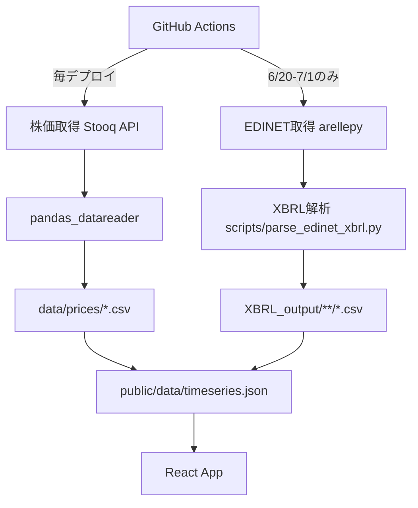
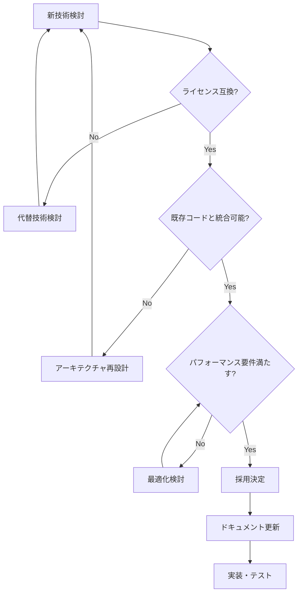
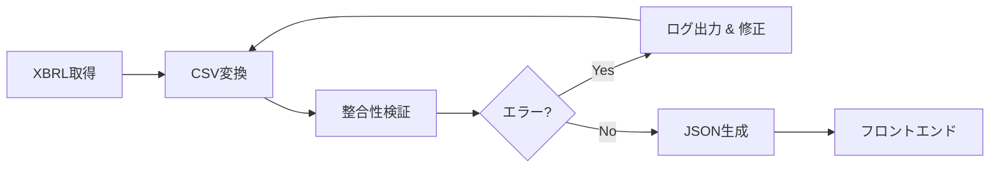
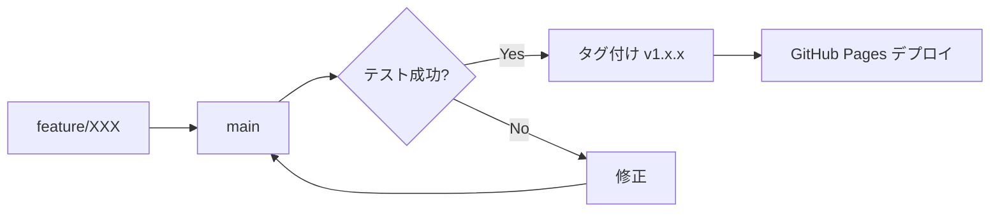
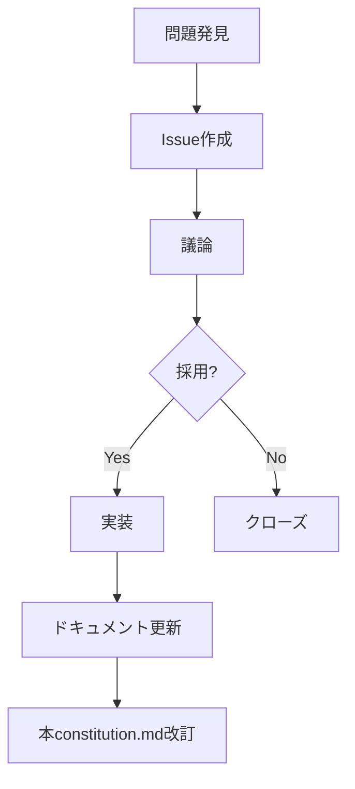

# ValueScope プロジェクト憲法

**バージョン**: v1.0.0  
**最終更新**: 2025-12-15  
**リポジトリ**: https://github.com/J1921604/ValueScope

---

## 1. プロジェクト理念

ValueScopeは、電力事業者（東京電力HD、中部電力、JERA）の財務・非財務情報を統合的に可視化し、企業価値評価を支援するWebアプリケーションです。

### 1.1 コアバリュー

- **透明性**: EDINET XMLデータに基づく信頼性の高い財務情報
- **比較可能性**: 3社横並び比較による相対評価
- **アクセシビリティ**: GitHub Pagesによる無料公開
- **拡張性**: Python + React/TypeScriptによるモダンアーキテクチャ

### 1.2 目標ユーザー

- 電力業界アナリスト
- 投資家・株主
- 政策立案者
- 研究者・学生

---

## 2. 技術憲法

### 2.1 技術スタック

| レイヤー | 技術 | バージョン | 理由 |
|---------|-----|----------|------|
| フロントエンド | React | 18.2.0 | コンポーネント再利用性 |
| 型システム | TypeScript | 5.3.3 | 型安全性・保守性 |
| ビルドツール | Vite | 5.0.8 | 高速開発体験 |
| UIライブラリ | Tailwind CSS | 3.x | ユーティリティファースト |
| データ処理 | Python | 3.10.11 | XBRL解析・データ生成 |
| テスト | Playwright | 1.40+ | E2Eテスト自動化 |
| デプロイ | GitHub Actions | latest | CI/CD自動化 |

### 2.2 データ取得方針



#### 2.2.1 株価データ
- **API**: Stooq（Yahoo Financeから移行）
- **更新頻度**: 毎デプロイ時
- **対象銘柄**: 9501.T（東京電力HD）、9502.T（中部電力）
- **ツール**: `pandas_datareader`

#### 2.2.2 財務データ
- **ソース**: EDINET API
- **更新頻度**: 年1回（6月20日～7月1日）
- **認証**: GitHub Secretsで管理
- **データ形式**: XBRL → CSV → JSON

### 2.3 コーディング規約

#### 2.3.1 TypeScript/React

```typescript
// ✅ Good: 型安全な関数コンポーネント
interface Props {
  data: FinancialData[];
  selectedYear: number | null;
}

export const FinancialTable: React.FC<Props> = ({ data, selectedYear }) => {
  // useMemoで計算処理を最適化
  const filteredData = useMemo(() => 
    data.filter(d => d.fiscal_year === selectedYear),
    [data, selectedYear]
  );
  
  return <table>{/* ... */}</table>;
};

// ❌ Bad: any型の使用
const processData = (data: any) => { /* ... */ };
```

#### 2.3.2 Python

```python
# ✅ Good: 型ヒント + docstring
def extract_xbrl_field(
    xbrl_root: ET.Element,
    tag_name: str,
    namespaces: dict[str, str]
) -> str | None:
    """XBRLツリーから指定タグの値を抽出
    
    Args:
        xbrl_root: XBRLドキュメントのルート要素
        tag_name: 検索するタグ名（例: 'NetSales'）
        namespaces: XML名前空間マッピング
    
    Returns:
        タグの値（存在しない場合はNone）
    """
    elem = xbrl_root.find(f'.//jpcrp_cor:{tag_name}', namespaces)
    return elem.text if elem is not None else None

# ❌ Bad: 型ヒントなし
def extract_field(root, tag):
    return root.find(tag).text
```

### 2.4 ファイル構造規約

```
07_ValueScope/
├── src/                      # Reactアプリケーション
│   ├── components/          # UIコンポーネント
│   │   ├── ComparisonFinancialTable.tsx  # 財務3表比較（PL/BS/CF）
│   │   ├── ComparisonTable.tsx           # EV分析比較
│   │   ├── MetricTooltip.tsx             # XBRLツールチップ
│   │   └── xbrlTagMap.ts                 # 全488項目XBRLマップ
│   ├── hooks/               # カスタムフック
│   └── utils/               # ユーティリティ
├── scripts/                 # データ生成スクリプト
│   ├── parse_edinet_xbrl.py         # XBRL→CSV変換
│   ├── build_timeseries.py          # 時系列JSON生成
│   ├── generate_xbrl_map.py         # XBRLマップ自動生成
│   └── fetch_stock_prices.py        # 株価取得（Stooq）
├── public/data/             # 静的データ（JSONファイル）
├── XBRL_output/             # XBRL解析結果（CSV）
├── specs/001-ValueScope/    # 仕様書
└── .github/workflows/       # GitHub Actions
```

---

## 3. 意思決定プロセス

### 3.1 重要決定の記録

| 決定事項 | 日付 | 理由 | 影響範囲 |
|---------|------|------|---------|
| Yahoo Finance → Stooq移行 | 2025-12-15 | Yahoo Finance API不安定 | scripts/fetch_stock_prices.py |
| 全488項目XBRL tooltips追加 | 2025-12-15 | ユーザービリティ向上 | ComparisonFinancialTable.tsx |
| EDINET取得を年1回に制限 | 2025-12-15 | API利用制限遵守 | .github/workflows/deploy-pages.yml |

### 3.2 技術選定フローチャート



---

## 4. データガバナンス

### 4.1 データソース信頼性

| データ種別 | ソース | 信頼性 | 更新頻度 |
|-----------|-------|-------|---------|
| 財務諸表 | EDINET XBRL | ★★★★★ | 年1回 |
| 株価 | Stooq | ★★★★☆ | 毎デプロイ |
| KPI閾値 | 手動設定 | ★★★☆☆ | 手動更新 |
| 従業員数 | 有価証券報告書 | ★★★★★ | 年1回 |

### 4.2 データ整合性チェック



**検証項目**:
- 総資産 = 負債 + 純資産
- 現金及び預金 > 0
- 従業員数の異常値検出（前年比±50%超）

---

## 5. 品質保証

### 5.1 テスト方針

| テスト種別 | ツール | カバレッジ目標 | 実行タイミング |
|-----------|-------|--------------|--------------|
| E2Eテスト | Playwright | 100%（主要フロー） | Git push前 |
| 単体テスト | Vitest | 80%（ロジック） | 開発中 |
| 型チェック | TypeScript | 100% | ビルド時 |

### 5.2 E2Eテストシナリオ

```typescript
// tests/e2e/financial-statements.spec.ts
test('財務3表の全項目にXBRLツールチップが表示される', async ({ page }) => {
  await page.goto('/');
  await page.click('text=財務3表');
  
  // PL 256項目
  const plTooltips = await page.locator('[data-xbrl-tag^="jpcrp_cor:"]').count();
  expect(plTooltips).toBeGreaterThanOrEqual(200);
  
  // BS 233項目
  await page.click('text=貸借対照表');
  const bsTooltips = await page.locator('[data-xbrl-tag^="jpcrp_cor:"]').count();
  expect(bsTooltips).toBeGreaterThanOrEqual(200);
  
  // CF 70項目
  await page.click('text=キャッシュフロー');
  const cfTooltips = await page.locator('[data-xbrl-tag^="jpcrp_cor:"]').count();
  expect(cfTooltips).toBeGreaterThanOrEqual(60);
});
```

---

## 6. セキュリティポリシー

### 6.1 機密情報管理

| 情報種別 | 保存場所 | アクセス制限 |
|---------|---------|------------|
| EDINET APIキー | GitHub Secrets | リポジトリ管理者のみ |
| ビルド成果物 | GitHub Pages | 公開 |
| ソースコード | GitHub Public Repo | 公開 |

### 6.2 依存ライブラリ脆弱性管理

```bash
# 毎月1回実行
npm audit
py -3.10 -m pip check
```

**対応フロー**:
1. Dependabotアラート確認
2. セキュリティパッチ適用
3. テスト実行
4. デプロイ

---

## 7. バージョン管理

### 7.1 セマンティックバージョニング

**フォーマット**: `v{MAJOR}.{MINOR}.{PATCH}`

- **MAJOR**: 破壊的変更（例: API構造変更）
- **MINOR**: 後方互換性のある機能追加（例: 新指標追加）
- **PATCH**: バグ修正（例: 計算ロジック修正）

### 7.2 リリースフロー



---

## 8. ドキュメント規約

### 8.1 必須ドキュメント

| ファイル | 用途 | 更新頻度 |
|---------|------|---------|
| README.md | プロジェクト概要 | 機能追加時 |
| constitution.md | プロジェクト憲法（本文書） | 意思決定時 |
| spec.md | 技術仕様 | 実装変更時 |
| plan.md | 開発計画 | スプリント開始時 |
| tasks.md | タスク管理 | 毎日 |

### 8.2 Mermaid図表標準

```markdown
## データフロー図

\`\`\`mermaid
flowchart TD
    A[データソース] --> B[処理]
    B --> C[出力]
\`\`\`

## スケジュール図

\`\`\`mermaid
gantt
    title 開発スケジュール
    dateFormat YYYY-MM-DD
    section Phase 1
    基本実装 :2025-12-25, 5d
\`\`\`
```

---

## 9. コントリビューションガイドライン

### 9.1 プルリクエスト規約

1. **ブランチ命名**: `feature/機能名` または `fix/バグ名`
2. **コミットメッセージ**: `.github/copilot-commit-message-instructions.md` に従う
3. **レビュー**: テスト100%パス必須
4. **マージ**: Squash mergeを推奨

### 9.2 禁止事項

- ❌ 機密情報のハードコード
- ❌ `any`型の多用
- ❌ テストのないロジック変更
- ❌ ドキュメント更新なしの仕様変更

---

## 10. 継続的改善

### 10.1 定期レビュー

| 項目 | 頻度 | 担当 |
|------|------|------|
| 技術スタック見直し | 四半期 | Tech Lead |
| パフォーマンス監査 | 毎リリース | 開発者 |
| ドキュメント更新 | 毎機能追加 | 実装者 |

### 10.2 改善提案プロセス



---

## 11. ライセンス

本プロジェクトは **MIT License** の下で公開されています。

- ソースコード: [https://github.com/J1921604/ValueScope](https://github.com/J1921604/ValueScope)
- ドキュメント: CC BY 4.0

---

## 12. 連絡先

- **リポジトリ**: https://github.com/J1921604/ValueScope
- **Issues**: https://github.com/J1921604/ValueScope/issues
- **Pull Requests**: https://github.com/J1921604/ValueScope/pulls

---

**変更履歴**

| バージョン | 日付 | 変更内容 |
|----------|------|---------|
| v1.0.0 | 2025-12-15 | 初版作成 |
