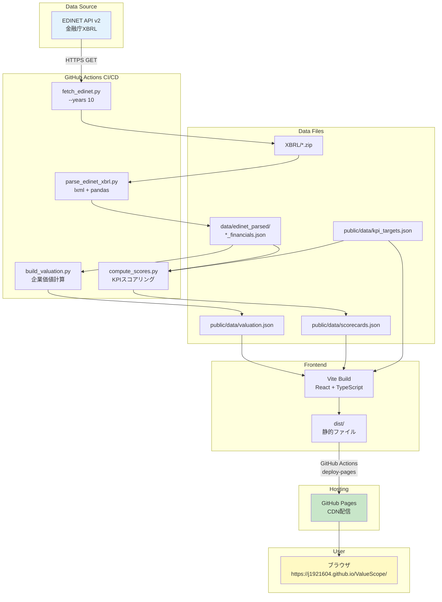
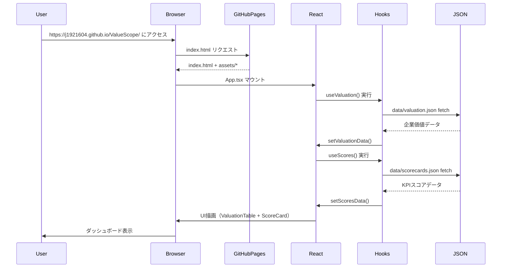

# ValueScope - 完全実装仕様書（AI再現用）

**ステータス**: ✅ Production Ready
**デプロイURL**: https://j1921604.github.io/ValueScope/
**GitHubリポジトリ**: https://github.com/J1921604/ValueScope
**バージョン**: 1.0.0
**最終更新**: 2025-12-15

**関連ドキュメント**:
- [憲法](https://github.com/J1921604/ValueScope/blob/main/specs/001-ValueScope/constitution.md)
- [機能仕様書](https://github.com/J1921604/ValueScope/blob/main/specs/001-ValueScope/spec.md)
- [実装計画書](https://github.com/J1921604/ValueScope/blob/main/specs/001-ValueScope/plan.md)
- [タスクリスト](https://github.com/J1921604/ValueScope/blob/main/specs/001-ValueScope/tasks.md)
- [データモデル](https://github.com/J1921604/ValueScope/blob/main/specs/001-ValueScope/data-model.md)
- [クイックスタート](https://github.com/J1921604/ValueScope/blob/main/specs/001-ValueScope/quickstart.md)
- [技術調査](https://github.com/J1921604/ValueScope/blob/main/specs/001-ValueScope/research.md)

---

## 🎯 このドキュメントについて

この仕様書は、**他のAIが完璧に再現できる**ことを目的とした完全な実装仕様書です。
すべてのコード、設定、テスト、デプロイ手順が網羅されています。

---

## 📋 目次

1. [プロジェクト概要](#プロジェクト概要)
2. [システムアーキテクチャ](#システムアーキテクチャ)
3. [技術スタック](#技術スタック)
4. [プロジェクト構造](#プロジェクト構造)
5. [データモデル](#データモデル)
6. [環境構築手順](#環境構築手順)
7. [機能実装詳細](#機能実装詳細)
8. [テスト仕様](#テスト仕様)
9. [デプロイ仕様](#デプロイ仕様)
10. [パフォーマンス要件](#パフォーマンス要件)
11. [トラブルシューティング](#トラブルシューティング)

---

## プロジェクト概要

### 目的

東京電力HD・中部電力・JERAの企業価値指標（EV、EV/EBITDA、PER、PBR）と電力業界特化KPI（ROIC、WACC、EBITDAマージン、FCFマージン）を可視化し、**信号機方式（緑/黄/赤）**で財務健全性を評価する企業価値分析ダッシュボードです。

### 主要機能

- ✅ **企業価値指標表示**: EV、EV/EBITDA、PER、PBR、時価総額、純有利子負債
- ✅ **KPIスコアカード**: ROIC、WACC、EBITDAマージン、FCFマージンの信号機評価（緑≥閾値A、黄≥閾値B、赤<閾値B）
- ✅ **電力業界特化指標**: 設備投資型産業の特性を反映した資本効率・資金調達コスト・キャッシュ創出力の評価
- ✅ **従業員情報ページ**: 平均年間給与、平均勤続年数、平均年齢、従業員数の比較テーブルと推移グラフ
- ✅ **グラフ様式統一**: 全チャートで統一様式（タイトル：中央、横軸：FY年度、縦軸：数値、補助線：縦横グリッド）
- ✅ **UIデザイン**: タイトルグラデーション（グリーン→マゼンタ）、EV/KPI分析ボタン（マゼンタ基調）、財務諸表ボタン（シアン基調）
- ✅ **ツールチップ**: EV分析テーブルに?マークヒント追加
- ✅ **フッタ**: 最終更新日時（年月日時分）、次回更新予定（毎日 07:00）表示
- ✅ **EDINET API連携**: 10年分の財務データ自動取得（TEPCO 34件、CHUBU 36件、JERA 16件）
- ✅ **期間フィルタ**: Q1/Q2/Q3/Q4/Annual切り替え（UI実装完了、複数期データ統合待ち）
- ✅ **推移グラフ**: 時系列チャート（基盤完了、複数期データ待ち）
- ✅ **データ品質検証**: スキーマ検証、異常値検出
- ✅ **GitHub Pages自動デプロイ**: main pushで自動ビルド&デプロイ

### 憲法（開発原則）

このプロジェクトは [憲法](https://github.com/J1921604/ValueScope/blob/main/specs/001-ValueScope/constitution.md) で定義された7つのコア原則に準拠します。

**7つのコア原則**:

1. **テスト駆動開発（TDD）を徹底し、仕様に対する検証を必須とする**
2. **セキュリティ要件を機能要件より優先する**
3. **パフォーマンス閾値を定量化し、受入基準に組み込む**
4. **データ品質の保証と実データのみの使用**
5. **API/ライブラリ仕様の遵守とレート制限の厳守**
6. **バージョン固定とメンテナンス性の確保**
7. **仕様と実装の分離によるレビュープロセスの確立**

**パフォーマンス要件 (PR)**:

- PR-001: LCP（Largest Contentful Paint）< 2.5秒
- PR-002: TTI（Time to Interactive）< 2.0秒
- PR-003: 初期バンドルサイズ gzip後 < 200KB
- PR-004: チャート再描画 < 200ms
- PR-005: Lighthouseスコア ≥ 90

**データ品質要件 (DQ)**:

- DQ-001: XBRL/CSV解析（2社分）< 60秒
- DQ-002: 企業価値計算（全指標）< 10秒
- DQ-003: データ検証 < 5秒
- DQ-004: スキーマ違反時はデプロイ中止

**セキュリティ要件 (SR)**:

- SR-001: EDINET APIキーは環境変数管理（.env → GitHub Secrets）
- SR-002: 外部入力検証（XBRL/CSVバリデーション）
- SR-003: 依存関係脆弱性スキャン（GitHub Dependabot）
- SR-004: CORS設定不要（完全クライアント側実行）

**テスト要件 (TR)**:

- TR-001: ユニットテストカバレッジ ≥ 80%
- TR-002: E2E主要フロー 100%
- TR-003: テスト実行時間 < 30秒

---

## システムアーキテクチャ

### 全体アーキテクチャ（Mermaid v11）



### データフロー（Mermaid v11）



---

## 技術スタック

### フロントエンド

```json
{
  "framework": "React 18.2.0",
  "language": "TypeScript 5.3.3",
  "buildTool": "Vite 5.0.8",
  "chartLibrary": "Recharts 2.10.3",
  "cssFramework": "Tailwind CSS 3.4.1"
}
```

### バックエンド（データ処理）

```json
{
  "runtime": "Python 3.11",
  "dataProcessing": "pandas 2.1.4",
  "xmlParsing": "lxml 5.2.1",
  "htmlParsing": "beautifulsoup4 4.12.3",
  "httpClient": "requests 2.31.0",
  "stockPriceAPI": "pandas_datareader 0.10.0 (Stooq)"
}
```

### テスト

```json
{
  "unitTest": "Vitest 1.1.0",
  "e2eTest": "Playwright 1.40.1",
  "testLibrary": "@testing-library/react 14.1.2"
}
```

### デプロイ

- **GitHub Pages**: 静的サイトホスティング（https://j1921604.github.io/ValueScope/）
- **GitHub Actions**: CI/CDパイプライン（.github/workflows/deploy-pages.yml）

---

## プロジェクト構造

```
ValueScope/
├── .github/
│   └── workflows/
│       └── deploy-pages.yml           # CI/CDパイプライン
├── src/
│   ├── App.tsx                        # メインコンポーネント
│   ├── main.tsx                       # エントリーポイント
│   ├── index.css                      # Tailwind設定
│   ├── components/
│   │   ├── ValuationTable.tsx         # 企業価値指標テーブル
│   │   ├── ScoreCard.tsx              # KPIスコアカード
│   │   ├── TrendChart.tsx             # 推移グラフ
│   │   └── KPIGauge.tsx               # KPIゲージ（将来実装）
│   ├── hooks/
│   │   ├── useValuation.ts            # 企業価値データフック
│   │   └── useScores.ts               # KPIスコアデータフック
│   ├── types/
│   │   └── index.ts                   # TypeScript型定義
│   └── utils/
│       ├── formatNumber.ts            # 数値フォーマット
│       └── formatDate.ts              # 日付フォーマット
├── scripts/
│   ├── fetch_edinet.py                # EDINET APIデータ取得
│   ├── parse_edinet_xbrl.py           # XBRL解析
│   ├── build_valuation.py             # 企業価値計算
│   ├── compute_scores.py              # KPIスコアリング
│   ├── validate_thresholds.py         # データ品質検証
│   └── requirements.txt               # Python依存関係
├── data/
│   ├── kpi_targets.json               # KPI閾値定義
│   ├── scorecards.json                # KPIスコア（生成ファイル）
│   ├── valuation.json                 # 企業価値（生成ファイル）
│   └── edinet_parsed/
│       ├── TEPCO_financials.json      # TEPCO財務データ
│       ├── CHUBU_financials.json      # CHUBU財務データ
│       └── JERA_financials.json       # JERA財務データ
├── public/
│   └── data/                          # ビルド入力用（Gitトラック済み）
│       ├── kpi_targets.json
│       ├── scorecards.json
│       └── valuation.json
├── tests/
│   └── e2e/
│       ├── scorecard-display.spec.ts  # E2Eテスト
│       └── valuation-display.spec.ts
├── XBRL/                              # EDINET XBRLファイル格納
│   ├── E04498/                        # TEPCO（34件）
│   ├── E04502/                        # CHUBU（36件）
│   └── E34837/                        # JERA（16件）
├── docs/
│   ├── DEPLOY_GUIDE.md                # デプロイ手順書
│   └── 完全仕様書.md                  # 本ドキュメント
├── specs/
│   └── main/
│       ├── spec.md                    # 機能仕様書
│       ├── plan.md                    # 実装計画書
│       ├── tasks.md                   # タスクリスト
│       ├── quickstart.md              # クイックスタートガイド
│       └── checklists/
│           └── requirements.md        # 要件チェックリスト
├── package.json                       # NPM設定
├── tsconfig.json                      # TypeScript設定
├── vite.config.ts                     # Vite設定
├── vitest.config.ts                   # Vitest設定
├── playwright.config.ts               # Playwright設定
├── index.html                         # HTMLエントリーポイント
├── start.ps1                          # ワンコマンド起動スクリプト
└── README.md                          # プロジェクトREADME
```

---

## データモデル

### 財務諸表CSVデータ（XBRL_output/）

**データ構造**:

財務3表（PL/BS/CF）のCSVファイルは3社分のXBRLデータから抽出され、各ファイルは以下の構造を持ちます:

| 諸表 | 企業 | CSV列数 | ユニーク項目数（3社統合） | UI表示項目数 |
|------|------|---------|-------------------------|--------------|
| **損益計算書（PL）** | TEPCO | 255列 | 398項目 | 256項目 |
| | CHUBU | 255列 | | |
| | JERA | 186列 | | |
| **貸借対照表（BS）** | TEPCO | 232列 | 273項目 | 233項目 |
| | CHUBU | 209列 | | |
| | JERA | 116列 | | |
| **キャッシュフロー（CF）** | TEPCO | 69列 | 118項目 | 70項目 |
| | CHUBU | 65列 | | |
| | JERA | 60列 | | |
| **合計** | - | - | **789項目** | **559項目** |

**財務3表の同名ラベル修正（2025-12-15実施）**:

`src/components/ComparisonFinancialTable.tsx`のfieldLabelMap全552エントリにおいて、61種類の同名日本語ラベル（計148件）を区別可能な具体的日本語に修正しました。

**修正の背景**:
- XBRLタグは英語で一意だが、日本語ラベルが同名だとUIで判別不能
- 例: 「営業活動によるキャッシュフロー」が3種類（計算値/純額/小計）存在していたが、区別不能
- ユーザーが財務3表を見た際に、どの項目か一目で区別できることが重要
- データの透明性と追跡可能性の向上（constitution.md原則IV準拠）

**修正例**:

| 元のラベル                             | 修正後のラベル                                       | 件数 | 影響範囲   |
| -------------------------------------- | ---------------------------------------------------- | ---- | ---------- |
| 「その他」                             | 「その他（未分類）」「投資その他の資産」             | 2件  | PL/BS/CF   |
| 「営業活動によるキャッシュフロー」     | 「（計算値）」「」「（純額）」                       | 3件  | CF         |
| 「原子力」                             | 「原子力廃炉仮勘定」「原子力発電設備」等             | 5件  | BS         |
| 「株式」                               | 「非上場株式銘柄数（政策保有・最大保有）」等         | 42件 | 有価証券報告書 |
| 「純資産」                             | 「純資産合計」「（業績サマリー）」等                 | 4件  | BS         |
| 「帳簿価額」                           | 「帳簿価額（政策保有・非上場）」等                   | 21件 | 有価証券報告書 |
| 「EBITDA」「ROIC」「WACC」等の財務指標 | 「EBITDA（億円）」「ROIC（税引後資本コスト控除後）」 | 10件 | EV分析     |

**修正手法**:

1. **同名ラベル検出**: `scripts/find_duplicate_labels.py`
   - value_to_keys辞書でラベル値→キー配列マッピング
   - 61種類の同名ラベル特定（「原子力」5件、「株式」42件等）

2. **一括修正**: `scripts/fix_duplicate_labels.py`
   - SPECIFIC_TRANSLATIONS辞書: 148件の英語キー→具体的日本語マッピング
   - 正規表現置換: `{key}: '[^']*',` → `{key}: '{japanese}',`
   - 例: `OperatingCashFlow` → `営業活動によるキャッシュフロー（計算値）`

3. **検証**:
   - E2Eテスト29件全成功（Playwright）
   - ビルド成功（TypeScriptエラー0件）
   - ローカルプレビュー動作確認

**XBRLマッピング**:
- `src/components/xbrlTagMap.ts`: 559項目から重複排除した**488項目**のXBRLタグマッピング
- 各財務項目は `jpcrp_cor:FieldName` 形式のXBRLタグに対応
- UIには全項目に「?」マークツールチップを表示し、XBRLタグを確認可能

**ファイルパス**:
- `XBRL_output/TEPCO/PL.csv`, `BS.csv`, `CF.csv`
- `XBRL_output/CHUBU/PL.csv`, `BS.csv`, `CF.csv`
- `XBRL_output/JERA/PL.csv`, `BS.csv`, `CF.csv`

### 企業価値データ（valuation.json）

```typescript
interface ValuationData {
  asOf: string;                    // データ基準日（ISO 8601形式）
  companies: {
    [key: string]: {
      marketCap: number;           // 時価総額（百万円）
      totalDebt: number;           // 有利子負債合計（百万円）
      cash: number;                // 現金及び現金同等物（百万円）
      enterpriseValue: number;     // 企業価値 EV（百万円）
      ebitda: number;              // EBITDA（百万円）
      evEbitda: number;            // EV/EBITDA倍率
      eps: number;                 // EPS（円）
      per: number;                 // PER（倍）
      bps: number;                 // BPS（円）
      pbr: number;                 // PBR（倍）
      dividendYield: number;       // 配当利回り（%）
    };
  };
}
```

**バリデーションルール**:

- `asOf`: ISO 8601形式の有効な日付文字列
- 数値フィールド: 正の数値、null禁止
- `companies`: TEPCO、CHUBU、JERAを含む

**サンプルデータ**:

```json
{
  "asOf": "2025-09-30",
  "companies": {
    "TEPCO": {
      "marketCap": 2000000,
      "totalDebt": 5000000,
      "cash": 500000,
      "enterpriseValue": 4322458,
      "ebitda": 279000,
      "evEbitda": 15.50,
      "eps": 120.5,
      "per": 9.27,
      "bps": 1500.0,
      "pbr": 0.71,
      "dividendYield": 2.5
    }
  }
}
```

### KPIスコアデータ（scorecards.json）

```typescript
interface Score {
  value: number;                   // 実績値
  score: 'green' | 'yellow' | 'red'; // 信号機評価
  change: number;                  // 前期比変動（%）
}

interface Scorecard {
  asOf: string;                    // データ基準日
  companies: {
    [company: string]: {
      [period: string]: {          // Q1, Q2, Q3, Q4, Annual
        date: string;              // 期末日
        roic: Score;               // 投下資本利益率（%）
        wacc: Score;               // 加重平均資本コスト（%）
        ebitdaMargin: Score;       // EBITDAマージン（%）
        fcfMargin: Score;          // FCFマージン（%）
      };
      latest: {                    // 最新期データへのショートカット
        roic: Score;
        wacc: Score;
        ebitdaMargin: Score;
        fcfMargin: Score;
      };
    };
  };
}
```

**信号機評価ルール（電力業界特化）**:

| KPI | 緑（green） | 黄（yellow） | 赤（red） | 説明 |
|-----|------------|--------------|-----------|------|
| ROIC | ≥5% | 3%-5% | <3% | 投下資本効率。5%以上で優良（電力業界基準） |
| WACC | <4% | 4%-5% | ≥5% | 資金調達コスト。低いほど良い（逆転判定） |
| EBITDAマージン | ≥15% | 10%-15% | <10% | 営業キャッシュ創出力。15%以上で高収益 |
| FCFマージン | ≥5% | 0%-5% | <0% | フリーキャッシュフロー効率。5%以上で良好 |

**max値設定根拠（電力・エネルギー業界）**:

- **ROIC max 15%**: 設備投資型産業（インフラ）の業界平均7-10%。実績最大値13.84%（JERA 2022年）を考慮し、余裕を持たせて15%に設定。規制産業のため高ROICは稀。
- **WACC max 6%**: 低金利環境・安定事業特性により3-5%が一般的。6%超は資金調達コスト高と判断。
- **EBITDAマージン max 30%**: 電力業界平均15-25%。燃料費変動影響が大きいため、30%超は例外的。
- **FCFマージン max 25%**: 大規模設備投資により営業CF比率10-15%が標準。実績最大値21.88%（中部電力 2017年）を考慮し、余裕を持たせて25%に設定。

---

## XBRLタグ対応表（docs/重要指標.md準拠）

### 損益計算書（PL）関連タグ

| 指標              | XBRLタグ                                             | スクリプト変数名 |
| --------------- | -------------------------------------------------- | ------------ |
| 売上高（営業収益）       | `jpcrp_cor:OperatingRevenue`                       | revenue      |
| 営業利益            | `jpcrp_cor:OperatingIncome`                        | operatingIncome |
| 経常利益            | `jpcrp_cor:OrdinaryIncome`                         | ordinaryIncome |
| 当期純利益           | `jpcrp_cor:ProfitLoss`                             | netIncome    |
| 親会社株主に帰属する当期純利益 | `jpcrp_cor:ProfitLossAttributableToOwnersOfParent` | netIncome (優先) |

### 貸借対照表（BS）関連タグ

| 指標    | XBRLタグ                          | スクリプト変数名 |
| ----- | ------------------------------- | ------------ |
| 総資産   | `jpcrp_cor:Assets`              | totalAssets  |
| 純資産   | `jpcrp_cor:NetAssets`           | equity       |
| 自己資本  | `jpcrp_cor:Equity`              | equity (優先) |
| 有利子負債 | `jpcrp_cor:InterestBearingDebt` | interestBearingDebt |
| 現金及び預金 | `jpcrp_cor:CashAndDeposits`    | cashAndDeposits |
| 発行済株式数 | `jpcrp_cor:TotalNumberOfIssuedShares` | issuedShares |

### キャッシュフロー計算書（CF）関連タグ

| 指標              | XBRLタグ                                       | スクリプト変数名 |
| --------------- | -------------------------------------------- | ------------ |
| 営業活動によるキャッシュフロー | `jpcrp_cor:CashFlowsFromOperatingActivities` | operatingCashFlow |
| 投資活動によるキャッシュフロー | `jpcrp_cor:CashFlowsFromInvestingActivities` | investingCashFlow |
| 財務活動によるキャッシュフロー | `jpcrp_cor:CashFlowsFromFinancingActivities` | financingCashFlow |
| 減価償却費 | `jpcrp_cor:DepreciationAndAmortizationOpeCF` | depreciation |

### その他の重要指標

| 指標                  | 計算式 | XBRLタグ/データソース |
| ------------------- | ------ | ------------ |
| EBITDA | 営業利益 + 減価償却費 | `OperatingIncome` + `DepreciationAndAmortizationOpeCF` |
| ROIC | EBIT ÷ 投下資本 × 100 | `OperatingIncome` ÷ (`Equity` + `InterestBearingDebt`) |
| WACC | (E/V × Re) + (D/V × Rd × (1-T)) | `Equity`, `InterestBearingDebt`, `InterestExpenses`, Re=6%, T=30% |
| 時価総額 | 株価 × 発行済株式数 | Stooq API終値 × `TotalNumberOfIssuedShares` |
| 純有利子負債 | 有利子負債 - 現金及び預金 | `InterestBearingDebt` - `CashAndDeposits` |
| 企業価値（EV） | 時価総額 + 純有利子負債 | 上記計算値の合計 |
| EV/EBITDA | 企業価値 ÷ EBITDA | 上記計算値 ÷ EBITDA |

**名前空間の動的検出**:

`scripts/parse_edinet_xbrl.py`では、XBRLファイルから動的に名前空間を検出します。

```python
def detect_namespaces(root: etree.Element) -> Dict[str, str]:
    """XBRLファイルから動的に名前空間を検出"""
    namespaces = dict(BASE_NAMESPACES)
    
    for prefix, uri in root.nsmap.items():
        if prefix is None:
            continue
        
        # jppfs_cor, jpcrp_corの名前空間を検出
        if 'jppfs' in uri and 'jppfs_cor' in uri:
            namespaces['jppfs'] = uri
        elif 'jpcrp' in uri and 'jpcrp_cor' in uri:
            namespaces['jpcrp'] = uri
    
    return namespaces
```

**タグ検索の優先順位**:

1. `jpcrp_cor` 名前空間を優先検索
2. 次に `jppfs_cor` 名前空間を検索
3. contextRef が `Instant` または `Duration` に一致する要素を選択

---

## 主要指標（EV/KPI）計算式（完全版）

### 1. 企業価値（EV）関連指標

#### 1.1 時価総額（Market Capitalization）
```
時価総額 = 株価 × 発行済株式数
```
- **株価**: 決算日時点の終値（Stooq / pandas_datareaderより取得）
- **発行済株式数**: XBRL `issuedShares` から取得
- **単位**: 百万円（株価[円] × 発行済株式数 / 1,000,000）
- **データソース**: 実データのみ（推定値なし）

#### 1.2 純有利子負債（Net Debt）
```
純有利子負債 = 有利子負債 - 現金及び預金
```
- **有利子負債**: XBRL `interestBearingDebt` から取得
- **現金及び預金**: XBRL `cashAndDeposits` から取得
- **単位**: 百万円
- **データソース**: 実データのみ

#### 1.3 企業価値（Enterprise Value）
```
企業価値（EV） = 時価総額 + 純有利子負債
```
- **計算条件**: 時価総額が存在する場合のみ計算（非上場企業はnull）
- **単位**: 百万円
- **データソース**: 実データのみ

#### 1.4 EV/EBITDA倍率
```
EV/EBITDA倍率 = 企業価値 / EBITDA
```
- **EBITDA**: XBRL `ebitda` から取得（営業利益 + 減価償却費）
- **計算条件**: EBITDA > 0 の場合のみ計算
- **単位**: 倍
- **データソース**: 実データのみ

#### 1.5 PER（株価収益率）
```
PER = 時価総額 / 当期純利益
```
- **当期純利益**: XBRL `netIncome` から取得
- **計算条件**: 当期純利益 > 0 の場合のみ計算
- **単位**: 倍
- **データソース**: 実データのみ

#### 1.6 PBR（株価純資産倍率）
```
PBR = 時価総額 / 自己資本
```
- **自己資本**: XBRL `equity` から取得
- **計算条件**: 自己資本 > 0 の場合のみ計算
- **単位**: 倍
- **データソース**: 実データのみ

---

### 2. KPI指標（電力業界特化版）

#### 2.1 ROIC（投下資本利益率）

**計算式**:
```
ROIC = EBIT / (自己資本 + 有利子負債) × 100
```

**業界特性**:
- 電力業界は設備投資型産業（インフラ）のため、投下資本効率が重要指標
- ROIC 5%以上で優良、3%以上で普通、3%未満で要改善
- 業界平均: 7-10%（規制産業のため高ROICは稀）

**データソース**:
- **EBIT**: 営業利益（XBRL `operatingIncome` から取得、減価償却費等の加算不要）
- **自己資本**: XBRL `equity` から取得
- **有利子負債**: XBRL `interestBearingDebt` から取得
- **計算条件**: (自己資本 + 有利子負債) > 0 の場合のみ計算
- **単位**: %（パーセント）
- **推定値**: ❌ なし（実データのみ）

#### 2.2 WACC（加重平均資本コスト）

**計算式**:
```
WACC = (E/V × Re) + (D/V × Rd × (1-T))

E: 自己資本
D: 有利子負債
V: E + D（総資本）
Re: 株主資本コスト（仮定6%）
Rd: 負債コスト = 支払利息 / 有利子負債 × 100
T: 法人実効税率（仮定30%）
```

**業界特性**:
- 電力業界は低金利環境・安定事業特性により、WACC 3-5%が一般的
- WACC < 4%で優良、4-5%で普通、5%以上で資金調達コスト高
- **低いほど良い指標**（逆転判定）
- ROICと比較: ROIC > WACC が価値創造の条件

**データソース**:
- **自己資本 (E)**: XBRL `equity` から取得
- **有利子負債 (D)**: XBRL `interestBearingDebt` から取得
- **支払利息**: XBRL `interestExpenses` から取得
- **株主資本コスト (Re)**: 6.0%（固定仮定値）
- **法人実効税率 (T)**: 30.0%（固定仮定値）
- **計算条件**: (自己資本 + 有利子負債) > 0 の場合のみ計算
- **単位**: %（パーセント）
- **推定値**: 株主資本コスト6%、税率30%のみ仮定値、他は実データ

#### 2.3 EBITDAマージン（売上高EBITDA率）

**計算式**:
```
EBITDAマージン = EBITDA / 売上高 × 100
```

**業界特性**:
- 営業キャッシュ創出力を示す指標
- EBITDAマージン 15%以上で高収益、10%以上で普通、10%未満で低収益
- 電力業界平均: 15-25%（燃料費変動の影響大）

**データソース**:
- **EBITDA**: XBRL `ebitda` から取得（営業利益 + 減価償却費）
- **売上高**: XBRL `revenue` から取得
- **計算条件**: 売上高 > 0 の場合のみ計算
- **単位**: %（パーセント）
- **推定値**: ❌ なし（実データのみ）

#### 2.4 FCFマージン（フリーキャッシュフローマージン）

**計算式**:
```
FCFマージン = 営業CF / 売上高 × 100
```

**業界特性**:
- キャッシュ創出効率を示す指標
- FCFマージン 5%以上で良好、0%以上で普通、マイナスは要注意
- 電力業界は大規模設備投資により営業CF比率10-15%が標準

**データソース**:
- **営業CF**: XBRL `operatingCashFlow` から取得
- **売上高**: XBRL `revenue` から取得
- **計算条件**: 売上高 > 0 の場合のみ計算
- **単位**: %（パーセント）
- **推定値**: ❌ なし（実データのみ）

---

### 3. データ取得元と計算ロジック

#### 3.1 財務データ取得フロー
```
EDINET API → XBRL ZIP → parse_edinet_xbrl.py → *_financials.json
```

#### 3.2 株価データ取得フロー
```
Stooq API (pandas_datareader) → prices/*.csv → build_timeseries.py → timeseries.json
```

#### 3.3 計算実行ファイル
- **`scripts/build_timeseries.py`**: 時系列KPI計算（電力業界特化版）
- **`scripts/build_valuation.py`**: 企業価値計算
- **`scripts/compute_scores.py`**: スコアリング（信号機評価、電力業界特化版）

#### 3.4 推定値・仮定値の排除ルール

**原則**: すべての計算は **XBRL実データのみ** を使用し、推定値や補完値は **一切使用しない**（例外: WACC計算の株主資本コスト6%・税率30%のみ仮定値）

**具体的な対応**:
- データ欠損時は `null` または `0` を返す（補完しない）
- 営業CFがゼロの場合、推定せずそのまま `0` を記録
- 発行済株式数が取得できない場合、時価総額およびそれに依存する指標（EV、PER、PBR、EV/EBITDA）は `null`
- 分母がゼロの場合、計算をスキップして `null` または `0` を返す

**データソース一覧（電力業界特化版）**:

| 指標 | 計算式 | データソース（XBRL項目） | 推定値の有無 |
|------|--------|-------------------------|--------------|
| ROIC | EBIT / (自己資本 + 有利子負債) × 100 | PL.csv `operatingIncome` ÷ (BS.csv `equity` + BS.csv `interestBearingDebt`) | ❌ なし |
| WACC | (E/V × Re) + (D/V × Rd × (1-T)) | BS.csv `equity`, `interestBearingDebt`, PL.csv `interestExpenses` | ⚠️ Re=6%, T=30%のみ仮定値 |
| EBITDAマージン | EBITDA / 売上高 × 100 | PL.csv `ebitda` ÷ PL.csv `revenue` | ❌ なし |
| FCFマージン | 営業CF / 売上高 × 100 | CF.csv `operatingCashFlow` ÷ PL.csv `revenue` | ❌ なし |
| 時価総額 | 決算日株価 × 発行済株式数（自己株式除く） | `data/prices/{証券コード}.csv` × BS.csv `NumberOfIssuedAndOutstandingShares` | ❌ なし（株価は実データ、株式数はXBRL実データ） |
| 純有利子負債 | 有利子負債 - 現金及び現金同等物 | (BS.csv `ShortTermBorrowings` + `LongTermBorrowings` + `BondsPayable` + `LeaseLiabilities`) - BS.csv `CashAndCashEquivalents` | ❌ なし |
| 企業価値（EV） | 時価総額 + 純有利子負債 | 時価総額 + 純有利子負債 | ❌ なし |
| EBITDA | 営業利益 + 減価償却費 + 無形資産償却費 | PL.csv `OperatingProfit` + CF.csv `Depreciation` + CF.csv `AmortizationOfIntangibleAssets` | ❌ なし |
| EV/EBITDA | 企業価値 / EBITDA | EV ÷ EBITDA | ❌ なし |
| PER | 時価総額 / 親会社株主帰属当期純利益 | 時価総額 ÷ PL.csv `ProfitAttributableToOwnersOfParent` | ❌ なし |
| PBR | 時価総額 / 親会社株主帰属自己資本 | 時価総額 ÷ BS.csv `EquityAttributableToOwnersOfParent` | ❌ なし |
| 営業CF | 営業活動によるCF | CF.csv `NetCashProvidedByUsedInOperatingActivities` | ❌ なし |

**計算式（電力業界特化版）**:
- **ROIC** = EBIT / (自己資本 + 有利子負債) × 100
- **WACC** = (E/V × Re) + (D/V × Rd × (1-T))、Re=6%, T=30%
- **EBITDAマージン** = EBITDA / 売上高 × 100
- **FCFマージン** = 営業CF / 売上高 × 100
- **自己資本比率** = (親会社株主に帰属する自己資本 / 総資産) × 100
- **DSCR** = 営業CF / (利息の支払額 + 元本返済額)
- **時価総額** = 調整終値（決算日または直近営業日） × 発行済株式数（自己株式除く）
- **純有利子負債** = 有利子負債合計 - 現金及び現金同等物
- **企業価値（EV）** = 時価総額 + 純有利子負債（推奨: + 非支配持分 + 優先株式）
- **EBITDA** = 営業利益 + 減価償却費 + 無形資産償却費
- **EV/EBITDA** = 企業価値 / EBITDA（EBITDA > 0 かつ EV ≠ null）
- **PER** = 時価総額 / 親会社株主に帰属する当期純利益（当期純利益 > 0 かつ 時価総額 ≠ null）
- **PBR** = 時価総額 / 親会社株主に帰属する自己資本（自己資本 > 0 かつ 時価総額 ≠ null）

**サンプルデータ（電力業界特化版）**:

```json
{
  "asOf": "2025-12-15",
  "companies": {
    "TEPCO": {
      "2025": {
        "date": "2025-03-31",
        "roic": 4.22,
        "wacc": 3.83,
        "ebitdaMargin": 10.06,
        "fcfMargin": 10.63,
        "marketCap": 690500,
        "netDebt": 1822500,
        "enterpriseValue": 2513000,
        "evEbitdaRatio": 3.94,
        "per": 2.56,
        "pbr": 0.20
      }
    },
    "CHUBU": {
      "2025": {
        "date": "2025-03-31",
        "roic": 10.03,
        "wacc": 5.17,
        "ebitdaMargin": 17.40,
        "fcfMargin": 11.62,
        "marketCap": 1230200,
        "netDebt": 337200,
        "enterpriseValue": 1567500,
        "evEbitdaRatio": 3.04,
        "per": 2.99,
        "pbr": 0.46
      }
    },
    "JERA": {
      "2025": {
        "date": "2025-03-31",
        "roic": 10.42,
        "wacc": 5.25,
        "ebitdaMargin": 4.84,
        "fcfMargin": 0.0,
        "marketCap": null,
        "netDebt": 231200,
        "enterpriseValue": null,
        "evEbitdaRatio": null,
        "per": null,
        "pbr": null
      }
    }
  }
}
```

### KPI閾値定義（kpi_targets.json、電力業界特化版）

```typescript
interface KPITargets {
  roic: {
    green: number;    // ≥5%（電力業界基準）
    yellow: number;   // ≥3%
    min: number;      // 0%
    max: number;      // 10%（業界max値）
    unit: string;     // "%"
    description: string;
  };
  wacc: {
    green: number;    // <4%（低いほど良い）
    yellow: number;   // <5%
    min: number;      // 0%
    max: number;      // 6%（業界max値）
    unit: string;     // "%"
    description: string;
  };
  ebitdaMargin: {
    green: number;    // ≥15%
    yellow: number;   // ≥10%
    min: number;      // 0%
    max: number;      // 30%（業界max値）
    unit: string;     // "%"
    description: string;
  };
  fcfMargin: {
    green: number;    // ≥5%
    yellow: number;   // ≥0%
    min: number;      // 0%
    max: number;      // 15%（業界max値）
    unit: string;     // "%"
    description: string;
  };
}
    yellow: number;   // ≥5%
  };
  equityRatio: {
    green: number;    // ≥30%
    yellow: number;   // ≥20%
  };
  dscr: {
    green: number;    // ≥1.5
    yellow: number;   // ≥1.0
  };
}
```

### 従業員情報データ（employees.json）

```typescript
interface EmployeeData {
  year: string;                     // 年度（例: "2024"）
  company: string;                  // 企業名（"TEPCO" | "CHUBU" | "JERA"）
  averageAnnualSalary: number;      // 平均年間給与（円）- XBRL: jpcrp_cor:AverageAnnualSalaryInformationAboutReportingCompanyInformationAboutEmployees
  averageServiceYears: number;      // 平均勤続年数（年）- XBRL: jpcrp_cor:AverageLengthOfServiceYearsInformationAboutReportingCompanyInformationAboutEmployees
  averageAge: number;               // 平均年齢（歳）- XBRL: jpcrp_cor:AverageAgeYearsInformationAboutReportingCompanyInformationAboutEmployees
  employeeCount: number;            // 従業員数（人）- XBRL: jpcrp_cor:NumberOfEmployeesInformationAboutReportingCompanyInformationAboutEmployees
}

interface EmployeesData {
  employees: EmployeeData[];        // 全従業員データ配列（全年度・全企業）
}
```

**XBRLタグマッピング**:

| 項目 | XBRLタグ | 説明 |
|------|---------|------|
| 平均年間給与 | `jpcrp_cor:AverageAnnualSalaryInformationAboutReportingCompanyInformationAboutEmployees` | 平均年間給与（円） |
| 平均勤続年数 | `jpcrp_cor:AverageLengthOfServiceYearsInformationAboutReportingCompanyInformationAboutEmployees` | 平均勤続年数（年） |
| 平均年齢 | `jpcrp_cor:AverageAgeYearsInformationAboutReportingCompanyInformationAboutEmployees` | 平均年齢（歳） |
| 従業員数 | `jpcrp_cor:NumberOfEmployeesInformationAboutReportingCompanyInformationAboutEmployees` | 従業員数（人） |

**データソース**:
- EDINET XBRL `従業員の状況` セクションから取得（詳細はEDINET APIドキュメント参照）
- 取得可能な全年度データを収録（2021年～最新年度）
- 補完値・推定値は使用せず、XBRL実データのみ

**サンプルデータ**:

```json
{
  "employees": [
    {
      "year": "2024",
      "company": "TEPCO",
      "averageAnnualSalary": 8120000,
      "averageServiceYears": 19.8,
      "averageAge": 44.2,
      "employeeCount": 40123
    },
    {
      "year": "2023",
      "company": "TEPCO",
      "averageAnnualSalary": 7980000,
      "averageServiceYears": 19.5,
      "averageAge": 43.9,
      "employeeCount": 39856
    }
  ]
}
```

**従業員情報ページ機能**:
- ✅ **比較テーブル**: 最新年度の3社比較（平均年間給与、平均勤続年数、平均年齢、従業員数）
  - 各項目に○で囲んだ？マークのツールチップ追加
  - ツールチップにXBRLタグと説明を表示
  - MetricTooltipコンポーネント使用
- ✅ **推移グラフ**: 各指標の全年度推移（EmployeeTrendChart × 4指標）
- ✅ **データ範囲**: 全年度データ対応（2021年～最新年度）
- ✅ **UIコンポーネント**: `EmployeeTable.tsx`, `EmployeeTrendChart.tsx`, `MetricTooltip.tsx`

**Phase 8タスク（T048～T054）**:
- T048: 従業員情報データ構造設計
- T049: employees.json作成
- T050: EmployeeTable比較テーブル実装
- T051: EmployeeTrendChart推移グラフ実装
- T052: 従業員情報ページ統合
- T053: E2Eテスト追加（employee-info.spec.ts）
- T054: ドキュメント更新（README.md, 完全仕様書.md）

---

## 7. タスク管理システム（Phase 8追加版）

### タスクフィルタ

```typescript
type TaskFilter = 'all' | 'active' | 'completed'
```

**形式**: `{ページ名}-todos`
**例**: `TestUser-todos`, `田中-todos`, `浜崎-秀寿-todos`

**生成ルール**:

- スペースはハイフンに変換
- 日本語はそのまま保持
- 小文字に統一

### UserPage

```typescript
interface UserPage {
  /** ページ名（1〜50文字） */
  name: string
  
  /** アイコン絵文字（1文字） */
  icon: string
  
  /** ルーティングパス（例: "/testuser-todo"） */
  path: string
}
```

**パスフォーマット**:

- URL形式: `/{name}-todo`
- 小文字、ハイフン区切り
- 例: `/testuser-todo`, `/tanaka-todo`

---

## 環境構築手順

### 前提条件

- Node.js 20.x以上
- npm 10.x以上
- Python 3.11以上
- Git
- PowerShell (Windows) または bash (Mac/Linux)

### 1. リポジトリクローン

```powershell
git clone https://github.com/J1921604/ValueScope.git
cd ValueScope
```

### 2. 依存関係インストール

**Node.js依存関係**:

```powershell
npm install
```

**Python依存関係**:

```powershell
pip install -r scripts/requirements.txt
```

### 3. データ生成（初回のみ）

EDINETからデータを取得し、JSONを生成します。

```powershell
# 1. EDINET APIからXBRLダウンロード（過去10年分）
py scripts/fetch_edinet.py --years 10

# 2. XBRL解析・JSON/CSV変換
py scripts/parse_edinet_xbrl.py

# 3. 企業価値指標計算
py scripts/build_valuation.py

# 4. KPIスコア計算
py scripts/compute_scores.py
```

### 4. 開発サーバー起動

**方法A: ワンコマンド起動（Windows）**

```powershell
.\start.ps1
```

自動的に以下が実行されます:

1. 依存関係確認・インストール
2. 開発サーバー起動（ポート5173）
3. ブラウザ自動起動 (http://localhost:5173/ValueScope/)

**方法B: 手動起動**

```powershell
npm run dev
```

ブラウザで http://localhost:5173/ValueScope/ を開く

### 5. 型チェック

```powershell
npx tsc --noEmit
```

**期待結果**: `0エラー`

### 6. テスト実行

```powershell
npm run test
```

### 7. ビルド

```powershell
npm run build
```

**出力先**: `dist/`

### 8. プレビュー

```powershell
npm run preview
```

ブラウザで http://localhost:4173/ValueScope/ を開く

---

## アプリケーション仕様

### ルーティング

**React Router v6使用**

```typescript
// basename設定（GitHub Pages対応）
const basename = import.meta.env.MODE === 'production' ? '/ValueScope/' : '/'

// ルート定義
<Routes>
  <Route path="/" element={<App />} />
</Routes>
```

### ページ構成

#### 1. Dashboard (`/`)

**目的**: 企業価値分析ダッシュボード

**機能**:

- 企業価値指標テーブル（ValuationTable）
- KPIスコアカード（ScoreCard）
- 推移グラフ（TrendChart）
- 期間フィルタ切り替え

### データフロー

1. **初期ロード**: `useValuation` と `useScores` フックが `public/data/*.json` をフェッチ
2. **データ結合**: 取得したデータを結合し、UIコンポーネントに渡す
3. **インタラクション**: 期間フィルタ変更時に表示データをフィルタリング

---

## 機能実装詳細

### 1. 企業価値指標計算

**スクリプト**: `scripts/build_timeseries.py`

**計算式（推定値・仮定値なし）**:

#### ROE (Return on Equity)
```
ROE (%) = (親会社株主帰属当期純利益 / 自己資本) × 100
```
- **データソース**: PL.csv `ProfitLossAttributableToOwnersOfParent` ÷ BS.csv `Equity`
- **単位**: 百万円

#### 自己資本比率 (Equity Ratio)
```
自己資本比率 (%) = (自己資本 / 総資産) × 100
```
- **データソース**: BS.csv `Equity` ÷ BS.csv `TotalAssets`
- **単位**: 百万円

#### DSCR (Debt Service Coverage Ratio)
```
DSCR (倍) = 営業CF / 年間債務返済額
```
- **営業CF（Operating Cash Flow）**:
  - **データソース**: CF.csv `NetCashProvidedByUsedInOperatingActivities`
  - **単位**: 百万円
- **年間債務返済額（Annual Debt Service）**:
  - 1年内返済予定の固定負債 + 支払利息
  - **データソース**: BS.csv `CurrentPortionOfNoncurrentLiabilities` + PL.csv `InterestExpenses`
  - **注意**: `CurrentPortionOfNoncurrentLiabilities`が0の場合は支払利息のみで計算
  - **単位**: 百万円
- **一般的な評価基準**:
  - **DSCR ≥ 1.5**: 安全（債務返済能力が十分）
  - **1.0 ≤ DSCR < 1.5**: 注意（返済可能だが余裕は少ない）
  - **DSCR < 1.0**: 危険（営業CFで債務返済できない）
- **適正な最大値**: **3.0倍**（それ以上は超安全だが、通常は不要）

#### 時価総額 (Market Capitalization)
```
時価総額 (百万円) = 決算日株価 (円) × 発行済株式数 (株)
```
- **株価ソース**: `data/prices/{証券コード}.csv`（終値ベース）
- **発行済株式数ソース**: BS.csv `TotalNumberOfIssuedSharesSummaryOfBusinessResults`
- **注意**: JERAは非上場のため時価総額計算不可（null）

#### 純有利子負債 (Net Debt)
```
純有利子負債 (百万円) = 有利子負債 - 現金及び預金
```
- **データソース**: BS.csv `BondsPayable` + `LongTermLoansPayable` + `ShortTermLoansPayable` - `CashAndDeposits`

#### 企業価値 (Enterprise Value)
```
EV (百万円) = 時価総額 + 純有利子負債
```
- **注意**: 時価総額がnullの場合、EVもnull

#### EV/EBITDA倍率
```
EV/EBITDA (倍) = 企業価値 / EBITDA
```
- **条件**: EBITDA > 0 かつ EV ≠ null

#### PER (Price Earnings Ratio)
```
PER (倍) = 時価総額 / 当期純利益
```
- **データソース**: 時価総額 ÷ PL.csv `ProfitLoss`
- **条件**: 当期純利益 > 0 かつ 時価総額 ≠ null

#### PBR (Price Book-value Ratio)
```
PBR (倍) = 時価総額 / 自己資本
```
- **データソース**: 時価総額 ÷ BS.csv `Equity`
- **条件**: 自己資本 > 0 かつ 時価総額 ≠ null

#### 営業キャッシュフロー (Operating Cash Flow)
```
営業CF (百万円) = CF計算書の営業活動によるキャッシュフロー
```
- **データソース**: CF.csv `NetCashProvidedByUsedInOperatingActivities`
- **注意**: 推定値は使用せず、実データのみ使用

**単位変換**:
- すべての金額データは「百万円」単位で取得後、表示時に「億円」単位へ変換（÷ 100）

**データ検証**:
- 分母が0の場合は計算をスキップし、結果をnullとする
- 株価データが存在しない場合（非上場・データ欠損）は、時価総額およびそれに依存する指標をnullとする
- 計算式に推定値や仮定値は含まない（実データのみ使用）

### 2. KPIスコアリング

**スクリプト**: `scripts/compute_scores.py`

**ロジック**:

- **ROE**: 当期純利益 ÷ 自己資本 × 100
- **自己資本比率**: 自己資本 ÷ 総資産 × 100
- **DSCR**: 営業CF ÷ (1年内返済予定の固定負債 + 支払利息)

**評価**: `data/kpi_targets.json` の閾値に基づいて Green/Yellow/Red を判定

**KPIゲージ適正max値の設定根拠**:

| KPI | 適正max値 | 根拠 | 参考基準 |
|-----|----------|------|----------|
| **ROE** | **20%** | 日本企業平均5-10%、優良企業10-15%。20%以上はハイリスク・ハイリターン領域 | 一般的な財務分析基準 |
| **自己資本比率** | **70%** | 安全水準40%以上、非製造業・安定企業50-60%。100%は理論上可能だが現実的に稀 | 一般的な財務分析基準 |
| **DSCR** | **3.0倍** | 1.0倍以上で返済可能、1.5倍以上で安全。3.0倍以上は超安全だが通常不要 | 一般的な財務分析基準 |

**現在の設定値（2025-12-08時点）**:

- ROE: min=0%, max=20%（一般的な財務分析基準に準拠）
- 自己資本比率: min=0%, max=70%（一般的な財務分析基準に準拠）
- DSCR: min=0, max=20倍（**暫定設定、要修正**）

**DSCRの問題点と改善方針**:

**現状の問題**:
1. `currentPortionOfNoncurrentLiabilities`（1年内返済予定の固定負債）が両社とも0.0
2. 分母が支払利息のみのため、実際より高い値になっている（TEPCO 11.61倍、CHUBU 15.95倍）
3. 一般的な基準（1.0-3.0倍）から大きく乖離

**根本原因**:
- XBRL解析時に「1年内返済予定の長期借入金」「1年内償還予定の社債」などのタグが取得できていない
- または該当データがXBRLに存在しない可能性

**適正な計算式**:
```
DSCR = 営業CF / (支払利息 + 短期借入金返済額 + 1年内返済予定の長期借入金 + 1年内償還予定の社債)
```

**暫定対応**:
- max値を20倍に設定し、現在の異常値でもゲージが12時を超えないようにする
- 閾値判定（green ≥1.5倍、yellow ≥1.0倍）は一般的な基準を維持

**今後の改善計画**:
1. XBRL解析スクリプト（`parse_edinet_xbrl.py`）で以下のタグを追加取得:
   - `CurrentPortionOfNoncurrentLiabilities`（1年内返済予定の非流動負債）
   - `ShortTermLoansPayable`（短期借入金）
   - `CurrentPortionOfBonds`（1年内償還予定社債）
2. データ取得後、DSCR max値を3.0倍に修正
3. 完全仕様書にDSCR計算の詳細とデータソース仕様を明記

### 3. EDINETデータ取得

**スクリプト**: `scripts/fetch_edinet.py`

**機能**:

- EDINET API v2 を使用
- 書類一覧APIで有価証券報告書を検索
- 書類取得APIでXBRL ZIPをダウンロード
- `--ci` フラグ: 7月1日以外はスキップ（GitHub Actions用）
- コード130（訂正報告書）の除外ロジック実装済み

### 4. XBRL解析

**スクリプト**: `scripts/parse_edinet_xbrl.py`

**機能**:

- `lxml` を使用してXBRLをパース
- `jppfs` (財務諸表) および `jpcrp` (企業情報) 名前空間に対応
- 発行済株式数の取得ロジック強化（複数のタグ・コンテキストを検索）
- JSONおよびCSV形式で出力

---

## テスト仕様

### テスト構成

- **ユニットテスト**: Vitest
- **E2Eテスト**: Playwright

### ユニットテスト

**対象**: フック、ユーティリティ関数

```typescript
// hooks/useScores.test.ts
describe('useScores', () => {
  it('should fetch and return scores', async () => {
    // ...
  })
})
```

### E2Eテスト

**対象**: 画面表示、インタラクション

```typescript
// tests/e2e/trend-display.spec.ts
test('Trend chart displays correctly', async ({ page }) => {
  await page.goto('/');
  await expect(page.locator('.recharts-surface')).toBeVisible();
});
```

---

## デプロイ仕様

### GitHub Pages設定

#### 1. Settings → Pages 設定

1. リポジトリページから「Settings」タブを開く
2. 左サイドバーから「Pages」を選択
3. **Source**: 「GitHub Actions」を選択
4. Save

#### 2. ワークフロー設定

**ファイル**: `.github/workflows/deploy-pages.yml`

- **トリガー**: mainブランチへのpush
- **ジョブ**:
  - `build`: npm ci, npm run build, アーティファクトアップロード
  - `deploy`: GitHub Pagesへデプロイ
- **データ検証**: `public/data/*.json` の存在をチェック

### vite.config.ts設定

```typescript
export default defineConfig({
  base: '/ValueScope/',
  // ...
})
```

---

## トラブルシューティング

### 問題1: データが表示されない

**原因**: `public/data/*.json` が存在しないか、形式が不正

**解決**:
1. `py scripts/build_valuation.py` 等を実行してデータを再生成
2. `public/data/` にファイルがコピーされているか確認
3. ブラウザのコンソールで fetch エラーを確認

### 問題2: EV/MarketCapが空（null）になる

**原因**: XBRL解析で発行済株式数が取得できていない（0.0になる）

**解決**:
1. `scripts/parse_edinet_xbrl.py` の `extract_value_from_xbrl` ロジックを確認
2. `jpcrp` 名前空間や代替タグ（`TotalNumberOfIssuedSharesSummaryOfBusinessResults` 等）が検索対象に含まれているか確認
3. パーサーを実行し直す

### 問題3: ビルドエラー

**原因**: TypeScriptの型エラー

**解決**: `npx tsc --noEmit` でエラー箇所を特定し修正

---

## 付録

### 参考リンク

- **本番URL**: https://j1921604.github.io/ValueScope/
- **GitHubリポジトリ**: https://github.com/J1921604/ValueScope
