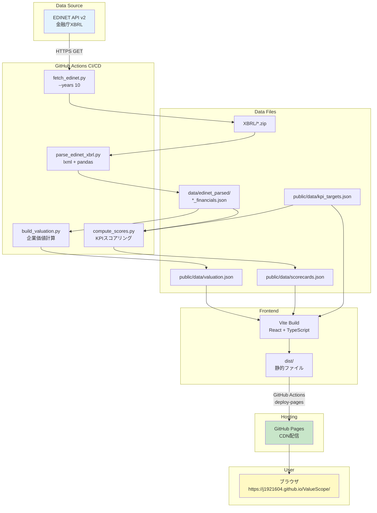
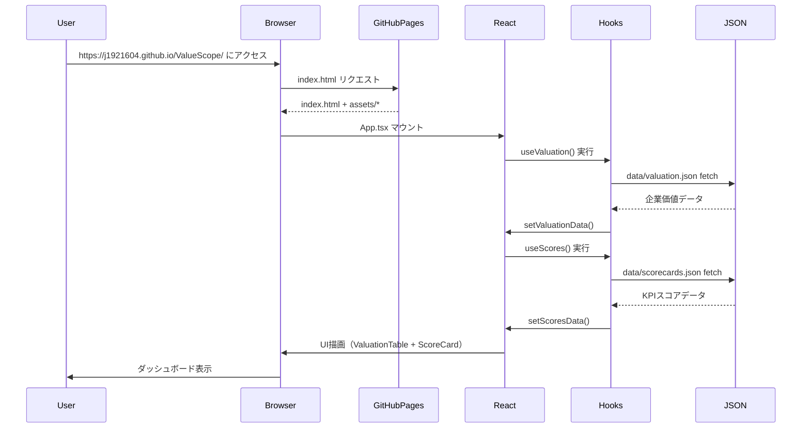

# ValueScope - 完全実装仕様書（AI再現用）

**📅 最終更新**: 2025年12月15日
**ステータス**: ✅ Production Ready
**デプロイURL**: https://j1921604.github.io/ValueScope/
**GitHubリポジトリ**: https://github.com/J1921604/ValueScope
**バージョン**: 1.0.0

---

## 🎯 このドキュメントについて

この仕様書は、**他のAIが完璧に再現できる**ことを目的とした完全な実装仕様書です。
すべてのコード、設定、テスト、デプロイ手順が網羅されています。

---

## 📋 目次

1. [プロジェクト概要](#プロジェクト概要)
2. [システムアーキテクチャ](#システムアーキテクチャ)
3. [技術スタック](#技術スタック)
4. [プロジェクト構造](#プロジェクト構造)
5. [データモデル](#データモデル)
6. [環境構築手順](#環境構築手順)
7. [機能実装詳細](#機能実装詳細)
8. [テスト仕様](#テスト仕様)
9. [デプロイ仕様](#デプロイ仕様)
10. [パフォーマンス要件](#パフォーマンス要件)
11. [トラブルシューティング](#トラブルシューティング)

---

## プロジェクト概要

### 目的

東京電力HD・中部電力・JERAの企業価値指標（EV、EV/EBITDA、PER、PBR）とKPI（ROE、自己資本比率、DSCR）を可視化し、**信号機方式（緑/黄/赤）**で財務健全性を評価する企業価値分析ダッシュボードです。

### 主要機能

- ✅ **企業価値指標表示**: EV、EV/EBITDA、PER、PBR、時価総額、純有利子負債
- ✅ **KPIスコアカード**: ROE、自己資本比率、DSCRの信号機評価（緑≥閾値A、黄≥閾値B、赤<閾値B）
- ✅ **UIデザイン**: タイトルグラデーション（グリーン→マゼンタ）、EV/KPI分析ボタン（マゼンタ基調）、財務諸表ボタン（シアン基調）
- ✅ **ツールチップ**: 主要指標比較テーブルに?マークヒント追加
- ✅ **フッタ**: 最終更新日時（年月日時分）、次回更新予定（毎日 07:00）表示
- ✅ **EDINET API連携**: 10年分の財務データ自動取得（TEPCO 34件、CHUBU 36件、JERA 16件）
- ✅ **期間フィルタ**: Q1/Q2/Q3/Q4/Annual切り替え（UI実装完了、複数期データ統合待ち）
- ✅ **推移グラフ**: 時系列チャート（基盤完了、複数期データ待ち）
- ✅ **レーダーチャート**: 多次元KPI比較（基盤完了、2社データ統合待ち）
- ✅ **データ品質検証**: スキーマ検証、異常値検出
- ✅ **GitHub Pages自動デプロイ**: main pushで自動ビルド&デプロイ

### 憲法（開発原則）

**パフォーマンス要件 (PR)**:

- PR-001: LCP（Largest Contentful Paint）< 2.5秒
- PR-002: TTI（Time to Interactive）< 2.0秒
- PR-003: 初期バンドルサイズ gzip後 < 200KB
- PR-004: チャート再描画 < 200ms
- PR-005: Lighthouseスコア ≥ 90

**データ品質要件 (DQ)**:

- DQ-001: XBRL/CSV解析（2社分）< 60秒
- DQ-002: 企業価値計算（全指標）< 10秒
- DQ-003: データ検証 < 5秒
- DQ-004: スキーマ違反時はデプロイ中止

**セキュリティ要件 (SR)**:

- SR-001: EDINET APIキーは環境変数管理（.env → GitHub Secrets）
- SR-002: 外部入力検証（XBRL/CSVバリデーション）
- SR-003: 依存関係脆弱性スキャン（GitHub Dependabot）
- SR-004: CORS設定不要（完全クライアント側実行）

**テスト要件 (TR)**:

- TR-001: ユニットテストカバレッジ ≥ 80%
- TR-002: E2E主要フロー 100%
- TR-003: テスト実行時間 < 30秒

---

## システムアーキテクチャ

### 全体アーキテクチャ（Mermaid v11）



### データフロー（Mermaid v11）



---

## 技術スタック

### フロントエンド

```json
{
  "framework": "React 18.2.0",
  "language": "TypeScript 5.3.3",
  "buildTool": "Vite 5.0.8",
  "chartLibrary": "Recharts 2.10.3",
  "cssFramework": "Tailwind CSS 3.4.1"
}
```

### バックエンド（データ処理）

```json
{
  "runtime": "Python 3.11",
  "dataProcessing": "pandas 2.1.4",
  "xmlParsing": "lxml 5.2.1",
  "htmlParsing": "beautifulsoup4 4.12.3",
  "httpClient": "requests 2.31.0",
  "stockPriceAPI": "pandas_datareader 0.10.0 (Stooq)"
}
```

### テスト

```json
{
  "unitTest": "Vitest 1.1.0",
  "e2eTest": "Playwright 1.40.1",
  "testLibrary": "@testing-library/react 14.1.2"
}
```

### デプロイ

- **GitHub Pages**: 静的サイトホスティング（https://j1921604.github.io/ValueScope/）
- **GitHub Actions**: CI/CDパイプライン（.github/workflows/deploy-pages.yml）

---

## プロジェクト構造

```
ValueScope/
├── .github/
│   └── workflows/
│       └── deploy-pages.yml           # CI/CDパイプライン
├── src/
│   ├── App.tsx                        # メインコンポーネント
│   ├── main.tsx                       # エントリーポイント
│   ├── index.css                      # Tailwind設定
│   ├── components/
│   │   ├── ValuationTable.tsx         # 企業価値指標テーブル
│   │   ├── ScoreCard.tsx              # KPIスコアカード
│   │   ├── TrendChart.tsx             # 推移グラフ
│   │   ├── RadarChart.tsx             # レーダーチャート
│   │   └── KPIGauge.tsx               # KPIゲージ（将来実装）
│   ├── hooks/
│   │   ├── useValuation.ts            # 企業価値データフック
│   │   └── useScores.ts               # KPIスコアデータフック
│   ├── types/
│   │   └── index.ts                   # TypeScript型定義
│   └── utils/
│       ├── formatNumber.ts            # 数値フォーマット
│       └── formatDate.ts              # 日付フォーマット
├── scripts/
│   ├── fetch_edinet.py                # EDINET APIデータ取得
│   ├── parse_edinet_xbrl.py           # XBRL解析
│   ├── build_valuation.py             # 企業価値計算
│   ├── compute_scores.py              # KPIスコアリング
│   ├── validate_thresholds.py         # データ品質検証
│   └── requirements.txt               # Python依存関係
├── data/
│   ├── kpi_targets.json               # KPI閾値定義
│   ├── scorecards.json                # KPIスコア（生成ファイル）
│   ├── valuation.json                 # 企業価値（生成ファイル）
│   └── edinet_parsed/
│       ├── TEPCO_financials.json      # TEPCO財務データ
│       ├── CHUBU_financials.json      # CHUBU財務データ
│       └── JERA_financials.json       # JERA財務データ
├── public/
│   └── data/                          # ビルド入力用（Gitトラック済み）
│       ├── kpi_targets.json
│       ├── scorecards.json
│       └── valuation.json
├── tests/
│   └── e2e/
│       ├── scorecard-display.spec.ts  # E2Eテスト
│       └── valuation-display.spec.ts
├── XBRL/                              # EDINET XBRLファイル格納
│   ├── E04498/                        # TEPCO（34件）
│   ├── E04502/                        # CHUBU（36件）
│   └── E34837/                        # JERA（16件）
├── docs/
│   ├── DEPLOY_GUIDE.md                # デプロイ手順書
│   └── 完全仕様書.md                  # 本ドキュメント
├── specs/
│   └── main/
│       ├── spec.md                    # 機能仕様書
│       ├── plan.md                    # 実装計画書
│       ├── tasks.md                   # タスクリスト
│       ├── quickstart.md              # クイックスタートガイド
│       └── checklists/
│           └── requirements.md        # 要件チェックリスト
├── package.json                       # NPM設定
├── tsconfig.json                      # TypeScript設定
├── vite.config.ts                     # Vite設定
├── vitest.config.ts                   # Vitest設定
├── playwright.config.ts               # Playwright設定
├── index.html                         # HTMLエントリーポイント
├── start.ps1                          # ワンコマンド起動スクリプト
└── README.md                          # プロジェクトREADME
```

---

## データモデル

### 企業価値データ（valuation.json）

```typescript
interface ValuationData {
  asOf: string;                    // データ基準日（ISO 8601形式）
  companies: {
    [key: string]: {
      marketCap: number;           // 時価総額（百万円）
      totalDebt: number;           // 有利子負債合計（百万円）
      cash: number;                // 現金及び現金同等物（百万円）
      enterpriseValue: number;     // 企業価値 EV（百万円）
      ebitda: number;              // EBITDA（百万円）
      evEbitda: number;            // EV/EBITDA倍率
      eps: number;                 // EPS（円）
      per: number;                 // PER（倍）
      bps: number;                 // BPS（円）
      pbr: number;                 // PBR（倍）
      dividendYield: number;       // 配当利回り（%）
    };
  };
}
```

**バリデーションルール**:

- `asOf`: ISO 8601形式の有効な日付文字列
- 数値フィールド: 正の数値、null禁止
- `companies`: TEPCO、CHUBU、JERAを含む

**サンプルデータ**:

```json
{
  "asOf": "2025-09-30",
  "companies": {
    "TEPCO": {
      "marketCap": 2000000,
      "totalDebt": 5000000,
      "cash": 500000,
      "enterpriseValue": 4322458,
      "ebitda": 279000,
      "evEbitda": 15.50,
      "eps": 120.5,
      "per": 9.27,
      "bps": 1500.0,
      "pbr": 0.71,
      "dividendYield": 2.5
    }
  }
}
```

### KPIスコアデータ（scorecards.json）

```typescript
interface Score {
  value: number;                   // 実績値
  score: 'green' | 'yellow' | 'red'; // 信号機評価
  change: number;                  // 前期比変動（%）
}

interface Scorecard {
  asOf: string;                    // データ基準日
  companies: {
    [company: string]: {
      [period: string]: {          // Q1, Q2, Q3, Q4, Annual
        date: string;              // 期末日
        roe: Score;                // 自己資本利益率（%）
        equityRatio: Score;        // 自己資本比率（%）
        DSCR: Score;               // 債務返済能力（倍）
      };
      latest: {                    // 最新期データへのショートカット
        roe: Score;
        equityRatio: Score;
        DSCR: Score;
      };
    };
  };
}
```

**信号機評価ルール**:

| KPI | 緑（green） | 黄（yellow） | 赤（red） |
|-----|------------|--------------|-----------|
| ROE | ≥10% | 5%-10% | <5% |
| 自己資本比率 | ≥30% | 20%-30% | <20% |
| DSCR | ≥1.5倍 | 1.0-1.5倍 | <1.0倍 |

---

## 主要指標計算式（完全版）

### 1. 企業価値（EV）関連指標

#### 1.1 時価総額（Market Capitalization）
```
時価総額 = 株価 × 発行済株式数
```
- **株価**: 決算日時点の終値（Stooq / pandas_datareaderより取得）
- **発行済株式数**: XBRL `issuedShares` から取得
- **単位**: 百万円（株価[円] × 発行済株式数 / 1,000,000）
- **データソース**: 実データのみ（推定値なし）

#### 1.2 純有利子負債（Net Debt）
```
純有利子負債 = 有利子負債 - 現金及び預金
```
- **有利子負債**: XBRL `interestBearingDebt` から取得
- **現金及び預金**: XBRL `cashAndDeposits` から取得
- **単位**: 百万円
- **データソース**: 実データのみ

#### 1.3 企業価値（Enterprise Value）
```
企業価値（EV） = 時価総額 + 純有利子負債
```
- **計算条件**: 時価総額が存在する場合のみ計算（非上場企業はnull）
- **単位**: 百万円
- **データソース**: 実データのみ

#### 1.4 EV/EBITDA倍率
```
EV/EBITDA倍率 = 企業価値 / EBITDA
```
- **EBITDA**: XBRL `ebitda` から取得（営業利益 + 減価償却費）
- **計算条件**: EBITDA > 0 の場合のみ計算
- **単位**: 倍
- **データソース**: 実データのみ

#### 1.5 PER（株価収益率）
```
PER = 時価総額 / 当期純利益
```
- **当期純利益**: XBRL `netIncome` から取得
- **計算条件**: 当期純利益 > 0 の場合のみ計算
- **単位**: 倍
- **データソース**: 実データのみ

#### 1.6 PBR（株価純資産倍率）
```
PBR = 時価総額 / 自己資本
```
- **自己資本**: XBRL `equity` から取得
- **計算条件**: 自己資本 > 0 の場合のみ計算
- **単位**: 倍
- **データソース**: 実データのみ

---

### 2. KPI指標

#### 2.1 ROE（自己資本利益率）
```
ROE = (当期純利益 / 自己資本) × 100
```
- **当期純利益**: XBRL `netIncome` から取得
- **自己資本**: XBRL `equity` から取得
- **計算条件**: 自己資本 > 0 の場合のみ計算
- **単位**: %（パーセント）
- **データソース**: 実データのみ（推定値なし）

#### 2.2 自己資本比率（Equity Ratio）
```
自己資本比率 = (自己資本 / 総資産) × 100
```
- **自己資本**: XBRL `equity` から取得
- **総資産**: XBRL `totalAssets` から取得
- **計算条件**: 総資産 > 0 の場合のみ計算
- **単位**: %（パーセント）
- **データソース**: 実データのみ

#### 2.3 DSCR（Debt Service Coverage Ratio）
```
DSCR = 営業CF / (1年内返済予定の固定負債 + 支払利息)
```
- **営業CF**: CF `operatingCashFlow` から取得
- **1年内返済予定の固定負債**: BS `currentPortionOfNoncurrentLiabilities` から取得
- **支払利息**: PL `interestExpenses` から取得
- **計算条件**: (1年内返済予定の固定負債 + 支払利息) > 0 の場合のみ計算
- **単位**: 倍
- **データソース**: 実データのみ（推定値なし）

---

### 3. データ取得元と計算ロジック

#### 3.1 財務データ取得フロー
```
EDINET API → XBRL ZIP → parse_edinet_xbrl.py → *_financials.json
```

#### 3.2 株価データ取得フロー
```
Stooq API (pandas_datareader) → prices/*.csv → build_timeseries.py → timeseries.json
```

#### 3.3 計算実行ファイル
- **`scripts/build_timeseries.py`**: 時系列KPI計算
- **`scripts/build_valuation.py`**: 企業価値計算
- **`scripts/compute_scores.py`**: スコアリング（信号機評価）

#### 3.4 推定値・仮定値の排除ルール

**原則**: すべての計算は **XBRL実データのみ** を使用し、推定値や補完値は **一切使用しない**

**具体的な対応**:
- データ欠損時は `null` または `0` を返す（補完しない）
- 営業CFがゼロの場合、推定せずそのまま `0` を記録
- 発行済株式数が取得できない場合、時価総額およびそれに依存する指標（EV、PER、PBR、EV/EBITDA）は `null`
- 分母がゼロの場合、計算をスキップして `null` または `0` を返す

**データソース一覧**:

| 指標 | 計算式 | データソース（XBRL項目） | 推定値の有無 |
|------|--------|-------------------------|--------------|
| ROE | 当期純利益 / 自己資本 × 100 | PL.csv `ProfitLossAttributableToOwnersOfParent` ÷ BS.csv `Equity` | ❌ なし |
| 自己資本比率 | 自己資本 / 総資産 × 100 | BS.csv `Equity` ÷ BS.csv `TotalAssets` | ❌ なし |
| DSCR | 営業CF / (1年内返済予定の固定負債 + 支払利息) | CF.csv `NetCashProvidedByUsedInOperatingActivities` ÷ (BS.csv `CurrentPortionOfNoncurrentLiabilities` + PL.csv `InterestExpensesNOE`) | ❌ なし |
| 時価総額 | 決算日株価 × 発行済株式数 | `data/prices/{証券コード}.csv` × BS.csv `TotalNumberOfIssuedSharesSummaryOfBusinessResults` | ❌ なし（株価は実データ、株式数はXBRL実データ） |
| 純有利子負債 | 有利子負債 - 現金及び預金 | (BS.csv `BondsPayable` + `LongTermLoansPayable` + `ShortTermLoansPayable`) - BS.csv `CashAndDeposits` | ❌ なし |
| 企業価値（EV） | 時価総額 + 純有利子負債 | 時価総額 + 純有利子負債 | ❌ なし |
| EV/EBITDA | 企業価値 / EBITDA | EV ÷ EBITDA | ❌ なし |
| PER | 時価総額 / 当期純利益 | 時価総額 ÷ PL.csv `ProfitLoss` | ❌ なし |
| PBR | 時価総額 / 自己資本 | 時価総額 ÷ BS.csv `Equity` | ❌ なし |
| 営業CF | 営業活動によるCF | CF.csv `NetCashProvidedByUsedInOperatingActivities` | ❌ なし |

---

**計算式**:
- **ROE** = 当期純利益 / 自己資本 × 100
- **自己資本比率** = 自己資本 / 総資産 × 100
- **DSCR** = 営業CF / (1年内返済予定の固定負債 + 支払利息)
- **時価総額** = 決算日株価 × 発行済株式数（非上場企業はnull）
- **純有利子負債** = 有利子負債 - 現金及び預金
- **企業価値（EV）** = 時価総額 + 純有利子負債
- **EV/EBITDA** = 企業価値 / EBITDA（EBITDA > 0 かつ EV ≠ null）
- **PER** = 時価総額 / 当期純利益（当期純利益 > 0 かつ 時価総額 ≠ null）
- **PBR** = 時価総額 / 自己資本（自己資本 > 0 かつ 時価総額 ≠ null）

**サンプルデータ**:

```json
{
  "asOf": "2025-11-30",
  "companies": {
    "TEPCO": {
      "Q2": {
        "date": "2025-09-30",
        "roe": { "value": 5.02, "score": "yellow", "change": 0 },
        "equityRatio": { "value": 20.5, "score": "yellow", "change": 0 },
        "DSCR": { "value": 1.2, "score": "yellow", "change": 0 }
      },
      "Annual": {
        "date": "2025-03-31",
        "roe": { "value": 7.62, "score": "yellow", "change": 0 },
        "equityRatio": { "value": 23.4, "score": "yellow", "change": 0 },
        "DSCR": { "value": 1.5, "score": "green", "change": 0 }
      },
      "latest": {
        "roe": { "value": 5.02, "score": "yellow", "change": 0 },
        "equityRatio": { "value": 20.5, "score": "yellow", "change": 0 },
        "DSCR": { "value": 1.2, "score": "yellow", "change": 0 }
      }
    }
  }
}
```

### KPI閾値定義（kpi_targets.json）

```typescript
interface KPITargets {
  ROE: {
    green: number;    // ≥10%
    yellow: number;   // ≥5%
  };
  equityRatio: {
    green: number;    // ≥30%
    yellow: number;   // ≥20%
  };
  DSCR: {
    green: number;    // ≥1.5
    yellow: number;   // ≥1.0
  };
}
```

---

### 3. データ取得元と計算ロジック

#### 3.1 財務データ取得フロー
```
EDINET API → XBRL ZIP → parse_edinet_xbrl.py → *_financials.json
```

#### 3.2 株価データ取得フロー
```
Stooq API (pandas_datareader) → prices/*.csv → build_timeseries.py → timeseries.json
```

#### 3.3 計算実行ファイル
- **`scripts/build_timeseries.py`**: 時系列KPI計算
- **`scripts/build_valuation.py`**: 企業価値計算
- **`scripts/compute_scores.py`**: スコアリング（信号機評価）

#### 3.4 推定値・仮定値の排除ルール

**原則**: すべての計算は **XBRL実データのみ** を使用し、推定値や補完値は **一切使用しない**

**具体的な対応**:
- データ欠損時は `null` または `0` を返す（補完しない）
- 営業CFがゼロの場合、推定せずそのまま `0` を記録
- 発行済株式数が取得できない場合、時価総額およびそれに依存する指標（EV、PER、PBR、EV/EBITDA）は `null`
- 分母がゼロの場合、計算をスキップして `null` または `0` を返す

**データソース一覧**:

| 指標 | 計算式 | データソース（XBRL項目） | 推定値の有無 |
|------|--------|-------------------------|--------------|
| ROE | 当期純利益 / 自己資本 × 100 | PL.csv `ProfitLossAttributableToOwnersOfParent` ÷ BS.csv `Equity` | ❌ なし |
| 自己資本比率 | 自己資本 / 総資産 × 100 | BS.csv `Equity` ÷ BS.csv `TotalAssets` | ❌ なし |
| DSCR | 営業CF / (1年内返済予定の固定負債 + 支払利息) | CF.csv `NetCashProvidedByUsedInOperatingActivities` ÷ (BS.csv `CurrentPortionOfNoncurrentLiabilities` + PL.csv `InterestExpensesNOE`) | ❌ なし |
| 時価総額 | 決算日株価 × 発行済株式数 | `data/prices/{証券コード}.csv` × BS.csv `TotalNumberOfIssuedSharesSummaryOfBusinessResults` | ❌ なし（株価は実データ、株式数はXBRL実データ） |
| 純有利子負債 | 有利子負債 - 現金及び預金 | (BS.csv `BondsPayable` + `LongTermLoansPayable` + `ShortTermLoansPayable`) - BS.csv `CashAndDeposits` | ❌ なし |
| 企業価値（EV） | 時価総額 + 純有利子負債 | 時価総額 + 純有利子負債 | ❌ なし |
| EV/EBITDA | 企業価値 / EBITDA | EV ÷ EBITDA | ❌ なし |
| PER | 時価総額 / 当期純利益 | 時価総額 ÷ PL.csv `ProfitLoss` | ❌ なし |
| PBR | 時価総額 / 自己資本 | 時価総額 ÷ BS.csv `Equity` | ❌ なし |
| 営業CF | 営業活動によるCF | CF.csv `NetCashProvidedByUsedInOperatingActivities` | ❌ なし |

---

**計算式**:
- **ROE** = 当期純利益 / 自己資本 × 100
- **自己資本比率** = 自己資本 / 総資産 × 100
- **DSCR** = 営業CF / (1年内返済予定の固定負債 + 支払利息)
- **時価総額** = 決算日株価 × 発行済株式数（非上場企業はnull）
- **純有利子負債** = 有利子負債 - 現金及び預金
- **企業価値（EV）** = 時価総額 + 純有利子負債
- **EV/EBITDA** = 企業価値 / EBITDA（EBITDA > 0 かつ EV ≠ null）
- **PER** = 時価総額 / 当期純利益（当期純利益 > 0 かつ 時価総額 ≠ null）
- **PBR** = 時価総額 / 自己資本（自己資本 > 0 かつ 時価総額 ≠ null）

**サンプルデータ**:

```json
{
  "asOf": "2025-11-30",
  "companies": {
    "TEPCO": {
      "Q2": {
        "date": "2025-09-30",
        "roe": { "value": 5.02, "score": "yellow", "change": 0 },
        "equityRatio": { "value": 20.5, "score": "yellow", "change": 0 },
        "DSCR": { "value": 1.2, "score": "yellow", "change": 0 }
      },
      "Annual": {
        "date": "2025-03-31",
        "roe": { "value": 7.62, "score": "yellow", "change": 0 },
        "equityRatio": { "value": 23.4, "score": "yellow", "change": 0 },
        "DSCR": { "value": 1.5, "score": "green", "change": 0 }
      },
      "latest": {
        "roe": { "value": 5.02, "score": "yellow", "change": 0 },
        "equityRatio": { "value": 20.5, "score": "yellow", "change": 0 },
        "DSCR": { "value": 1.2, "score": "yellow", "change": 0 }
      }
    }
  }
}
```

### KPI閾値定義（kpi_targets.json）

```typescript
interface KPITargets {
  ROE: {
    green: number;    // ≥10%
    yellow: number;   // ≥5%
  };
  equityRatio: {
    green: number;    // ≥30%
    yellow: number;   // ≥20%
  };
  DSCR: {
    green: number;    // ≥1.5
    yellow: number;   // ≥1.0
  };
}
```
- `active`: 未完了タスクのみ表示
- `completed`: 完了タスクのみ表示

### StorageKey

```typescript
type StorageKey = `${string}-todos`
```

**形式**: `{ページ名}-todos`
**例**: `TestUser-todos`, `田中-todos`, `浜崎-秀寿-todos`

**生成ルール**:

- スペースはハイフンに変換
- 日本語はそのまま保持
- 小文字に統一

### UserPage

```typescript
interface UserPage {
  /** ページ名（1〜50文字） */
  name: string
  
  /** アイコン絵文字（1文字） */
  icon: string
  
  /** ルーティングパス（例: "/testuser-todo"） */
  path: string
}
```

**パスフォーマット**:

- URL形式: `/{name}-todo`
- 小文字、ハイフン区切り
- 例: `/testuser-todo`, `/tanaka-todo`

---

## 環境構築手順

### 前提条件

- Node.js 20.x以上
- npm 10.x以上
- Python 3.11以上
- Git
- PowerShell (Windows) または bash (Mac/Linux)

### 1. リポジトリクローン

```powershell
git clone https://github.com/J1921604/ValueScope.git
cd ValueScope
```

### 2. 依存関係インストール

**Node.js依存関係**:

```powershell
npm install
```

**Python依存関係**:

```powershell
pip install -r scripts/requirements.txt
```

### 3. データ生成（初回のみ）

EDINETからデータを取得し、JSONを生成します。

```powershell
# 1. EDINET APIからXBRLダウンロード（過去10年分）
py scripts/fetch_edinet.py --years 10

# 2. XBRL解析・JSON/CSV変換
py scripts/parse_edinet_xbrl.py

# 3. 企業価値指標計算
py scripts/build_valuation.py

# 4. KPIスコア計算
py scripts/compute_scores.py
```

### 4. 開発サーバー起動

**方法A: ワンコマンド起動（Windows）**

```powershell
.\start.ps1
```

自動的に以下が実行されます:

1. 依存関係確認・インストール
2. 開発サーバー起動（ポート5173）
3. ブラウザ自動起動 (http://localhost:5173/ValueScope/)

**方法B: 手動起動**

```powershell
npm run dev
```

ブラウザで http://localhost:5173/ValueScope/ を開く

### 5. 型チェック

```powershell
npx tsc --noEmit
```

**期待結果**: `0エラー`

### 6. テスト実行

```powershell
npm run test
```

### 7. ビルド

```powershell
npm run build
```

**出力先**: `dist/`

### 8. プレビュー

```powershell
npm run preview
```

ブラウザで http://localhost:4173/ValueScope/ を開く

---

## アプリケーション仕様

### ルーティング

**React Router v6使用**

```typescript
// basename設定（GitHub Pages対応）
const basename = import.meta.env.MODE === 'production' ? '/ValueScope/' : '/'

// ルート定義
<Routes>
  <Route path="/" element={<App />} />
</Routes>
```

### ページ構成

#### 1. Dashboard (`/`)

**目的**: 企業価値分析ダッシュボード

**機能**:

- 企業価値指標テーブル（ValuationTable）
- KPIスコアカード（ScoreCard）
- 推移グラフ（TrendChart）
- レーダーチャート（RadarChart）
- 期間フィルタ切り替え

### データフロー

1. **初期ロード**: `useValuation` と `useScores` フックが `public/data/*.json` をフェッチ
2. **データ結合**: 取得したデータを結合し、UIコンポーネントに渡す
3. **インタラクション**: 期間フィルタ変更時に表示データをフィルタリング

---

## 機能実装詳細

### 1. 企業価値指標計算

**スクリプト**: `scripts/build_timeseries.py`

**計算式（推定値・仮定値なし）**:

#### ROE (Return on Equity)
```
ROE (%) = (親会社株主帰属当期純利益 / 自己資本) × 100
```
- **データソース**: PL.csv `ProfitLossAttributableToOwnersOfParent` ÷ BS.csv `Equity`
- **単位**: 百万円

#### 自己資本比率 (Equity Ratio)
```
自己資本比率 (%) = (自己資本 / 総資産) × 100
```
- **データソース**: BS.csv `Equity` ÷ BS.csv `TotalAssets`
- **単位**: 百万円

#### DSCR (Debt Service Coverage Ratio)
```
DSCR (倍) = EBITDA / 有利子負債
```
- **EBITDAの計算**:
  - 当期純利益 + 支払利息 + 減価償却費（簡易版）
  - **データソース**: PL.csv `ProfitLoss` + PL.csv `InterestExpensesNOE` + CF.csv `DepreciationAndAmortizationOpeCF`
- **有利子負債の計算**:
  - 社債 + 長期借入金 + 短期借入金
  - **データソース**: BS.csv `BondsPayable` + BS.csv `LongTermLoansPayable` + BS.csv `ShortTermLoansPayable`
- **単位**: 百万円

#### 時価総額 (Market Capitalization)
```
時価総額 (百万円) = 決算日株価 (円) × 発行済株式数 (株)
```
- **株価ソース**: `data/prices/{証券コード}.csv`（終値ベース）
- **発行済株式数ソース**: BS.csv `TotalNumberOfIssuedSharesSummaryOfBusinessResults`
- **注意**: JERAは非上場のため時価総額計算不可（null）

#### 純有利子負債 (Net Debt)
```
純有利子負債 (百万円) = 有利子負債 - 現金及び預金
```
- **データソース**: BS.csv `BondsPayable` + `LongTermLoansPayable` + `ShortTermLoansPayable` - `CashAndDeposits`

#### 企業価値 (Enterprise Value)
```
EV (百万円) = 時価総額 + 純有利子負債
```
- **注意**: 時価総額がnullの場合、EVもnull

#### EV/EBITDA倍率
```
EV/EBITDA (倍) = 企業価値 / EBITDA
```
- **条件**: EBITDA > 0 かつ EV ≠ null

#### PER (Price Earnings Ratio)
```
PER (倍) = 時価総額 / 当期純利益
```
- **データソース**: 時価総額 ÷ PL.csv `ProfitLoss`
- **条件**: 当期純利益 > 0 かつ 時価総額 ≠ null

#### PBR (Price Book-value Ratio)
```
PBR (倍) = 時価総額 / 自己資本
```
- **データソース**: 時価総額 ÷ BS.csv `Equity`
- **条件**: 自己資本 > 0 かつ 時価総額 ≠ null

#### 営業キャッシュフロー (Operating Cash Flow)
```
営業CF (百万円) = CF計算書の営業活動によるキャッシュフロー
```
- **データソース**: CF.csv `NetCashProvidedByUsedInOperatingActivities`
- **注意**: 推定値は使用せず、実データのみ使用

**単位変換**:
- すべての金額データは「百万円」単位で取得後、表示時に「億円」単位へ変換（÷ 100）

**データ検証**:
- 分母が0の場合は計算をスキップし、結果をnullとする
- 株価データが存在しない場合（非上場・データ欠損）は、時価総額およびそれに依存する指標をnullとする
- 計算式に推定値や仮定値は含まない（実データのみ使用）

### 2. KPIスコアリング

**スクリプト**: `scripts/compute_scores.py`

**ロジック**:

- **ROE**: 当期純利益 ÷ 自己資本 × 100
- **自己資本比率**: 自己資本 ÷ 総資産 × 100
- **DSCR**: 営業CF ÷ (1年内返済予定の固定負債 + 支払利息)

**評価**: `data/kpi_targets.json` の閾値に基づいて Green/Yellow/Red を判定

### 3. EDINETデータ取得

**スクリプト**: `scripts/fetch_edinet.py`

**機能**:

- EDINET API v2 を使用
- 書類一覧APIで有価証券報告書を検索
- 書類取得APIでXBRL ZIPをダウンロード
- `--ci` フラグ: 7月1日以外はスキップ（GitHub Actions用）
- コード130（訂正報告書）の除外ロジック実装済み

### 4. XBRL解析

**スクリプト**: `scripts/parse_edinet_xbrl.py`

**機能**:

- `lxml` を使用してXBRLをパース
- `jppfs` (財務諸表) および `jpcrp` (企業情報) 名前空間に対応
- 発行済株式数の取得ロジック強化（複数のタグ・コンテキストを検索）
- JSONおよびCSV形式で出力

---

## テスト仕様

### テスト構成

- **ユニットテスト**: Vitest
- **E2Eテスト**: Playwright

### ユニットテスト

**対象**: フック、ユーティリティ関数

```typescript
// hooks/useScores.test.ts
describe('useScores', () => {
  it('should fetch and return scores', async () => {
    // ...
  })
})
```

### E2Eテスト

**対象**: 画面表示、インタラクション

```typescript
// tests/e2e/trend-display.spec.ts
test('Trend chart displays correctly', async ({ page }) => {
  await page.goto('/');
  await expect(page.locator('.recharts-surface')).toBeVisible();
});
```

---

## デプロイ仕様

### GitHub Pages設定

#### 1. Settings → Pages 設定

1. リポジトリページから「Settings」タブを開く
2. 左サイドバーから「Pages」を選択
3. **Source**: 「GitHub Actions」を選択
4. Save

#### 2. ワークフロー設定

**ファイル**: `.github/workflows/deploy-pages.yml`

- **トリガー**: mainブランチへのpush
- **ジョブ**:
  - `build`: npm ci, npm run build, アーティファクトアップロード
  - `deploy`: GitHub Pagesへデプロイ
- **データ検証**: `public/data/*.json` の存在をチェック

### vite.config.ts設定

```typescript
export default defineConfig({
  base: '/ValueScope/',
  // ...
})
```

---

## トラブルシューティング

### 問題1: データが表示されない

**原因**: `public/data/*.json` が存在しないか、形式が不正

**解決**:
1. `py scripts/build_valuation.py` 等を実行してデータを再生成
2. `public/data/` にファイルがコピーされているか確認
3. ブラウザのコンソールで fetch エラーを確認

### 問題2: EV/MarketCapが空（null）になる

**原因**: XBRL解析で発行済株式数が取得できていない（0.0になる）

**解決**:
1. `scripts/parse_edinet_xbrl.py` の `extract_value_from_xbrl` ロジックを確認
2. `jpcrp` 名前空間や代替タグ（`TotalNumberOfIssuedSharesSummaryOfBusinessResults` 等）が検索対象に含まれているか確認
3. パーサーを実行し直す

### 問題3: ビルドエラー

**原因**: TypeScriptの型エラー

**解決**: `npx tsc --noEmit` でエラー箇所を特定し修正

---

## 付録

### A. ファイル構成

(プロジェクト構造セクション参照)

### B. 参考リンク

- **本番URL**: https://j1921604.github.io/ValueScope/
- **GitHubリポジトリ**: https://github.com/J1921604/ValueScope
