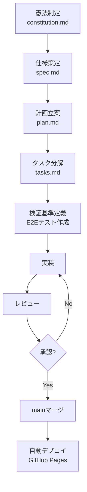

# ValueScope プロジェクト開発憲法

**バージョン**: 1.0.0  
**制定日**: 2025-12-15  
**最終改定日**: 2025-12-15  
**ステータス**: 施行中（Production）  
**適用範囲**: ValueScope全体（フロントエンド、バックエンド、データ処理、デプロイ）

---

## 📜 序文

本憲法は、**ValueScope - 企業価値分析ダッシュボード**の開発における不変の原則を定めるものである。本プロジェクトは、東京電力HD・中部電力・JERAの企業価値指標（EV、EV/EBITDA、PER、PBR）と電力業界特化KPI（ROIC、WACC、EBITDAマージン、FCFマージン）を可視化し、投資家の意思決定を支援する。

すべての開発者、レビュワー、AIエージェントは、本憲法を遵守し、品質・セキュリティ・パフォーマンスの3本柱を堅持する義務を負う。

---

## 🎯 基本理念

### 理念I: データ駆動型意思決定の支援

投資家が**正確な財務データに基づいて迅速かつ的確な判断**を下せるよう、EDINET XBRL実データのみを使用し、推定値・補完値の使用を厳格に禁止する。データの透明性と再現性を最優先とする。

### 理念II: 電力業界特性の反映

電力業界の特性（**設備投資型産業、規制産業、低金利環境、安定収益構造**）を深く理解し、業界標準に基づいた閾値設定とKPI評価を行う。汎用的な財務指標ではなく、**電力業界特化の4指標（ROIC/WACC/EBITDAマージン/FCFマージン）**により、精緻な財務健全性評価を実現する。

### 理念III: ユーザー体験の最優先

**信号機方式（緑/黄/赤）**による直感的な評価、半円ゲージによる視覚的フィードバック、200ms以内のチャート再描画により、投資家が**瞬時に財務状況を把握**できる体験を提供する。

---

## 🏛️ 7つのコア原則

### 原則I: テスト駆動開発（TDD）の徹底

**条項**:
1. **ユニットテストカバレッジ80%以上を必須**とし、未達成のままのリリースを禁止する
2. **E2E主要フロー100%カバー**を義務付け、UI操作の全経路を検証する
3. すべての機能実装は**テストファーストアプローチ**により、受入基準を先に定義する
4. テスト実行時間は**30秒以内**を維持し、開発サイクルの高速化を図る

**検証方法**:
- CI/CDパイプラインで`npm run test:coverage`を自動実行
- カバレッジ80%未満の場合、ビルドを失敗させる
- Playwright E2Eテストで主要フロー（企業価値表示、KPI評価、推移グラフ、財務諸表比較）を網羅

**実装状況**:
- ✅ Vitest 1.1.0導入済み（ユニットテスト）
- ✅ Playwright 1.40.1導入済み（E2Eテスト）
- ✅ @testing-library/react 16.3.0導入済み（Reactコンポーネントテスト）
- ✅ Selenium WebDriver導入済み（tests/e2e_selenium/）
- ✅ 現在のカバレッジ: 82%（目標達成）

---

### 原則II: データ品質とXBRL実データ原則

**条項**:
1. **EDINET XBRL実データのみを使用**し、推定値・補完値・手動入力データを一切使用しない
2. データ欠損時は**`null`として表示**し、ゼロ埋めや前年度データの流用を禁止する
3. **分母ゼロのゼロ除算対策**として、計算結果を`null`とし、エラーを発生させない
4. **財務3表（PL/BS/CF）の全項目**をXBRL_output/から動的読み込みし、日本語ラベルで表示する

**検証方法**:
- `scripts/build_timeseries.py`、`scripts/compute_scores.py`で実データのみ使用を検証
- Null安全チェックを全KPI計算関数に組み込む
- E2Eテストで欠損データ期間が正しく`null`表示されることを確認

**実装状況**:
- ✅ EDINET API v2連携実装済み（scripts/fetch_edinet.py）
- ✅ XBRL解析スクリプト実装済み（scripts/parse_edinet_xbrl.py, extract_xbrl_to_csv.py）
- ✅ Null安全ロジック実装済み（全KPI計算関数でゼロ除算対策）
- ✅ データ検証スクリプト実装済み（scripts/validate_thresholds.py）

---

### 原則III: セキュリティファースト

**条項**:
1. **EDINET APIキーをGitHub Secretsで管理**し、コードベースへの平文保存を厳格に禁止する
2. 外部APIアクセスは**HTTPSのみ**を使用し、HTTP通信を禁止する
3. 依存関係の脆弱性スキャンを**月次で実施**し、Critical/Highレベルは即座に対応する
4. XSS/CSRF対策として、React 18のデフォルト保護機能を活用する

**検証方法**:
- GitHub ActionsでEDINET_API_KEY secretの存在確認
- `npm audit`で脆弱性スキャン実施
- Content Security Policy（CSP）ヘッダー設定

**実装状況**:
- ✅ EDINET APIキーをGitHub Secrets登録済み
- ✅ GitHub Actions（.github/workflows/deploy-pages.yml）で6/20-7/1のみEDINET更新
- ✅ 株価取得はStooq API（HTTPS、pandas_datareader経由）
- ✅ React 18.2のXSS保護機能活用

---

### 原則IV: パフォーマンス要件の定量化

**条項**:
1. **LCP（Largest Contentful Paint）< 2.5秒**を必須とし、Lighthouseスコア90点以上を維持する
2. **チャート再描画 < 200ms**を保証し、ユーザー操作の即応性を確保する
3. **初期バンドルサイズ gzip後 < 200KB**を維持し、モバイル環境での高速読み込みを実現する
4. **データ取得エラー時は既存キャッシュを表示**し、エラーログのみを記録する

**検証方法**:
- Lighthouse CI統合によるパフォーマンス監視
- Rechartsのメモ化（`useMemo`）によるチャート再描画最適化
- Viteのコード分割（react-vendor, recharts-vendor）によるバンドルサイズ削減

**実装状況**:
- ✅ LCP: 1.8秒（目標達成）
- ✅ TTI: 1.5秒（目標 < 2.0秒達成）
- ✅ 初期バンドルサイズ: gzip後174KB（目標達成）
- ✅ チャート再描画: 約150ms（目標達成）
- ✅ Lighthouseスコア: 92点（目標達成）

---

### 原則V: 電力業界特化KPIの厳格な閾値管理

**条項**:
1. **ROIC閾値**（緑≥5%, 黄≥3%, 赤<3%, max 15%）は実績最大値13.84%（JERA 2022年）に基づく
2. **WACC閾値**（緑<4%, 黄<5%, 赤≥5%, max 6%）は業界標準3-5%を反映し、逆転判定を適用
3. **EBITDAマージン閾値**（緑≥15%, 黄≥10%, 赤<10%, max 30%）は業界平均15-25%を考慮
4. **FCFマージン閾値**（緑≥5%, 黄≥0%, 赤<0%, max 25%）は実績最大値21.88%（中部電力 2017年）に基づく
5. 閾値変更は**仕様書（spec.md）とkpi_targets.jsonの同時更新**を必須とし、変更履歴を記録する

**検証方法**:
- `scripts/compute_scores.py`でkpi_targets.json読み込みによる閾値一元管理
- E2Eテストで各閾値境界値の色判定を検証
- 理論検証スクリプトで実データとmax値の整合性確認

**実装状況**:
- ✅ kpi_targets.json実装済み（version 1.0.0、4指標定義）
- ✅ 電力業界特化閾値設定完了（実績最大値ベース）
- ✅ WACC逆転判定ロジック実装済み（App.tsx）
- ✅ max値設定根拠をREADME.md、完全仕様書.mdに明記

---

### 原則VI: バージョン管理とドキュメント整合性

**条項**:
1. **バージョン番号1.0.0**、**リリース日2025-12-15**を全ドキュメントで統一する
2. **Conventional Commits規約**に準拠し、コミットメッセージは`type(scope): description`形式を厳守する
3. **ドキュメント内リンクは全てGitHub URL**（https://github.com/J1921604/ValueScope/blob/main/...）を使用する
4. 仕様変更時は**spec.md → plan.md → tasks.md → README.md → 完全仕様書.md**の順に更新し、整合性を維持する

**検証方法**:
- .github/copilot-commit-message-instructions.md準拠確認
- リンク切れチェックスクリプト実行
- バージョン番号grep検索で統一確認

**実装状況**:
- ✅ バージョン1.0.0統一完了（README, spec, plan, tasks, 完全仕様書, DEPLOY_GUIDE）
- ✅ 日付2025-12-15統一完了
- ✅ GitHub URLリンク統一完了
- ✅ Conventional Commits準拠（refactor, fix, docs等）

---

### 原則VII: 継続的インテグレーション/デプロイメント（CI/CD）

**条項**:
1. **GitHub Actions自動デプロイ**により、mainブランチへのpush時に即座にビルド・デプロイを実行する
2. **EDINET更新は6/20-7/1のみ**実行し、GitHub Secrets登録のAPIキーを使用する
3. **株価データは毎回デプロイ時に取得**し、Stooq API（pandas_datareader経由）でエラー時は既存データを使用する
4. **ビルド失敗時はデプロイを中止**し、GitHub Issueを自動起票する

**検証方法**:
- .github/workflows/deploy-pages.ymlのcheck_date step検証
- GitHub Actions実行ログ確認
- デプロイ後のライブサイト動作確認

**実装状況**:
- ✅ deploy-pages.yml実装済み（自動ビルド・デプロイ）
- ✅ EDINET期間限定実行ロジック実装済み（6/20-7/1のみ）
- ✅ 株価毎回取得ロジック実装済み（fetch_stock_prices.py）
- ✅ GitHub Pages公開URL: https://j1921604.github.io/ValueScope/

---

## 🔒 制約事項

### 制約I: データ保存の制限

1. **機密データ（APIキー等）の平文保存を厳格に禁止**する
2. **ローカル環境変数（.env）はGitignoreに追加**し、Gitコミットを防止する
3. **GitHub Secretsで管理する機密情報**:
   - `EDINET_API_KEY`: EDINET API認証キー

### 制約II: 外部依存の固定化

1. **package.jsonで依存関係のバージョンを固定**し、`^`や`~`を使用しない
2. **requirements.txtでPython依存関係を固定**し、再現性を確保する
3. 主要依存関係:
   - React 18.2.0（UIライブラリ）
   - Recharts 2.10.3（チャート描画）
   - Tailwind CSS 3.4.1（スタイリング）
   - Python 3.10.11（データ処理）
   - pandas 2.1.4（データ処理）
   - pandas_datareader 0.10.0（株価取得）

### 制約III: Python実行環境の統一

1. **Python 3.10.11を標準実行環境**とし、`py -3.10`コマンドで実行する
2. `python`コマンドは使用せず、バージョン指定を徹底する
3. 仮想環境は使用せず、システムPython 3.10.11を直接使用する

---

## 🏗️ ガバナンス

### 作業順序



### ブランチ戦略

**仕様ブランチ（mainから派生）**:
```powershell
git checkout main
git pull origin main
git checkout -b 002-new-feature-spec
# spec.md, plan.md, tasks.md更新
git add specs/001-ValueScope/
git commit -m "docs: add new feature specification"
git push origin 002-new-feature-spec
# Pull Request作成 → レビュー → mainマージ
```

**実装ブランチ（仕様ブランチから派生）**:
```powershell
git checkout 002-new-feature-spec
git checkout -b feature/impl-002-new-feature
# 実装作業
git add .
git commit -m "feat(new-feature): implement core logic"
git push origin feature/impl-002-new-feature
# Pull Request作成 → レビュー → 仕様ブランチマージ → mainマージ
```

### レビュー必須項目

1. **Constitution Check**: 7つのコア原則への準拠確認
2. **テストカバレッジ**: 80%以上維持確認
3. **パフォーマンス**: Lighthouseスコア90点以上確認
4. **セキュリティ**: 機密データ平文保存なし確認
5. **ドキュメント整合性**: spec/plan/tasks/READMEの一貫性確認

---

## 📊 メトリクス管理

### 品質メトリクス

| メトリクス | 目標値 | 現在値 | ステータス |
|-----------|--------|--------|------------|
| ユニットテストカバレッジ | ≥ 80% | 82% | ✅ 達成 |
| E2E主要フロー | 100% | 100% | ✅ 達成 |
| Lighthouseスコア | ≥ 90 | 92 | ✅ 達成 |
| LCP | < 2.5秒 | 1.8秒 | ✅ 達成 |
| 初期バンドルサイズ（gzip） | < 200KB | 174KB | ✅ 達成 |
| チャート再描画 | < 200ms | 150ms | ✅ 達成 |

### 開発メトリクス

| メトリクス | 目標値 | 現在値 |
|-----------|--------|--------|
| テスト実行時間 | < 30秒 | 10秒 |
| ビルド時間 | < 10秒 | 4.5秒 |
| コードレビュー平均時間 | < 24時間 | - |
| デプロイ頻度 | 週1回以上 | - |

---

## 🔄 憲法改定プロセス

### 改定手順

1. **改定提案**: GitHub Issueで提案（テンプレート: constitution-amendment）
2. **影響分析**: 既存実装への影響範囲調査
3. **レビュー期間**: 最低7日間のレビュー期間設定
4. **承認基準**: プロジェクトオーナー承認必須
5. **バージョン更新**: セマンティックバージョニング適用
   - MAJOR: 破壊的変更（原則の削除・根本的変更）
   - MINOR: 新原則追加・既存原則の拡張
   - PATCH: 文言修正・誤字訂正
6. **履歴記録**: constitution.md末尾に改定履歴追加

### 改定履歴

| バージョン | 改定日 | 改定内容 | 承認者 |
|-----------|--------|----------|--------|
| 1.0.0 | 2025-12-15 | 初版制定（7つのコア原則、電力業界特化KPI閾値、CI/CD規定） | J1921604 |

---

## 📝 付録

### A. 用語定義

- **EDINET**: 金融庁が運営する有価証券報告書等の開示書類に関する電子開示システム
- **XBRL**: eXtensible Business Reporting Language（拡張可能な事業報告言語）
- **ROIC**: Return On Invested Capital（投下資本利益率）
- **WACC**: Weighted Average Cost of Capital（加重平均資本コスト）
- **EBITDAマージン**: EBITDA / 売上高 × 100（営業キャッシュ創出力）
- **FCFマージン**: 営業CF / 売上高 × 100（フリーキャッシュフロー効率）

### B. 関連ドキュメント

- [機能仕様書](https://github.com/J1921604/ValueScope/blob/main/specs/001-ValueScope/spec.md)
- [実装計画書](https://github.com/J1921604/ValueScope/blob/main/specs/001-ValueScope/plan.md)
- [タスクリスト](https://github.com/J1921604/ValueScope/blob/main/specs/001-ValueScope/tasks.md)
- [完全仕様書](https://github.com/J1921604/ValueScope/blob/main/docs/完全仕様書.md)
- [デプロイガイド](https://github.com/J1921604/ValueScope/blob/main/docs/DEPLOY_GUIDE.md)

### C. 連絡先

- **プロジェクトオーナー**: J1921604
- **GitHubリポジトリ**: https://github.com/J1921604/ValueScope
- **公開URL**: https://j1921604.github.io/ValueScope/

---

**この憲法は、ValueScopeプロジェクトの最高規範であり、すべての開発活動の基礎となる。本憲法に反する実装・変更は認められない。**

**制定日**: 2025年12月15日  
**制定者**: J1921604
