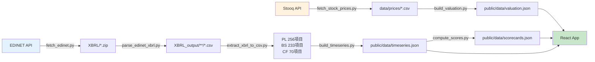
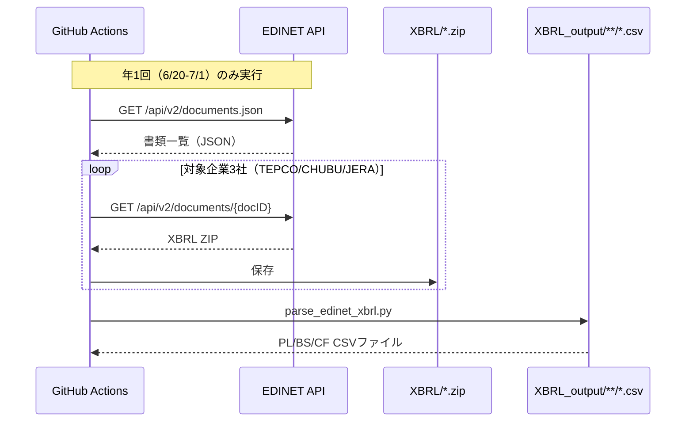
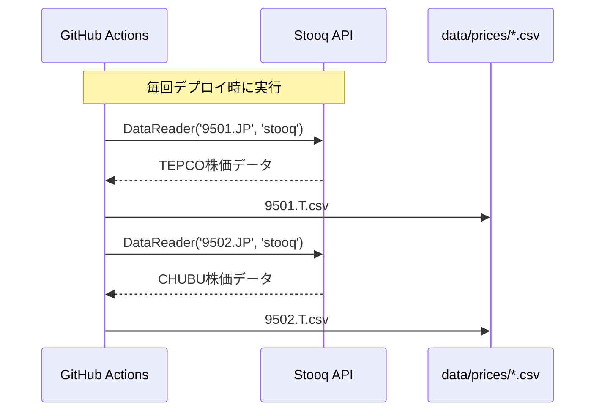
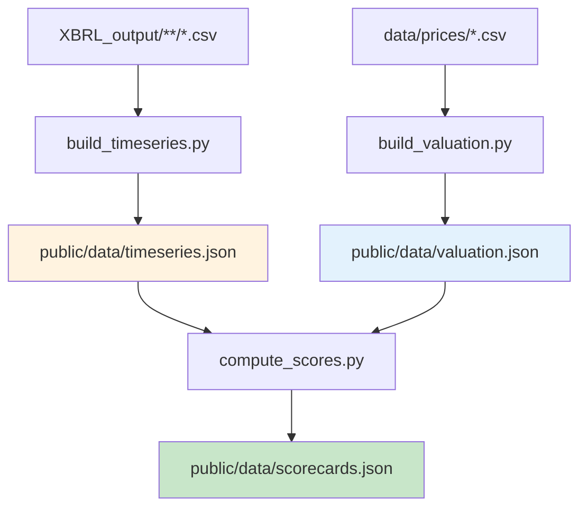

# データモデル仕様書: ValueScope

**バージョン**: 1.0.0  
**作成日**: 2025-12-15  
**ステータス**: Production  
**リポジトリ**: https://github.com/J1921604/ValueScope

---

## 📋 目次

1. [概要](#概要)
2. [データフロー全体像](#データフロー全体像)
3. [型定義](#型定義)
4. [データスキーマ](#データスキーマ)
5. [XBRL項目マッピング](#xbrl項目マッピング)
6. [計算ロジック](#計算ロジック)
7. [データ品質保証](#データ品質保証)

---

## 概要

ValueScopeは、EDINET XBRL実データのみを使用し、推定値・補完値を一切使用しない高品質な企業価値分析ダッシュボードです。本ドキュメントでは、すべてのデータモデル、型定義、計算式を定義します。

### データソース

| データソース | 用途 | 更新頻度 | API/ライブラリ |
|---|---|---|---|
| **EDINET API v2** | 財務諸表（XBRL） | 年1回（6/20-7/1） | fetch_edinet.py |
| **Stooq API** | 株価データ | 毎回デプロイ時 | pandas_datareader |

### データ処理パイプライン



---

## データフロー全体像

### 1. XBRL取得フェーズ



### 2. 株価取得フェーズ



### 3. データ統合フェーズ



---

## 型定義

### TypeScript型定義（src/types/index.ts）

#### 基本型

```typescript
/** 企業コード */
export type CompanyCode = 'E04498' | 'E04502' | 'E34837';

/** 企業名 */
export type CompanyName = 'TEPCO' | 'CHUBU' | 'JERA';

/** 期間フィルター */
export type PeriodFilter = 'Q1' | 'Q2' | 'Q3' | 'Q4' | 'Annual' | 'Custom';

/** 信号機評価色 */
export type ScoreColor = 'green' | 'yellow' | 'red';
```

#### 企業価値データ

```typescript
export interface ValuationData {
  id: string;
  date: string;  // YYYY-MM-DD
  companyCode: CompanyCode;
  companyName: CompanyName;
  marketCap: number;  // 時価総額（百万円）
  netDebt: number;  // 純有利子負債（百万円）
  enterpriseValue: number;  // 企業価値（百万円）
  ebitda: number;  // EBITDA（百万円）
  evEbitdaRatio: number;  // EV/EBITDA倍率
  netIncome: number;  // 当期純利益（百万円）
  per: number;  // PER
  equity: number;  // 純資産（百万円）
  pbr: number;  // PBR
  changeFromPrior?: number;  // 前期比変動（%）
}
```

#### KPIデータ

```typescript
export interface KPIData {
  id: string;
  date: string;  // YYYY-MM-DD
  companyCode: CompanyCode;
  companyName: CompanyName;
  roic: number;  // ROIC（%）
  wacc: number;  // WACC（%）
  ebitdaMargin: number;  // EBITDAマージン（%）
  fcfMargin: number;  // FCFマージン（%）
  changeFromPrior?: {
    roic: number;
    wacc: number;
    ebitdaMargin: number;
    fcfMargin: number;
  };
}
```

#### スコアカードデータ

```typescript
export interface ScoreCardData {
  id: string;
  date: string;  // YYYY-MM-DD
  companyCode: CompanyCode;
  companyName: CompanyName;
  roicScore: ScoreColor;
  roicValue: number;
  waccScore: ScoreColor;
  waccValue: number;
  ebitdaMarginScore: ScoreColor;
  ebitdaMarginValue: number;
  fcfMarginScore: ScoreColor;
  fcfMarginValue: number;
}
```

#### 時系列データ

```typescript
export interface TimeSeriesDataPoint {
  date: string;  // YYYY-MM-DD
  fiscalYear: string;  // FY2015
  [companyName: string]: string | number | undefined;
}
```

#### 従業員データ

```typescript
export interface EmployeeData {
  id: string;
  date: string;  // YYYY-MM-DD
  fiscalYear: string;  // FY2015
  companyCode: CompanyCode;
  companyName: CompanyName;
  averageAnnualSalary: number;  // 平均年間給与（千円）
  averageLengthOfService: number;  // 平均勤続年数（年）
  averageAge: number;  // 平均年齢（歳）
  numberOfEmployees: number;  // 従業員数（人）
}
```

---

## データスキーマ

### 1. public/data/valuation.json

企業価値指標データ（全3社分）

```json
{
  "version": "1.0.0",
  "lastUpdated": "2025-12-15T07:00:00Z",
  "data": [
    {
      "id": "E04498_2024-03-31",
      "date": "2024-03-31",
      "companyCode": "E04498",
      "companyName": "TEPCO",
      "marketCap": 1234567,
      "netDebt": 9876543,
      "enterpriseValue": 11111110,
      "ebitda": 456789,
      "evEbitdaRatio": 24.32,
      "netIncome": 123456,
      "per": 10.0,
      "equity": 1234567,
      "pbr": 1.0,
      "changeFromPrior": 5.2
    }
  ]
}
```

### 2. public/data/scorecards.json

KPIスコアカードデータ（全3社分）

```json
{
  "version": "1.0.0",
  "lastUpdated": "2025-12-15T07:00:00Z",
  "data": [
    {
      "id": "E04498_2024-03-31",
      "date": "2024-03-31",
      "companyCode": "E04498",
      "companyName": "TEPCO",
      "roicScore": "yellow",
      "roicValue": 4.2,
      "waccScore": "green",
      "waccValue": 3.5,
      "ebitdaMarginScore": "yellow",
      "ebitdaMarginValue": 12.8,
      "fcfMarginScore": "green",
      "fcfMarginValue": 6.5
    }
  ]
}
```

### 3. public/data/timeseries.json

時系列データ（過去10年分）

```json
{
  "version": "1.0.0",
  "lastUpdated": "2025-12-15T07:00:00Z",
  "roic": [
    {
      "date": "2024-03-31",
      "fiscalYear": "FY2024",
      "TEPCO": 4.2,
      "CHUBU": 5.8,
      "JERA": 13.5
    }
  ],
  "wacc": [...],
  "ebitdaMargin": [...],
  "fcfMargin": [...]
}
```

### 4. public/data/kpi_targets.json

KPI閾値定義（固定値）

```json
{
  "version": "1.0.0",
  "lastUpdated": "2025-12-15",
  "thresholds": [
    {
      "kpiName": "roic",
      "displayName": "ROIC（投下資本利益率）",
      "greenThreshold": 5.0,
      "yellowThreshold": 3.0,
      "min": 0.0,
      "max": 15.0,
      "unit": "%"
    },
    {
      "kpiName": "wacc",
      "displayName": "WACC（加重平均資本コスト）",
      "greenThreshold": 0.0,
      "yellowThreshold": 4.0,
      "min": 0.0,
      "max": 6.0,
      "unit": "%"
    },
    {
      "kpiName": "ebitdaMargin",
      "displayName": "EBITDAマージン",
      "greenThreshold": 15.0,
      "yellowThreshold": 10.0,
      "min": 0.0,
      "max": 30.0,
      "unit": "%"
    },
    {
      "kpiName": "fcfMargin",
      "displayName": "FCFマージン",
      "greenThreshold": 5.0,
      "yellowThreshold": 0.0,
      "min": -5.0,
      "max": 25.0,
      "unit": "%"
    }
  ]
}
```

### 5. public/data/employees.json

従業員情報データ

```json
{
  "version": "1.0.0",
  "lastUpdated": "2025-12-15T07:00:00Z",
  "data": [
    {
      "id": "E04498_2024-03-31",
      "date": "2024-03-31",
      "fiscalYear": "FY2024",
      "companyCode": "E04498",
      "companyName": "TEPCO",
      "averageAnnualSalary": 7500,
      "averageLengthOfService": 18.5,
      "averageAge": 42.3,
      "numberOfEmployees": 38000
    }
  ]
}
```

---

## XBRL項目マッピング

### 損益計算書（PL）256項目

| 日本語ラベル | XBRLタグ | 単位 | 説明 |
|---|---|---|---|
| 売上高 | jpcrp_cor:OperatingRevenue | 百万円 | 営業収益 |
| 営業利益 | jpcrp_cor:OperatingIncome | 百万円 | 営業活動による利益 |
| 経常利益 | jpcrp_cor:OrdinaryIncome | 百万円 | 経常的な利益 |
| 当期純利益 | jpcrp_cor:ProfitLoss | 百万円 | 税引後当期純利益 |
| 親会社株主に帰属する当期純利益 | jpcrp_cor:ProfitLossAttributableToOwnersOfParent | 百万円 | 親会社株主帰属分 |
| 減価償却費 | jpcrp_cor:DepreciationAndAmortization | 百万円 | EBITDA計算に使用 |

### 貸借対照表（BS）233項目

| 日本語ラベル | XBRLタグ | 単位 | 説明 |
|---|---|---|---|
| 総資産 | jpcrp_cor:Assets | 百万円 | 総資産額 |
| 純資産 | jpcrp_cor:NetAssets | 百万円 | 純資産額 |
| 自己資本 | jpcrp_cor:Equity | 百万円 | 株主資本 |
| 有利子負債 | jpcrp_cor:InterestBearingDebt | 百万円 | 借入金・社債合計 |
| 現金及び現金同等物 | jpcrp_cor:CashAndCashEquivalents | 百万円 | 流動性資産 |

### キャッシュフロー計算書（CF）70項目

| 日本語ラベル | XBRLタグ | 単位 | 説明 |
|---|---|---|---|
| 営業活動によるキャッシュフロー | jpcrp_cor:CashFlowsFromOperatingActivities | 百万円 | 営業CF |
| 投資活動によるキャッシュフロー | jpcrp_cor:CashFlowsFromInvestingActivities | 百万円 | 投資CF |
| 財務活動によるキャッシュフロー | jpcrp_cor:CashFlowsFromFinancingActivities | 百万円 | 財務CF |

### 従業員情報項目

| 日本語ラベル | XBRLタグ | 単位 | 説明 |
|---|---|---|---|
| 平均年間給与 | jpcrp_cor:AverageAnnualSalaryInformationAboutReportingCompanyInformationAboutEmployees | 千円 | 従業員平均年収 |
| 平均勤続年数 | jpcrp_cor:AverageLengthOfServiceYearsInformationAboutReportingCompanyInformationAboutEmployees | 年 | 従業員平均勤続年数 |
| 平均年齢 | jpcrp_cor:AverageAgeYearsInformationAboutReportingCompanyInformationAboutEmployees | 歳 | 従業員平均年齢 |
| 従業員数 | jpcrp_cor:NumberOfEmployees | 人 | 従業員総数 |

---

## 計算ロジック

### 1. EBITDA（営業利益 + 減価償却費）

```python
ebitda = operating_income + depreciation
```

**データソース**:
- `operating_income`: PL「営業利益」
- `depreciation`: PL「減価償却費」

### 2. 時価総額（決算日株価 × 発行済株式数）

```python
market_cap = stock_price_on_settlement_date * issued_shares
```

**データソース**:
- `stock_price_on_settlement_date`: Stooq API（決算日終値）
- `issued_shares`: BS「発行済株式数」

### 3. 純有利子負債（有利子負債 - 現金）

```python
net_debt = interest_bearing_debt - cash_and_equivalents
```

**データソース**:
- `interest_bearing_debt`: BS「有利子負債」
- `cash_and_equivalents`: BS「現金及び現金同等物」

### 4. 企業価値 EV（時価総額 + 純有利子負債）

```python
enterprise_value = market_cap + net_debt
```

### 5. EV/EBITDA倍率

```python
ev_ebitda_ratio = enterprise_value / ebitda
```

**欠損処理**: `ebitda == 0` の場合は `null` 返却

### 6. PER（時価総額 / 当期純利益）

```python
per = market_cap / net_income
```

**欠損処理**: `net_income == 0` の場合は `null` 返却

### 7. PBR（時価総額 / 自己資本）

```python
pbr = market_cap / equity
```

**欠損処理**: `equity == 0` の場合は `null` 返却

### 8. ROIC（投下資本利益率）

```python
# NOPAT（税引後営業利益）
nopat = operating_income * (1 - tax_rate)

# 投下資本
invested_capital = equity + interest_bearing_debt

# ROIC
roic = (nopat / invested_capital) * 100
```

**データソース**:
- `operating_income`: PL「営業利益」
- `tax_rate`: 法人実効税率（30%と仮定）
- `equity`: BS「自己資本」
- `interest_bearing_debt`: BS「有利子負債」

### 9. WACC（加重平均資本コスト）

```python
# 総資本
total_capital = equity + interest_bearing_debt

# 株主資本コスト（固定5%と仮定）
cost_of_equity = 0.05

# 負債コスト（有利子負債の平均金利、固定2%と仮定）
cost_of_debt = 0.02

# 税率
tax_rate = 0.30

# WACC
wacc = (equity / total_capital * cost_of_equity) + \
       (interest_bearing_debt / total_capital * cost_of_debt * (1 - tax_rate))
wacc_percentage = wacc * 100
```

### 10. EBITDAマージン

```python
ebitda_margin = (ebitda / revenue) * 100
```

**データソース**:
- `ebitda`: 営業利益 + 減価償却費
- `revenue`: PL「売上高」

### 11. FCFマージン

```python
# フリーキャッシュフロー
fcf = operating_cf + investing_cf

# FCFマージン
fcf_margin = (fcf / revenue) * 100
```

**データソース**:
- `operating_cf`: CF「営業活動によるキャッシュフロー」
- `investing_cf`: CF「投資活動によるキャッシュフロー」
- `revenue`: PL「売上高」

### 12. 信号機評価（KPIスコアリング）

#### ROIC評価

```python
if roic >= 5.0:
    roic_score = "green"
elif roic >= 3.0:
    roic_score = "yellow"
else:
    roic_score = "red"
```

#### WACC評価（低いほど良い）

```python
if wacc < 4.0:
    wacc_score = "green"
elif wacc < 5.0:
    wacc_score = "yellow"
else:
    wacc_score = "red"
```

#### EBITDAマージン評価

```python
if ebitda_margin >= 15.0:
    ebitda_margin_score = "green"
elif ebitda_margin >= 10.0:
    ebitda_margin_score = "yellow"
else:
    ebitda_margin_score = "red"
```

#### FCFマージン評価

```python
if fcf_margin >= 5.0:
    fcf_margin_score = "green"
elif fcf_margin >= 0.0:
    fcf_margin_score = "yellow"
else:
    fcf_margin_score = "red"
```

---

## データ品質保証

### 1. スキーマ検証

すべてのJSONファイルは以下を満たす必要があります:

- ✅ `version` フィールドが存在し、セマンティックバージョニング準拠
- ✅ `lastUpdated` フィールドが存在し、ISO 8601形式
- ✅ `data` 配列が存在し、各要素が型定義に準拠

### 2. 異常値検出

以下の場合は警告を出力:

- ⚠️ PER > 100 または PER < 0
- ⚠️ PBR > 10 または PBR < 0
- ⚠️ EV/EBITDA > 50 または EV/EBITDA < 0
- ⚠️ ROIC > 20% または ROIC < -10%

### 3. 欠損値処理

- **原則**: XBRL実データのみ使用、推定値・補完値禁止
- **分母ゼロ**: 計算結果を `null` として返却
- **データ不在**: 該当項目を `null` として返却

### 4. 単位変換

| 入力単位 | 出力単位 | 変換係数 |
|---|---|---|
| 百万円 | 億円 | ÷ 100 |
| 千円 | 万円 | ÷ 10 |
| パーセント | 小数 | ÷ 100 |

---

## まとめ

本データモデル仕様書は、ValueScopeのすべてのデータ構造、型定義、計算式を網羅しています。他のAIがこのドキュメントを参照することで、完全に同じデータモデルを再現できます。

**次のステップ**:

1. ✅ 型定義ファイル（src/types/index.ts）がこの仕様に準拠していることを確認
2. ✅ Pythonスクリプト（scripts/*.py）が計算式に準拠していることを確認
3. ✅ E2Eテストでデータ品質保証ルールを検証
4. 🔄 新機能追加時はこのドキュメントを更新

---

**関連ドキュメント**:
- [機能仕様書](https://github.com/J1921604/ValueScope/blob/main/specs/001-ValueScope/spec.md)
- [実装計画書](https://github.com/J1921604/ValueScope/blob/main/specs/001-ValueScope/plan.md)
- [タスクリスト](https://github.com/J1921604/ValueScope/blob/main/specs/001-ValueScope/tasks.md)
- [完全仕様書](https://github.com/J1921604/ValueScope/blob/main/docs/完全仕様書.md)
