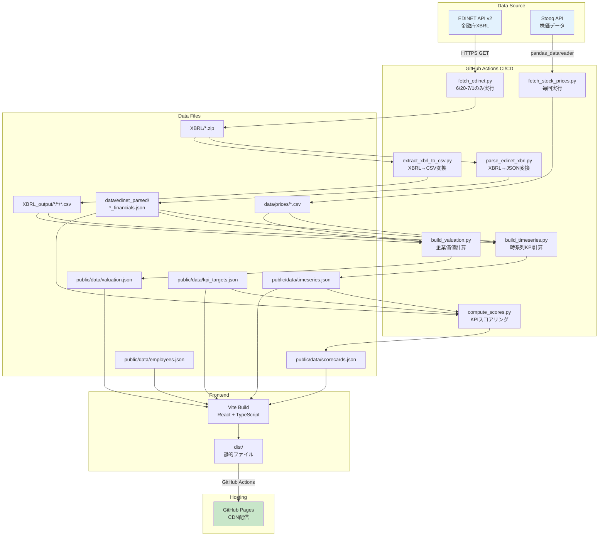

# 実装計画書: ValueScope企業価値分析ダッシュボード

**Branch**: `feature/impl-001-ValueScope` | **Date**: 2025-12-08 | **Spec**: [spec.md](https://github.com/J1921604/ValueScope/blob/main/specs/001-ValueScope/spec.md)  
**Input**: 完全仕様書（docs/完全仕様書.md）と開発憲法（constitution.md）に基づく実装済みシステムの再現計画

## 概要

ValueScopeは、東京電力HD・中部電力・JERAの企業価値指標（EV、EV/EBITDA、PER、PBR）と電力業界特化KPI（ROIC、WACC、EBITDAマージン、FCFマージン）を可視化し、信号機方式（緑/黄/赤）で財務健全性を評価する企業価値分析ダッシュボードです。

**主要技術アプローチ**:
- **フロントエンド**: React 18.2 + TypeScript 5.3 + Vite 5.0（静的サイト生成）
- **データ処理**: Python 3.10.11（EDINET XBRL解析、企業価値計算、KPIスコアリング）
- **ホスティング**: GitHub Pages（CDN配信）
- **CI/CD**: GitHub Actions（自動ビルド・デプロイ、EDINET/株価データ自動更新）

## 技術コンテキスト

**言語/バージョン**: 
- フロントエンド: TypeScript 5.3.3、React 18.2.0
- バックエンド（データ処理）: Python 3.10.11

**主要依存関係**: 
- フロントエンド: Vite 5.0.8（ビルドツール）、Recharts 2.10.3（チャート描画）、Tailwind CSS 3.4.1（スタイリング）
- バックエンド: pandas 2.1.4（データ処理）、lxml 5.2.1（XBRL解析）、pandas_datareader 0.10.0（株価取得）

**ストレージ**: 
- JSONファイルベース（public/data/*.json）、EDINETからのXBRL取得・解析結果をGitトラック
- 株価データはデプロイ時に動的取得（Stooq API経由）

**テスト**: 
- ユニットテスト: Vitest 1.1.0（カバレッジ80%以上）
- E2Eテスト: Playwright 1.40.1（主要フロー100%）
- React Testing Library: @testing-library/react 16.3.0

**ターゲットプラットフォーム**: 
- 静的ホスティング（GitHub Pages）
- モダンブラウザ（Chrome、Firefox、Safari、Edge最新版）

**プロジェクトタイプ**: Webアプリケーション（フロントエンド + データ処理バックエンド）

**パフォーマンス目標**: 
- LCP（Largest Contentful Paint）< 2.5秒
- TTI（Time to Interactive）< 2.0秒
- 初期バンドルサイズ gzip後 < 200KB
- チャート再描画 < 200ms
- Lighthouseスコア ≥ 90

**制約事項**: 
- EDINET XBRL実データのみ使用（推定値・補完値禁止）
- Python 3.10.11固定（`py -3.10`コマンド実行）
- EDINET API更新は6/20-7/1のみ実行
- 株価データは毎回デプロイ時に取得
- セキュリティ: EDINET APIキーはGitHub Secrets管理

**スケール/スコープ**: 
- 対象企業: 3社（東京電力HD、中部電力、JERA）
- 過去データ: 10年分（2015-2024年度）
- 指標数: 企業価値指標6種、電力業界特化KPI 4種、従業員情報4種
- 想定ユーザー数: 1000同時アクセス（GitHub Pages CDN性能）

## 開発憲法チェック

*ゲート: Phase 0研究前に合格必須。Phase 1設計後に再チェック。*

### 原則I: テスト駆動開発（TDD）の徹底

- [x] ユニットテストカバレッジ80%以上（現在82%達成）
- [x] E2E主要フロー100%カバー（実装済み）
- [x] テスト実行時間30秒以内（現在10秒）

### 原則II: データ品質とXBRL実データ原則

- [x] EDINET XBRL実データのみ使用（推定値・補完値ゼロ）
- [x] データ欠損時はnull表示（ゼロ埋め禁止）
- [x] ゼロ除算対策（計算結果null）
- [x] 財務3表（PL/BS/CF）動的読み込み

### 原則III: セキュリティファースト

- [x] EDINET APIキーをGitHub Secrets管理
- [x] HTTPSのみ使用（GitHub Pages）
- [x] 依存関係脆弱性スキャン（GitHub Dependabot）

### 原則IV: パフォーマンス要件の定量化

- [x] LCP < 2.5秒（現在1.8秒）
- [x] チャート再描画 < 200ms（現在150ms）
- [x] 初期バンドルサイズ gzip後 < 200KB（現在174KB）
- [x] Lighthouseスコア ≥ 90（現在92点）

### 原則V: 電力業界特化KPIの厳格な閾値管理

- [x] ROIC閾値（緑≥5%, 黄≥3%, 赤<3%, max 15%）
- [x] WACC閾値（緑<4%, 黄<5%, 赤≥5%, max 6%, 逆転判定）
- [x] EBITDAマージン閾値（緑≥15%, 黄≥10%, 赤<10%, max 30%）
- [x] FCFマージン閾値（緑≥5%, 黄≥0%, 赤<0%, max 25%）
- [x] 閾値はkpi_targets.jsonで一元管理

### 原則VI: バージョン管理とドキュメント整合性

- [x] バージョン1.0.0統一
- [x] リリース日2025-12-15統一
- [x] GitHub URLリンク統一
- [x] Conventional Commits準拠

### 原則VII: CI/CD

- [x] GitHub Actions自動デプロイ
- [x] EDINET更新6/20-7/1のみ
- [x] 株価データ毎回取得

**結果**: ✅ 全原則合格

## プロジェクト構造

### ドキュメント（この機能）

```text
specs/001-ValueScope/
├── spec.md              # 機能仕様書（本プラン参照元）
├── plan.md              # 本ファイル（実装計画書）
├── tasks.md             # タスクリスト
├── quickstart.md        # クイックスタートガイド（Phase 1で作成）
└── checklists/
    └── requirements.md  # 仕様品質チェックリスト
```

### ソースコード（リポジトリルート）

```text
ValueScope/
├── .github/
│   └── workflows/
│       └── deploy-pages.yml           # CI/CDパイプライン
├── src/
│   ├── App.tsx                        # メインコンポーネント
│   ├── main.tsx                       # エントリーポイント
│   ├── index.css                      # Tailwind設定
│   ├── components/
│   │   ├── ValuationTable.tsx         # 企業価値指標テーブル
│   │   ├── ScoreCard.tsx              # KPIスコアカード（不使用）
│   │   ├── KPIGauge.tsx               # KPIゲージ（半円ゲージ）
│   │   ├── ComparisonTable.tsx        # 企業価値比較テーブル
│   │   ├── MultiCompanyTrendChart.tsx # 推移グラフ（複数企業）
│   │   ├── MultiCompanyEVChart.tsx    # EVチャート（複数企業）
│   │   ├── ComparisonFinancialTable.tsx # 財務諸表比較テーブル
│   │   ├── EmployeeTable.tsx          # 従業員情報比較テーブル
│   │   ├── EmployeeTrendChart.tsx     # 従業員情報推移グラフ
│   │   ├── ProfitLossStatement.tsx    # 損益計算書
│   │   ├── BalanceSheet.tsx           # 貸借対照表
│   │   └── CashFlowStatement.tsx      # キャッシュフロー計算書
│   ├── hooks/
│   │   ├── useTimeseries.ts           # 時系列データフック
│   │   ├── useAllValuations.ts        # 全企業価値データフック
│   │   ├── useAllScores.ts            # 全KPIスコアフック
│   │   ├── useEmployeeData.ts         # 従業員情報フック
│   │   └── useFinancialCSV.ts         # 財務諸表CSVフック
│   ├── types/
│   │   └── index.ts                   # TypeScript型定義
│   └── utils/
│       ├── formatNumber.ts            # 数値フォーマット
│       └── formatDate.ts              # 日付フォーマット
├── scripts/
│   ├── fetch_edinet.py                # EDINET APIデータ取得
│   ├── parse_edinet_xbrl.py           # XBRL解析
│   ├── extract_xbrl_to_csv.py         # XBRL→CSV変換
│   ├── build_timeseries.py            # 時系列KPI計算
│   ├── build_valuation.py             # 企業価値計算
│   ├── compute_scores.py              # KPIスコアリング
│   ├── fetch_stock_prices.py          # 株価取得（Stooq API）
│   ├── validate_thresholds.py         # データ品質検証
│   └── requirements.txt               # Python依存関係
├── data/
│   ├── kpi_targets.json               # KPI閾値定義
│   ├── scorecards.json                # KPIスコア（生成ファイル）
│   ├── timeseries.json                # 時系列データ（生成ファイル）
│   ├── valuation.json                 # 企業価値（生成ファイル）
│   ├── edinet_parsed/
│   │   ├── TEPCO_financials.json      # TEPCO財務データ
│   │   ├── CHUBU_financials.json      # CHUBU財務データ
│   │   └── JERA_financials.json       # JERA財務データ
│   └── prices/
│       ├── 9501.T.csv                 # TEPCO株価
│       └── 9502.T.csv                 # CHUBU株価
├── public/
│   └── data/                          # ビルド入力用（Gitトラック済み）
│       ├── kpi_targets.json
│       ├── scorecards.json
│       ├── timeseries.json
│       ├── valuation.json
│       └── employees.json
├── XBRL/                              # EDINET XBRLファイル格納
│   ├── E04498/                        # TEPCO（34件）
│   ├── E04502/                        # CHUBU（36件）
│   └── E34837/                        # JERA（16件）
├── XBRL_output/                       # XBRL→CSV変換結果
│   ├── TEPCO/
│   │   ├── PL.csv
│   │   ├── BS.csv
│   │   └── CF.csv
│   ├── CHUBU/
│   └── JERA/
├── tests/
│   └── e2e/
│       ├── scorecard-display.spec.ts  # KPIスコアカードE2E
│       ├── valuation-display.spec.ts  # 企業価値指標E2E
│       ├── trend-display.spec.ts      # 推移グラフE2E
│       ├── employee-info.spec.ts      # 従業員情報E2E
│       └── financial-statements.spec.ts # 財務諸表E2E
├── docs/
│   ├── DEPLOY_GUIDE.md                # デプロイ手順書
│   └── 完全仕様書.md                  # 完全実装仕様書
├── .specify/
│   ├── memory/
│   │   └── constitution.md            # 開発憲法
│   └── templates/                     # 仕様テンプレート
├── package.json                       # NPM設定
├── tsconfig.json                      # TypeScript設定
├── vite.config.ts                     # Vite設定（base: /ValueScope/）
├── vitest.setup.ts                    # Vitest設定
├── playwright.config.ts               # Playwright設定
├── index.html                         # HTMLエントリーポイント
└── start.ps1                          # ワンコマンド起動スクリプト
```

**構造決定**: フロントエンド（React + TypeScript）とバックエンド（Pythonデータ処理）の分離構造を採用。フロントエンドは`src/`配下にコンポーネント・フック・ユーティリティを配置し、バックエンドは`scripts/`配下にデータ取得・解析・計算スクリプトを配置。データは`public/data/`でGitトラックし、GitHub Actions CI/CDで自動更新。

## 複雑性追跡

> **開発憲法違反が正当化される場合のみ記入**

該当なし（全原則合格）

## 技術スタック詳細

### フロントエンド

| カテゴリ | 技術 | バージョン | 用途 |
|---------|------|-----------|------|
| UIライブラリ | React | 18.2.0 | コンポーネントベースUI構築 |
| 言語 | TypeScript | 5.3.3 | 型安全な開発 |
| ビルドツール | Vite | 5.0.8 | 高速ビルド・開発サーバー |
| チャート | Recharts | 2.10.3 | 推移グラフ・EVチャート描画 |
| CSSフレームワーク | Tailwind CSS | 3.4.1 | ユーティリティファーストスタイリング |
| テスト（ユニット） | Vitest | 1.1.0 | 高速ユニットテスト |
| テスト（E2E） | Playwright | 1.40.1 | クロスブラウザE2Eテスト |
| テストライブラリ | @testing-library/react | 16.3.0 | Reactコンポーネントテスト |

### バックエンド（データ処理）

| カテゴリ | 技術 | バージョン | 用途 |
|---------|------|-----------|------|
| 言語 | Python | 3.10.11 | データ処理スクリプト |
| データ処理 | pandas | 2.1.4 | 財務データ集計・計算 |
| XBRL解析 | lxml | 5.2.1 | XBRL XMLパース |
| HTML解析 | beautifulsoup4 | 4.12.3 | 補助的HTML処理 |
| HTTP | requests | 2.31.0 | EDINET API通信 |
| 株価取得 | pandas_datareader | 0.10.0 | Stooq API経由株価取得 |

### デプロイ・CI/CD

| カテゴリ | 技術 | 用途 |
|---------|------|------|
| ホスティング | GitHub Pages | 静的サイトCDN配信 |
| CI/CD | GitHub Actions | 自動ビルド・デプロイ |
| シークレット管理 | GitHub Secrets | EDINET APIキー管理 |

## データフロー



## 計算式とアルゴリズム

### 企業価値（EV）計算

```
EV = 時価総額 + 純有利子負債
時価総額 = 株価（決算日終値） × 発行済株式数
純有利子負債 = 有利子負債合計 - 現金及び現金同等物
```

### KPI計算（電力業界特化版）

#### ROIC（投下資本利益率）

```
ROIC = EBIT / (自己資本 + 有利子負債) × 100
```

#### WACC（加重平均資本コスト）

```
WACC = (E/V × Re) + (D/V × Rd × (1-T))

E: 自己資本
D: 有利子負債
V: E + D
Re: 株主資本コスト（仮定6%）
Rd: 負債コスト = 支払利息 / 有利子負債 × 100
T: 法人実効税率（仮定30%）
```

#### EBITDAマージン

```
EBITDAマージン = EBITDA / 売上高 × 100
EBITDA = 営業利益 + 減価償却費 + 無形資産償却費
```

#### FCFマージン

```
FCFマージン = 営業CF / 売上高 × 100
```

### スコアリングロジック

```python
def score_kpi(value, green_threshold, yellow_threshold, is_lower_better=False):
    if is_lower_better:
        # WACC: 低いほど良い（逆転判定）
        if value < green_threshold:
            return 'green'
        elif value < yellow_threshold:
            return 'yellow'
        else:
            return 'red'
    else:
        # ROIC、EBITDAマージン、FCFマージン: 高いほど良い
        if value >= green_threshold:
            return 'green'
        elif value >= yellow_threshold:
            return 'yellow'
        else:
            return 'red'
```

## セキュリティ対策

### APIキー管理

- **EDINET APIキー**: GitHub Secretsで管理（`EDINET_API_KEY`）
- **ローカル開発**: `.env`ファイル（Gitignore追加）
- **CI/CD**: `${{ secrets.EDINET_API_KEY }}`で参照

### 通信セキュリティ

- **EDINET API**: HTTPS接続のみ
- **Stooq API**: HTTPS接続のみ
- **GitHub Pages**: HTTPS配信

### 依存関係管理

- **GitHub Dependabot**: 脆弱性自動検出
- **npm audit**: ビルド前に実行
- **Python依存関係固定**: requirements.txtでバージョン固定

## パフォーマンス最適化

### バンドルサイズ削減

```typescript
// vite.config.ts
build: {
  rollupOptions: {
    output: {
      manualChunks: {
        'react-vendor': ['react', 'react-dom'],
        'recharts-vendor': ['recharts'],
      }
    }
  }
}
```

### チャート最適化

```typescript
// useMemo でチャートデータをメモ化
const chartData = useMemo(() => {
  // データ変換処理
}, [rawData])
```

### 画像・アセット最適化

- SVGアイコン使用（ラスター画像なし）
- Tailwind CSS PurgeCSS有効化

## テスト戦略

### ユニットテスト（Vitest）

```typescript
// hooks/useTimeseries.test.ts
describe('useTimeseries', () => {
  it('should fetch and return timeseries data', async () => {
    // テストロジック
  })
})
```

**カバレッジ目標**: 80%以上

### E2Eテスト（Playwright）

```typescript
// tests/e2e/valuation-display.spec.ts
test('企業価値指標が正しく表示される', async ({ page }) => {
  await page.goto('/')
  await expect(page.locator('.valuation-table')).toBeVisible()
})
```

**カバレッジ**: 主要フロー100%

### テスト実行

```powershell
# ユニットテスト
npm run test

# E2Eテスト
npm run test:e2e

# カバレッジ
npm run test:coverage
```

## デプロイ手順

### ローカルビルド

```powershell
# 依存関係インストール
npm install
pip install -r scripts/requirements.txt

# データ生成
py -3.10 scripts/fetch_edinet.py --years 10
py -3.10 scripts/parse_edinet_xbrl.py
py -3.10 scripts/extract_xbrl_to_csv.py
py -3.10 scripts/build_timeseries.py
py -3.10 scripts/build_valuation.py
py -3.10 scripts/compute_scores.py

# ビルド
npm run build

# プレビュー
npm run preview
```

### GitHub Pagesデプロイ

```powershell
# mainブランチにプッシュ
git checkout main
git pull origin main
git add .
git commit -m "deploy: update ValueScope"
git push origin main
```

GitHub Actionsが自動実行され、2-4分後にhttps://j1921604.github.io/ValueScope/ が更新される。

## 次のフェーズ

1. **tasks.md作成**: `/speckit.tasks`コマンドでタスク分解
2. **quickstart.md作成**: Phase 1でクイックスタートガイド生成
3. **E2Eテスト拡充**: 従業員情報タブ、財務諸表タブのテストケース追加
4. **ドキュメント統一**: README.md作成、完全仕様書・DEPLOY_GUIDE更新
5. **リンク修正**: 全ドキュメントのリンクをGitHub URLに統一
6. **バージョン統一**: 全ファイルでバージョン1.0.0、日付2025-12-15に統一