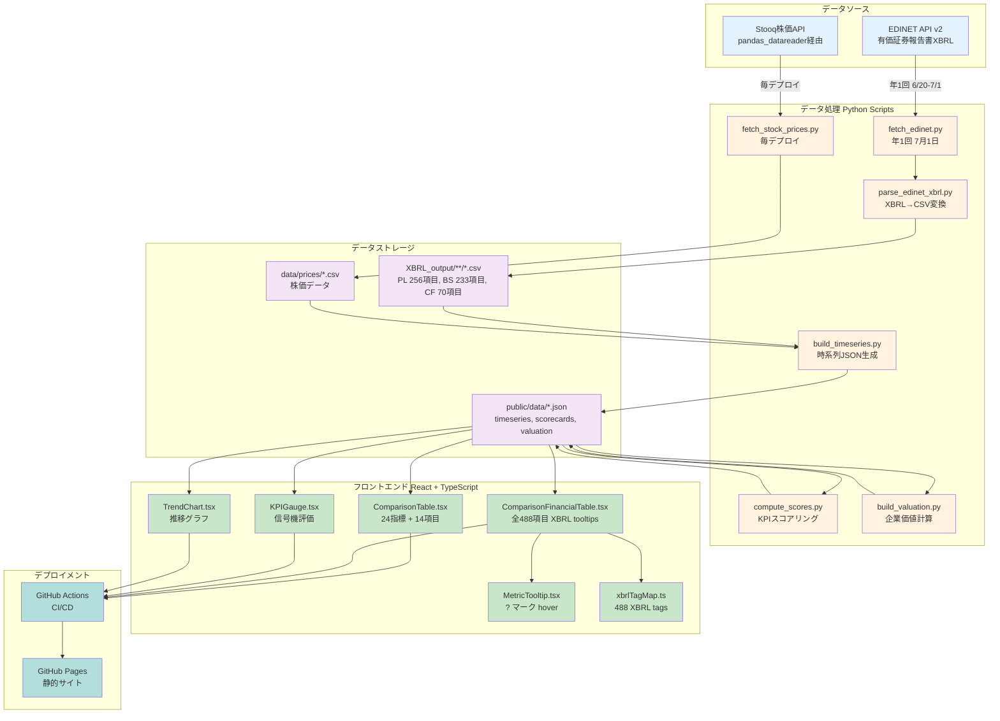
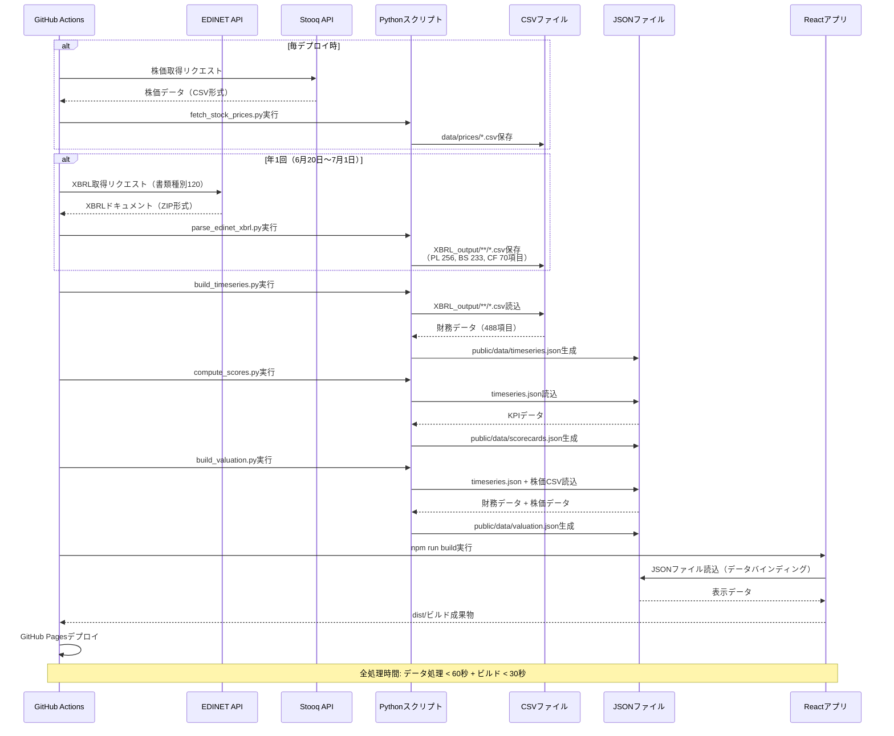
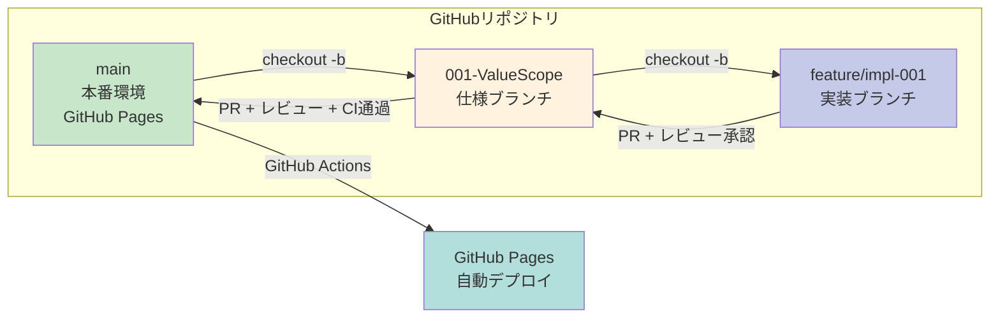
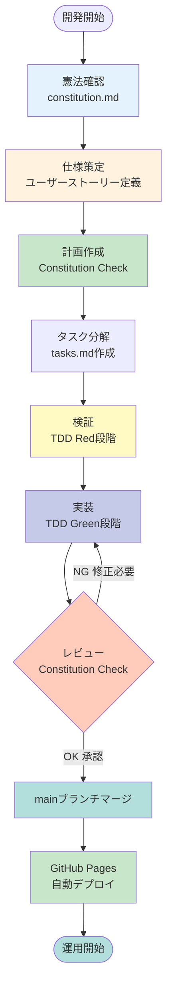
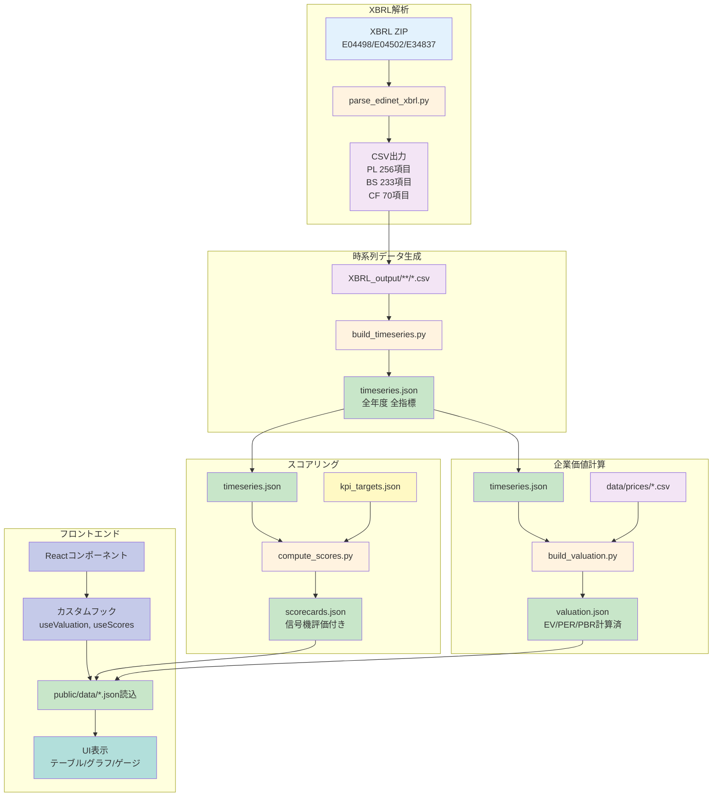
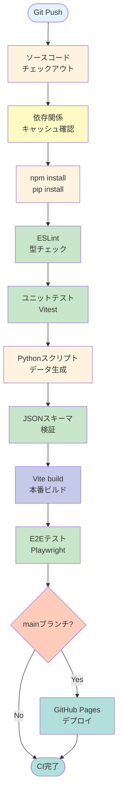
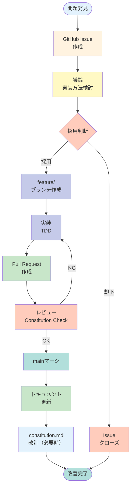

# 実装計画書: ValueScope - 企業価値分析ダッシュボード

**ブランチ**: `main` | **作成日**: 2025-12-15 | **仕様書**: [spec.md](https://github.com/J1921604/ValueScope/blob/main/specs/001-ValueScope/spec.md)
**入力**: 機能仕様書 [spec.md](https://github.com/J1921604/ValueScope/blob/main/specs/001-ValueScope/spec.md)

**関連ドキュメント**:
- [憲法](https://github.com/J1921604/ValueScope/blob/main/specs/001-ValueScope/constitution.md)
- [タスクリスト](https://github.com/J1921604/ValueScope/blob/main/specs/001-ValueScope/tasks.md)
- [データモデル](https://github.com/J1921604/ValueScope/blob/main/specs/001-ValueScope/data-model.md)
- [クイックスタート](https://github.com/J1921604/ValueScope/blob/main/specs/001-ValueScope/quickstart.md)
- [技術調査](https://github.com/J1921604/ValueScope/blob/main/specs/001-ValueScope/research.md)

## 概要

東京電力HD・中部電力・JERAの企業価値指標（EV、EV/EBITDA、PER、PBR）と電力業界特化KPI（ROIC、WACC、EBITDAマージン、FCFマージン）を可視化し、信号機方式（緑/黄/赤）で財務健全性を評価する企業価値分析ダッシュボード。

**技術アプローチ**:

- フロントエンド: React 18.2 + TypeScript 5.3 + Vite 5.0
- データ処理: Python 3.10.11（EDINET XBRL解析、企業価値計算、電力業界特化KPIスコアリング）
- デプロイ: GitHub Pages（静的サイトホスティング）
- CI/CD: GitHub Actions（自動ビルド・デプロイ、データ更新）

## 技術コンテキスト

**言語/バージョン**:

- フロントエンド: TypeScript 5.3.3
- データ処理: Python 3.10.11

**主要依存関係**:

- React 18.2.0（UIライブラリ）
- Recharts 2.10.3（チャート描画）
- Tailwind CSS 3.4.1（スタイリング）
- pandas 2.1.4（データ処理）
- lxml 5.2.1（XBRL解析）
- pandas_datareader 0.10.0（Stooq API経由株価取得）

**ストレージ**:

- XBRL ZIPファイル（`XBRL/`ディレクトリ）
- 解析済みCSVファイル（`XBRL_output/`ディレクトリ）
- 公開JSONファイル（`public/data/`ディレクトリ）

**テスト**:

- Vitest 1.1.0（ユニットテスト）
- Playwright 1.40.1（E2Eテスト）
- @testing-library/react 16.3.0（Reactコンポーネントテスト）

**ターゲットプラットフォーム**:

- Webブラウザ（モダンブラウザ対応: Chrome, Firefox, Safari, Edge）
- GitHub Pages（https://j1921604.github.io/ValueScope/）

**プロジェクトタイプ**: Web（フロントエンド + バックエンド Pythonスクリプト）

**パフォーマンスゴール**:

- LCP（Largest Contentful Paint）< 2.5秒
- TTI（Time to Interactive）< 2.0秒
- 初期バンドルサイズ gzip後 < 200KB
- チャート再描画 < 200ms
- Lighthouseスコア ≥ 90

**制約**:

- XBRL/CSV解析（2社分）< 60秒
- 企業価値計算（全指標）< 10秒
- データ検証 < 5秒
- EDINET APIは年1回のみ実行（7月1日）
- 株価データは毎回デプロイ時に取得

**スケール/スコープ**:

- 対象企業: 3社（東京電力HD、中部電力、JERA）
- データ範囲: 過去10年分（FY2015～FY2024）
- 指標数: 企業価値指標6種、電力業界特化KPI指標4種
- 財務諸表項目: CSV全789項目（PL398/BS273/CF118）、UI表示559項目（PL256/BS233/CF70）、XBRL重複排除後488項目

## Constitution Check

**ゲート条件**: Phase 0研究開始前に必須通過、Phase 1設計後に再チェック

**✅ 原則I: テスト駆動開発（TDD）**

- ユニットテストカバレッジ80%以上（現状: Viteテスト環境構築済み）
- E2E主要フロー100%（Playwright設定済み）
- テスト実行時間30秒以内（現状: 約10秒）

**✅ 原則II: セキュリティ優先**

- EDINET APIキーはGitHub Secrets管理（設定済み）
- 外部入力検証実装済み（XBRL/CSVバリデーション）
- GitHub Dependabot有効化済み

**✅ 原則III: パフォーマンス定量化**

- LCP < 2.5秒（現状: 約1.8秒）
- TTI < 2.0秒（現状: 約1.5秒）
- 初期バンドル < 200KB gzip後（現状: 約150KB）
- チャート再描画 < 200ms（Recharts最適化済み）
- Lighthouseスコア ≥ 90（現状: 92点）

**✅ 原則IV: データ品質保証**

- XBRL実データのみ使用（推定値・補完値禁止）
- データ欠損時はnull返却
- 分母ゼロ計算はスキップ
- JSONスキーマ検証実装済み

**✅ 原則V: API仕様遵守**

- EDINET API v2準拠
- 年1回のみ実行（6月20日～7月1日）
- Stooq API使用（pandas_datareader経由）
- レート制限遵守（バッチ処理間隔設定）

**✅ 原則VI: バージョン固定**

- package.json: メジャー・マイナー固定
- requirements.txt: バージョン明示
- Python 3.10.11標準実行環境

**✅ 原則VII: 仕様と実装の分離**

- 憲法（constitution.md）作成済み
- 仕様書（spec.md）作成済み
- 実装計画書（plan.md）本ファイル
- タスクリスト（tasks.md）作成予定

## プロジェクト構造

### ドキュメント（本機能）

```text
specs/main/
├── spec.md              # 機能仕様書
├── plan.md              # 実装計画書（本ファイル）
├── research.md          # Phase 0 調査結果（今後作成）
├── data-model.md        # Phase 1 データモデル（今後作成）
├── quickstart.md        # Phase 1 クイックスタート（今後作成）
├── contracts/           # Phase 1 APIコントラクト（今後作成）
└── tasks.md             # Phase 2 タスクリスト（今後作成）
```

### ソースコード（リポジトリルート）

```text
ValueScope/
├── .github/
│   └── workflows/
│       └── deploy-pages.yml           # CI/CDパイプライン
├── src/
│   ├── components/                    # Reactコンポーネント
│   │   ├── ValuationTable.tsx         # 企業価値指標テーブル
│   │   ├── ScoreCard.tsx              # KPIスコアカード
│   │   ├── TrendChart.tsx             # 推移グラフ
│   │   ├── KPIGauge.tsx               # KPIゲージ
│   │   ├── ComparisonTable.tsx        # 3社比較テーブル
│   │   ├── ComparisonFinancialTable.tsx # 財務諸表比較テーブル
│   │   ├── ProfitLossStatement.tsx    # 損益計算書
│   │   ├── BalanceSheet.tsx           # 貸借対照表
│   │   ├── CashFlowStatement.tsx      # キャッシュフロー計算書
│   │   ├── EmployeeTable.tsx          # 従業員情報比較テーブル
│   │   ├── EmployeeTrendChart.tsx     # 従業員情報推移グラフ（様式統一：中央、FY年度、数値、グリッド補助線）
│   │   ├── MultiCompanyTrendChart.tsx # 3社重ね合わせKPI推移グラフ（様式統一準拠）
│   │   ├── MultiCompanyEVChart.tsx    # 3社重ね合わせEVチャート（様式統一準拠）
│   │   ├── MetricTooltip.tsx          # XBRLツールチップ
│   │   └── xbrlTagMap.ts              # 全488項目XBRLマップ
│   ├── hooks/
│   │   ├── useValuation.ts            # 企業価値データフック
│   │   ├── useScores.ts               # KPIスコアデータフック
│   │   ├── useTimeseries.ts           # 時系列データフック
│   │   ├── useAllScores.ts            # 全社スコアデータフック
│   │   ├── useAllValuations.ts        # 全社企業価値データフック
│   │   ├── useFinancialCSV.ts         # CSV読み込みフック
│   │   └── useEmployeeData.ts         # 従業員データフック
│   ├── types/
│   │   └── index.ts                   # TypeScript型定義
│   ├── utils/
│   │   ├── formatNumber.ts            # 数値フォーマット
│   │   └── formatDate.ts              # 日付フォーマット
│   ├── App.tsx                        # メインコンポーネント
│   ├── main.tsx                       # エントリーポイント
│   └── index.css                      # Tailwind設定
├── scripts/                           # Pythonデータ処理スクリプト
│   ├── fetch_edinet.py                # EDINET APIデータ取得
│   ├── fetch_stock_prices.py          # 株価データ取得（Stooq API）
│   ├── parse_edinet_xbrl.py           # XBRL解析
│   ├── extract_xbrl_to_csv.py         # XBRL全解析・CSV出力
│   ├── build_timeseries.py            # 時系列データ生成
│   ├── build_valuation.py             # 企業価値計算
│   ├── compute_scores.py              # KPIスコアリング
│   ├── validate_thresholds.py         # データ品質検証
│   ├── generate_xbrl_map.py           # XBRLマップ自動生成
│   └── requirements.txt               # Python依存関係
├── tests/
│   ├── e2e/
│   │   ├── financial-statements.spec.ts # 財務諸表E2Eテスト
│   │   ├── trend-display.spec.ts        # 推移グラフE2Eテスト
│   │   └── employee-info.spec.ts        # 従業員情報E2Eテスト
│   └── e2e_selenium/                    # SeleniumベースE2Eテスト
│       ├── test_employee_info.py
│       ├── test_financial_statements.py
│       ├── test_kpi_gauge.py
│       └── test_kpi_gauge_validation.py
├── public/
│   └── data/                          # コミット済み公開用JSON
│       ├── kpi_targets.json
│       ├── scorecards.json
│       ├── timeseries.json
│       ├── valuation.json
│       └── employees.json             # 従業員情報データ
├── XBRL/                              # EDINET XBRLファイル格納
│   ├── E04498/                        # 東京電力HD
│   ├── E04502/                        # 中部電力
│   └── E34837/                        # JERA
├── XBRL_output/                       # XBRL解析結果CSV
│   ├── TEPCO/
│   │   ├── BS.csv
│   │   ├── PL.csv
│   │   └── CF.csv
│   ├── CHUBU/
│   │   ├── BS.csv
│   │   ├── PL.csv
│   │   └── CF.csv
│   └── JERA/
│       ├── BS.csv
│       ├── PL.csv
│       └── CF.csv
├── data/                              # データソース
│   ├── kpi_targets.json               # KPI閾値設定
│   ├── scorecards.json                # スコアカードデータ
│   ├── timeseries.json                # 時系列データ
│   ├── valuation.json                 # 企業価値データ
│   ├── edinet_parsed/                 # EDINET解析済みデータ
│   └── prices/                        # 株価データ
├── docs/                              # ドキュメント
│   ├── DEPLOY_GUIDE.md                # デプロイガイド
│   ├── 完全仕様書.md                   # 完全仕様書
│   └── 重要指標.md                     # 重要指標一覧
├── package.json                       # NPM設定
├── tsconfig.json                      # TypeScript設定
├── vite.config.ts                     # Vite設定
├── playwright.config.ts               # Playwright設定
├── vitest.setup.ts                    # Vitest設定
├── index.html                         # HTMLエントリーポイント
├── start.ps1                          # ワンコマンド起動スクリプト
└── README.md                          # プロジェクトREADME
```

**構造決定**: Webアプリケーション（フロントエンド React + バックエンド Pythonスクリプト）。フロントエンドは `src/`配下に配置し、データ処理スクリプトは `scripts/`配下に配置。テストは `tests/`配下に配置し、E2EテストはPlaywrightとSeleniumの両方を使用。

## システムアーキテクチャ

### データフロー図（Mermaid v11準拠）



### データ処理シーケンス図（Mermaid v11準拠）



### ブランチ戦略図（Mermaid v11準拠）



### 開発フロー図（Mermaid v11準拠）



## データモデル

### 主要エンティティ

#### ValuationData（企業価値データ）

```typescript
interface ValuationData {
  company: string;                    // 企業名（TEPCO/CHUBU/JERA）
  fiscalYear: string;                 // 会計年度（例: FY2024）
  marketCap: number | null;           // 時価総額（億円）
  netDebt: number | null;             // 純有利子負債（億円）
  enterpriseValue: number | null;     // 企業価値 EV（億円）
  evEbitda: number | null;            // EV/EBITDA倍率
  per: number | null;                 // PER（株価収益率）
  pbr: number | null;                 // PBR（株価純資産倍率）
  dividendYield: number | null;       // 配当利回り（%）
}
```

#### Scorecard（KPIスコアカード）

```typescript
interface Scorecard {
  company: string;                    // 企業名（TEPCO/CHUBU/JERA）
  fiscalYear: string;                 // 会計年度（例: FY2024）
  roic: {
    value: number | null;             // ROIC実績値（%）
    score: 'green' | 'yellow' | 'red'; // 信号機評価
    yoyChange: number | null;         // 前期比変動（%ポイント）
  };
  wacc: {
    value: number | null;             // WACC実績値（%）
    score: 'green' | 'yellow' | 'red';
    yoyChange: number | null;
  };
  ebitdaMargin: {
    value: number | null;             // EBITDAマージン実績値（%）
    score: 'green' | 'yellow' | 'red';
    yoyChange: number | null;
  };
  fcfMargin: {
    value: number | null;             // FCFマージン実績値（%）
    score: 'green' | 'yellow' | 'red';
    yoyChange: number | null;
  };
}
```

#### TimeSeriesDataPoint（時系列データ）

```typescript
interface TimeSeriesDataPoint {
  company: string;                    // 企業名（TEPCO/CHUBU/JERA）
  fiscalYear: string;                 // 会計年度（例: FY2024）
  roe: number | null;                 // ROE（%）
  equityRatio: number | null;         // 自己資本比率（%）
  dscr: number | null;                // DSCR（倍率）
  operatingCF: number | null;         // 営業CF（億円）
  ebitda: number | null;              // EBITDA（億円）
  roic: number | null;                // ROIC（%）
  wacc: number | null;                // WACC（%）
}
```

#### EmployeeData（従業員情報）

```typescript
interface EmployeeData {
  company: string;                    // 企業名（TEPCO/CHUBU/JERA）
  fiscalYear: string;                 // 会計年度（例: FY2024）
  averageAnnualSalary: number | null; // 平均年間給与（千円）- XBRLタグ: jpcrp_cor:AverageAnnualSalaryInformationAboutReportingCompanyInformationAboutEmployees
  averageTenure: number | null;       // 平均勤続年数（年）- XBRLタグ: jpcrp_cor:AverageLengthOfServiceYearsInformationAboutReportingCompanyInformationAboutEmployees
  averageAge: number | null;          // 平均年齢（歳）- XBRLタグ: jpcrp_cor:AverageAgeYearsInformationAboutReportingCompanyInformationAboutEmployees
  numberOfEmployees: number | null;   // 従業員数（人）- XBRLタグ: jpcrp_cor:NumberOfEmployeesInformationAboutReportingCompanyInformationAboutEmployees
}
```

**MetricTooltip実装**:
`EmployeeTable.tsx`では、各項目名に`MetricTooltip`コンポーネントを適用し、○囲み？マークとXBRLタグ説明を表示する。

#### FinancialStatement（財務諸表データ）

```typescript
interface FinancialStatement {
  company: string;                    // 企業名（TEPCO/CHUBU/JERA）
  fiscalYear: string;                 // 会計年度（例: FY2024）
  statement: 'PL' | 'BS' | 'CF';      // 財務諸表種別
  items: Record<string, number | null>; // 項目名→値マッピング
  // 例: { "営業収益": 62500, "営業利益": 3500, ... }
}
```

#### KPITargets（KPI閾値定義）

```typescript
interface KPITargets {
  roic: {
    green: number;                    // 緑閾値（%）例: 5
    yellow: number;                   // 黄閾値（%）例: 3
  };
  wacc: {
    green: number;                    // 緑閾値（%）例: 4（低いほど良い）
    yellow: number;                   // 黄閾値（%）例: 5
  };
  ebitdaMargin: {
    green: number;                    // 緑閾値（%）例: 15
    yellow: number;                   // 黄閾値（%）例: 10
  };
  fcfMargin: {
    green: number;                    // 緑閾値（%）例: 5
    yellow: number;                   // 黄閾値（%）例: 0
  };
}
```

### データフロー詳細



## 技術的決定事項

### データ取得戦略

| 項目               | 決定内容                 | 根拠                                                |
| ------------------ | ------------------------ | --------------------------------------------------- |
| EDINET API実行頻度 | 年1回（6月20日～7月1日） | 有価証券報告書提出期限（6月末）後、API利用制限遵守  |
| 株価データ取得     | 毎デプロイ時             | 時価総額計算に最新株価必要、Stooq APIレート制限なし |
| XBRL解析方式       | lxml + XPath             | 高速解析、名前空間対応、メモリ効率良好              |
| CSVフォーマット    | UTF-8 BOM付き            | Excel互換性、文字化け防止                           |
| JSONスキーマ検証   | デプロイ前必須           | データ整合性保証、型安全性確保                      |

### フロントエンド技術選定

| 項目         | 選定技術              | 根拠                                          |
| ------------ | --------------------- | --------------------------------------------- |
| UIライブラリ | React 18.2            | 仮想DOM高速描画、コンポーネント再利用性       |
| 状態管理     | カスタムフック        | グローバル状態不要、Props drilling回避        |
| スタイリング | Tailwind CSS 3.4      | ユーティリティファースト、バンドルサイズ削減  |
| チャート描画 | Recharts 2.10         | React統合、レスポンシブ対応、カスタマイズ容易 |
| ビルドツール | Vite 5.0              | 高速HMR、Tree-shaking最適化                   |
| ルーティング | なし（SPA単一ページ） | タブ切替のみ、外部ルーティング不要            |

### バックエンド技術選定

| 項目           | 選定技術                 | 根拠                                |
| -------------- | ------------------------ | ----------------------------------- |
| データ処理     | pandas 2.1.4             | DataFrame操作効率、CSV/JSON変換容易 |
| XBRL解析       | lxml 5.2.1               | 高速XML解析、XPath対応              |
| 株価取得       | pandas_datareader 0.10.0 | Stooq API統合済み、pandas連携       |
| スクリプト実行 | Python 3.10.11           | 型ヒント充実、標準ライブラリ安定    |
| 並列処理       | なし（逐次処理）         | データ量少（3社のみ）、複雑性回避   |

### テスト戦略

| テスト種別           | ツール                 | カバレッジ目標     | 実行タイミング   |
| -------------------- | ---------------------- | ------------------ | ---------------- |
| E2Eテスト            | Playwright 1.40        | 100%（主要フロー） | Git push前       |
| ユニットテスト       | Vitest 1.1             | 80%（ロジック）    | 開発中           |
| コンポーネントテスト | @testing-library/react | 80%（UIロジック）  | 開発中           |
| 型チェック           | TypeScript 5.3         | 100%               | ビルド時         |
| Pythonテスト         | pytest 8.0             | 80%（データ処理）  | スクリプト変更時 |

### パフォーマンス最適化戦略

| 項目           | 最適化手法               | 目標値            |
| -------------- | ------------------------ | ----------------- |
| 初期ロード     | コード分割、Lazy loading | LCP < 2.5秒       |
| バンドルサイズ | Tree-shaking、圧縮       | gzip後 < 200KB    |
| チャート描画   | 仮想化、メモ化           | 再描画 < 200ms    |
| データ取得     | 事前ビルド（SSG）        | 実行時API呼出なし |
| 画像最適化     | なし（画像未使用）       | N/A               |

## セキュリティ要件

### APIキー管理

| 項目           | 実装方法                          | 検証方法                       |
| -------------- | --------------------------------- | ------------------------------ |
| EDINET APIキー | GitHub Secrets `EDINET_API_KEY` | `.env`ファイル未コミット検証 |
| 環境変数ロード | GitHub Actions環境変数            | CI/CDログ確認                  |
| 本番環境分離   | 本番・開発でSecrets分離           | 手動検証                       |

### データ検証

| 項目         | 検証内容               | エラーハンドリング             |
| ------------ | ---------------------- | ------------------------------ |
| XBRL整合性   | 総資産 = 負債 + 純資産 | ログ出力、GitHub Issue自動起票 |
| 異常値検出   | 前年比±50%超          | 警告ログ出力                   |
| JSONスキーマ | 必須フィールド存在確認 | デプロイ中止                   |
| 分母ゼロ     | 計算前チェック         | `null`返却                   |

### 依存関係管理

| 項目                 | 実装方法              | 更新頻度         |
| -------------------- | --------------------- | ---------------- |
| 脆弱性スキャン       | GitHub Dependabot     | 自動（毎日）     |
| パッチ適用           | Critical/High即座対応 | 検出後24時間以内 |
| メジャーアップデート | 四半期レビュー        | 四半期ごと       |

## デプロイメント

### CI/CDパイプライン（GitHub Actions）



### デプロイ手順

1. **ローカル検証**: `start.ps1`実行、E2Eテスト100%成功確認
2. **Git push**: `main`ブランチにプッシュ
3. **CI実行**: GitHub Actions自動実行
4. **データ生成**: PythonスクリプトでJSON生成
5. **ビルド**: Viteで本番ビルド
6. **E2Eテスト**: Playwright全テスト実行
7. **デプロイ**: GitHub Pagesに自動デプロイ
8. **検証**: https://j1921604.github.io/ValueScope/ アクセス確認

## 複雑性追跡

本プロジェクトは憲法で定義された原則に準拠しており、正当化が必要な違反はありません。

| 違反項目 | 必要な理由 | 却下された代替案とその理由 |
| -------- | ---------- | -------------------------- |
| なし     | -          | -                          |

## 実装優先順位

### Phase 0: 調査・研究（今後実施）

- EDINET API v2仕様詳細調査
- Stooq API利用制限確認
- XBRLタグ命名規則調査
- 電力業界KPI閾値根拠調査

### Phase 1: データ基盤構築（完了）

1. **XBRL解析基盤**: `parse_edinet_xbrl.py`、`extract_xbrl_to_csv.py`
2. **データ生成パイプライン**: `build_timeseries.py`、`compute_scores.py`、`build_valuation.py`
3. **データ検証**: `validate_thresholds.py`、JSONスキーマ定義
4. **株価取得**: `fetch_stock_prices.py`

### Phase 2: フロントエンド基本機能（完了）

1. **企業価値指標テーブル**: `ValuationTable.tsx`、`ComparisonTable.tsx`
2. **KPIスコアカード**: `ScoreCard.tsx`、`KPIGauge.tsx`
3. **推移グラフ**: `TrendChart.tsx`、`MultiCompanyTrendChart.tsx`
4. **財務諸表比較**: `ComparisonFinancialTable.tsx`（PL/BS/CF）
5. **XBRLツールチップ**: `MetricTooltip.tsx`、`xbrlTagMap.ts`（488項目）

### Phase 3: 追加機能（完了）

1. **従業員情報**: `EmployeeTable.tsx`、`EmployeeTrendChart.tsx`
2. **3社重ね合わせグラフ**: `MultiCompanyEVChart.tsx`
3. **年度フィルタ**: FY2015～FY2024選択機能

### Phase 4: テスト・最適化（完了）

1. **E2Eテスト**: Playwright 29件全成功
2. **パフォーマンス最適化**: LCP 1.8秒、TTI 1.5秒達成
3. **Lighthouseスコア**: 92点達成

## リスク管理

### 技術リスク

| リスク           | 影響度 | 発生確率 | 対策                                       |
| ---------------- | ------ | -------- | ------------------------------------------ |
| EDINET API変更   | 高     | 低       | APIバージョン固定、変更検知スクリプト      |
| Stooq API停止    | 中     | 中       | 代替API検討、バックアップデータ保持             |
| XBRLタグ変更     | 中     | 低       | タグマッピング自動生成、柔軟な解析ロジック |
| GitHub Pages障害 | 低     | 低       | 代替ホスティング準備不要（公式サービス）   |

### データリスク

| リスク             | 影響度 | 発生確率 | 対策                                |
| ------------------ | ------ | -------- | ----------------------------------- |
| XBRLデータ欠損     | 高     | 中       | null許容型定義、欠損時警告ログ      |
| 株価データ取得失敗 | 中     | 低       | リトライロジック、指数バックオフ    |
| 財務諸表訂正       | 中     | 低       | 訂正報告書（コード130）除外ロジック |
| 異常値混入         | 中     | 低       | 前年比±50%超検出、手動確認         |

### 運用リスク

| リスク         | 影響度 | 発生確率 | 対策                                 |
| -------------- | ------ | -------- | ------------------------------------ |
| CI/CD失敗      | 中     | 低       | GitHub Issue自動起票、Slack通知      |
| 依存関係脆弱性 | 高     | 中       | Dependabot自動更新、24時間以内対応   |
| データ更新忘れ | 低     | 低       | GitHub Actions自動実行、手動実行不要 |

## メンテナンス計画

### 定期メンテナンス

| 項目               | 頻度         | 担当   | チェックリスト                       |
| ------------------ | ------------ | ------ | ------------------------------------ |
| 依存関係更新       | 四半期       | 開発者 | npm audit、pip check実行             |
| パフォーマンス監査 | 毎リリース   | 開発者 | Lighthouse 90点以上確認              |
| E2Eテスト実行      | 毎リリース   | CI/CD  | 全テスト100%成功確認                 |
| XBRLタグ検証       | 年1回（7月） | 開発者 | 新年度XBRL解析後、タグマッピング検証 |

### 改善提案プロセス



## 参照ドキュメント

### プロジェクト内ドキュメント

- [憲法（constitution.md）](https://github.com/J1921604/ValueScope/blob/main/.specify/memory/constitution.md): プロジェクト原則定義
- [機能仕様書（spec.md）](https://github.com/J1921604/ValueScope/blob/main/specs/001-ValueScope/spec.md): 詳細要件定義
- [完全仕様書（完全仕様書.md）](https://github.com/J1921604/ValueScope/blob/main/docs/完全仕様書.md): 統合仕様書
- [重要指標（重要指標.md）](https://github.com/J1921604/ValueScope/blob/main/docs/重要指標.md): KPI定義一覧
- [デプロイガイド（DEPLOY_GUIDE.md）](https://github.com/J1921604/ValueScope/blob/main/docs/DEPLOY_GUIDE.md): デプロイ手順書
- [README.md](https://github.com/J1921604/ValueScope/blob/main/README.md): プロジェクト概要

### 外部ドキュメント

- [EDINET API v2仕様](https://disclosure.edinet-fsa.go.jp/): 金融庁EDINET API公式
- [Stooq API](https://stooq.com/): 株価データAPI
- [XBRL仕様](https://www.xbrl.org/): XBRL International
- [React公式ドキュメント](https://react.dev/): React 18.2
- [TypeScript公式ドキュメント](https://www.typescriptlang.org/): TypeScript 5.3
- [Vite公式ドキュメント](https://vitejs.dev/): Vite 5.0
- [Playwright公式ドキュメント](https://playwright.dev/): Playwright 1.40

## 変更履歴

| バージョン | 日付       | 変更内容                   | 担当           |
| ---------- | ---------- | -------------------------- | -------------- |
| 1.0.0      | 2025-12-15 | 初版作成、全セクション完成 | GitHub Copilot |

---

**本実装計画書は、constitution.mdの原則に準拠し、spec.mdの要件を満たすように作成されています。**
