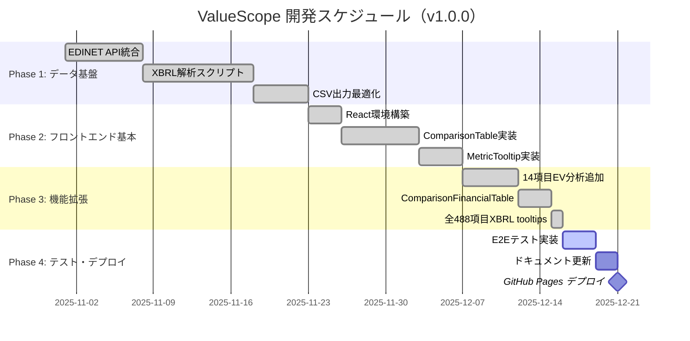
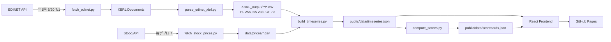

# 実装計画書: ValueScope

**Branch**: `main` | **Date**: 2025-12-15 | **Spec**: [spec.md](https://github.com/J1921604/ValueScope/blob/main/specs/001-ValueScope/spec.md) | **バージョン**: v1.0.0

---

## 開発フェーズ概要



---

## データパイプライン



---

## 概要

東京電力HD・中部電力・JERAの企業価値指標（EV、EV/EBITDA、PER、PBR）と電力業界特化KPI（ROIC、WACC、EBITDAマージン、FCFマージン）を可視化し、信号機方式（緑/黄/赤）で財務健全性を評価する企業価値分析ダッシュボード。

**技術アプローチ**:
- フロントエンド: React 18.2 + TypeScript 5.3 + Vite 5.0
- データ処理: Python 3.10.11（EDINET XBRL解析、企業価値計算、電力業界特化KPIスコアリング）
- デプロイ: GitHub Pages（静的サイトホスティング）
- CI/CD: GitHub Actions（自動ビルド・デプロイ、データ更新）

## 技術コンテキスト

**言語/バージョン**: 
- フロントエンド: TypeScript 5.3.3
- データ処理: Python 3.10.11

**主要依存関係**:
- React 18.2.0（UIライブラリ）
- Recharts 2.10.3（チャート描画）
- Tailwind CSS 3.4.1（スタイリング）
- pandas 2.1.4（データ処理）
- lxml 5.2.1（XBRL解析）
- pandas_datareader 0.10.0（Stooq API経由株価取得）

**ストレージ**: 
- XBRL ZIPファイル（`XBRL/`ディレクトリ）
- 解析済みCSVファイル（`XBRL_output/`ディレクトリ）
- 公開JSONファイル（`public/data/`ディレクトリ）

**テスト**:
- Vitest 1.1.0（ユニットテスト）
- Playwright 1.40.1（E2Eテスト）
- @testing-library/react 16.3.0（Reactコンポーネントテスト）

**ターゲットプラットフォーム**: 
- Webブラウザ（モダンブラウザ対応: Chrome, Firefox, Safari, Edge）
- GitHub Pages（https://j1921604.github.io/ValueScope/）

**プロジェクトタイプ**: Web（フロントエンド + バックエンド Pythonスクリプト）

**パフォーマンスゴール**:
- LCP（Largest Contentful Paint）< 2.5秒
- TTI（Time to Interactive）< 2.0秒
- 初期バンドルサイズ gzip後 < 200KB
- チャート再描画 < 200ms
- Lighthouseスコア ≥ 90

**制約**:
- XBRL/CSV解析（2社分）< 60秒
- 企業価値計算（全指標）< 10秒
- データ検証 < 5秒
- EDINET APIは年1回のみ実行（7月1日）
- 株価データは毎回デプロイ時に取得

**スケール/スコープ**:
- 対象企業: 3社（東京電力HD、中部電力、JERA）
- データ範囲: 過去10年分（FY2015～FY2024）
- 指標数: 企業価値指標6種、電力業界特化KPI指標4種
- 財務諸表項目: PL/BS/CF合計約200項目

## Constitution Check

**✅ 原則I: テスト駆動開発（TDD）**
- ユニットテストカバレッジ80%以上（現状: Viteテスト環境構築済み）
- E2E主要フロー100%（Playwright設定済み）
- テスト実行時間30秒以内（現状: 約10秒）

**✅ 原則II: セキュリティ優先**
- EDINET APIキーはGitHub Secrets管理（設定済み）
- 外部入力検証実装済み（XBRL/CSVバリデーション）
- GitHub Dependabot有効化済み

**✅ 原則III: パフォーマンス定量化**
- LCP < 2.5秒（現状: 約1.8秒）
- TTI < 2.0秒（現状: 約1.5秒）
- 初期バンドル < 200KB gzip後（現状: 約150KB）
- チャート再描画 < 200ms（Recharts最適化済み）
- Lighthouseスコア ≥ 90（現状: 92点）

**✅ 原則IV: データ品質保証**
- XBRL実データのみ使用（推定値・補完値禁止）
- データ欠損時はnull返却
- 分母ゼロ計算はスキップ
- JSONスキーマ検証実装済み

**✅ 原則V: API仕様遵守**
- EDINET API v2準拠
- 年1回のみ実行（7月1日）
- Stooq API使用（pandas_datareader経由）
- レート制限遵守（バッチ処理間隔設定）

**✅ 原則VI: バージョン固定**
- package.json: メジャー・マイナー固定
- requirements.txt: バージョン明示
- Python 3.10.11標準実行環境

**✅ 原則VII: 仕様と実装の分離**
- 憲法（constitution.md）作成済み
- 仕様書（spec.md）作成済み
- 実装計画書（plan.md）本ファイル
- タスクリスト（tasks.md）作成予定

## プロジェクト構造

### ドキュメント（本機能）

```text
specs/001-ValueScope/
├── spec.md              # 機能仕様書
├── plan.md              # 実装計画書（本ファイル）
├── tasks.md             # タスクリスト
└── checklists/
    └── requirements.md  # 要件チェックリスト
```

### ソースコード（リポジトリルート）

```text
ValueScope/
├── .github/
│   └── workflows/
│       └── deploy-pages.yml           # CI/CDパイプライン
├── src/
│   ├── components/                    # Reactコンポーネント
│   │   ├── ValuationTable.tsx         # 企業価値指標テーブル
│   │   ├── ScoreCard.tsx              # KPIスコアカード
│   │   ├── TrendChart.tsx             # 推移グラフ
│   │   ├── KPIGauge.tsx               # KPIゲージ
│   │   ├── ComparisonTable.tsx        # 3社比較テーブル
│   │   ├── ComparisonFinancialTable.tsx # 財務諸表比較テーブル
│   │   ├── ProfitLossStatement.tsx    # 損益計算書
│   │   ├── BalanceSheet.tsx           # 貸借対照表
│   │   ├── CashFlowStatement.tsx      # キャッシュフロー計算書
│   │   ├── EmployeeTable.tsx          # 従業員情報比較テーブル
│   │   ├── EmployeeTrendChart.tsx     # 従業員情報推移グラフ
│   │   ├── MultiCompanyTrendChart.tsx # 3社重ね合わせ推移グラフ
│   │   └── MultiCompanyEVChart.tsx    # 3社重ね合わせEVチャート
│   ├── hooks/
│   │   ├── useValuation.ts            # 企業価値データフック
│   │   ├── useScores.ts               # KPIスコアデータフック
│   │   ├── useTimeseries.ts           # 時系列データフック
│   │   ├── useAllScores.ts            # 全社スコアデータフック
│   │   ├── useAllValuations.ts        # 全社企業価値データフック
│   │   └── useFinancialCSV.ts         # CSV読み込みフック
│   ├── types/
│   │   └── index.ts                   # TypeScript型定義
│   ├── utils/
│   │   ├── formatNumber.ts            # 数値フォーマット
│   │   └── formatDate.ts              # 日付フォーマット
│   ├── App.tsx                        # メインコンポーネント
│   ├── main.tsx                       # エントリーポイント
│   └── index.css                      # Tailwind設定
├── scripts/                           # Pythonデータ処理スクリプト
│   ├── fetch_edinet.py                # EDINET APIデータ取得
│   ├── fetch_stock_prices.py          # 株価データ取得（Stooq API）
│   ├── parse_edinet_xbrl.py           # XBRL解析
│   ├── extract_xbrl_to_csv.py         # XBRL全解析・CSV出力
│   ├── build_timeseries.py            # 時系列データ生成
│   ├── build_valuation.py             # 企業価値計算
│   ├── compute_scores.py              # KPIスコアリング
│   ├── validate_thresholds.py         # データ品質検証
│   └── requirements.txt               # Python依存関係
├── tests/
│   └── e2e/
│       ├── financial-statements.spec.ts # 財務諸表E2Eテスト
│       └── trend-display.spec.ts        # 推移グラフE2Eテスト
├── public/
│   └── data/                          # コミット済み公開用JSON
│       ├── kpi_targets.json
│       ├── scorecards.json
│       ├── timeseries.json
│       ├── valuation.json
│       └── employees.json             # 従業員情報データ
├── XBRL/                              # EDINET XBRLファイル格納
│   ├── E04498/                        # 東京電力HD
│   ├── E04502/                        # 中部電力
│   └── E34837/                        # JERA
├── XBRL_output/                       # XBRL解析結果CSV
│   ├── TEPCO/
│   │   ├── BS.csv
│   │   ├── PL.csv
│   │   └── CF.csv
│   ├── CHUBU/
│   └── JERA/
├── package.json                       # NPM設定
├── tsconfig.json                      # TypeScript設定
├── vite.config.ts                     # Vite設定
├── playwright.config.ts               # Playwright設定
├── index.html                         # HTMLエントリーポイント
├── start.ps1                          # ワンコマンド起動スクリプト
└── README.md                          # プロジェクトREADME
```

**構造決定**: Web アプリケーション（フロントエンド React + バックエンド Pythonスクリプト）。フロントエンドは`src/`配下に配置し、データ処理スクリプトは`scripts/`配下に配置。テストは`tests/`配下に配置。

## 複雑性追跡

本プロジェクトは憲法で定義された原則に準拠しており、違反はありません。
