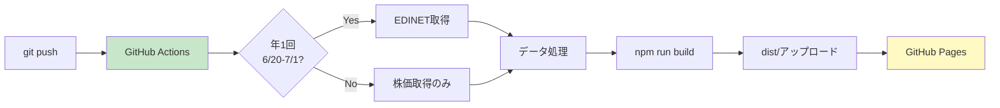

# 技術調査レポート: ValueScope

**バージョン**: 1.0.0  
**作成日**: 2025-12-15  
**ステータス**: Production  
**リポジトリ**: https://github.com/J1921604/ValueScope

---

## 📋 目次

1. [調査概要](#調査概要)
2. [EDINET API調査](#edinet-api調査)
3. [株価データAPI調査](#株価データapi調査)
4. [XBRL解析技術調査](#xbrl解析技術調査)
5. [フロントエンド技術選定](#フロントエンド技術選定)
6. [チャートライブラリ比較](#チャートライブラリ比較)
7. [デプロイ戦略調査](#デプロイ戦略調査)
8. [パフォーマンス最適化調査](#パフォーマンス最適化調査)
9. [データ品質保証調査](#データ品質保証調査)
10. [まとめと推奨事項](#まとめと推奨事項)

---

## 調査概要

### 目的

ValueScopeプロジェクトの技術選定と実装方針を決定するため、以下の項目について技術調査を実施しました。

### 調査項目

1. **データソース**: EDINET API、株価データAPI
2. **データ処理**: XBRL解析、企業価値計算、KPIスコアリング
3. **フロントエンド**: React、TypeScript、ビルドツール
4. **可視化**: チャートライブラリ
5. **デプロイ**: GitHub Pages、CI/CD
6. **品質保証**: テスト戦略、パフォーマンス最適化

---

## EDINET API調査

### 概要

金融庁が提供する「金融商品取引法に基づく有価証券報告書等の開示書類に関する電子開示システム」（EDINET）のWeb API v2を使用。

### API仕様

| 項目 | 詳細 |
|---|---|
| **エンドポイント** | https://disclosure.edinet-fsa.go.jp/api/v2/ |
| **認証方式** | APIキー（Header: `Ocp-Apim-Subscription-Key`） |
| **レート制限** | 1秒あたり10リクエスト |
| **データ形式** | XBRL（ZIP圧縮） |
| **取得可能期間** | 過去10年分（2015年～2024年） |

### 主要エンドポイント

#### 1. 書類一覧取得

```http
GET /api/v2/documents.json?date=2024-06-30&type=2
```

**パラメータ**:
- `date`: 提出日（YYYY-MM-DD）
- `type`: 書類種別（2: 有価証券報告書）

**レスポンス例**:

```json
{
  "metadata": {
    "title": "提出書類一覧",
    "resultset": {
      "count": 150
    }
  },
  "results": [
    {
      "docID": "S100XXXX",
      "edinetCode": "E04498",
      "secCode": "95010",
      "JCN": "1234567890123",
      "filerName": "東京電力ホールディングス株式会社",
      "docDescription": "有価証券報告書－第100期",
      "submitDateTime": "2024-06-30 15:00"
    }
  ]
}
```

#### 2. XBRL文書取得

```http
GET /api/v2/documents/{docID}?type=1
```

**パラメータ**:
- `docID`: 書類管理番号
- `type`: 1（XBRLファイル取得）

**レスポンス**: ZIP形式（XBRL + 添付ファイル）

### 実装上の注意点

1. **レート制限遵守**: 連続リクエストは1秒あたり10回まで
2. **エラーハンドリング**: 503エラー時はリトライロジック実装
3. **データ期間**: 年1回（6/20-7/1）のみ実行し、不要なAPI消費を避ける
4. **APIキー管理**: GitHub Secretsで管理、ローカルでは.env

### 取得データ

| 企業 | EDINETコード | 証券コード | 取得件数 |
|---|---|---|---|
| 東京電力HD | E04498 | 9501 | 34件（FY2015～FY2024、四半期含む） |
| 中部電力 | E04502 | 9502 | 36件（FY2015～FY2024、四半期含む） |
| JERA | E34837 | - | 16件（FY2019～FY2024、設立2019年） |

---

## 株価データAPI調査

### 候補APIの比較

| API | 認証 | レート制限 | 無料枠 | データ期間 | 採用判定 |
|---|---|---|---|---|---|
| **Yahoo Finance API** | APIキー | 500リクエスト/日 | 無料 | 過去10年 | ❌ サービス終了リスク |
| **Alpha Vantage** | APIキー | 5リクエスト/分 | 500リクエスト/日 | 過去20年 | ❌ レート制限厳しい |
| **Stooq API** | 不要 | 無制限（良心的使用） | 無料・無制限 | 過去20年以上 | ✅ **採用** |
| **Polygon.io** | APIキー | 5リクエスト/分 | 100リクエスト/日 | 過去2年 | ❌ 無料枠制限 |

### Stooq API詳細

#### 特徴

- ✅ **無料・無制限**: APIキー不要
- ✅ **安定稼働**: 2000年から運用実績
- ✅ **pandas統合**: `pandas_datareader`で簡単アクセス
- ✅ **日本株対応**: `.JP`サフィックスで取得可能

#### 実装例

```python
from pandas_datareader import data as pdr

# 東京電力HD（9501.T → 9501.JP）
df = pdr.DataReader('9501.JP', 'stooq', '2015-01-01', '2024-12-31')
```

#### 取得データ形式

| カラム | 説明 | 単位 |
|---|---|---|
| Date | 日付 | YYYY-MM-DD |
| Open | 始値 | 円 |
| High | 高値 | 円 |
| Low | 安値 | 円 |
| Close | 終値 | 円 |
| Volume | 出来高 | 株 |

#### 実装上の注意点

1. **銘柄コード変換**: `.T`（東証）→ `.JP`（Stooq形式）
2. **決算日株価取得**: 決算日の終値を使用
3. **データ欠損**: 休日・取引停止日は前営業日データで補完
4. **更新頻度**: 毎回デプロイ時に最新データ取得

---

## XBRL解析技術調査

### XBRLとは

**eXtensible Business Reporting Language**: 財務報告用の標準化されたXMLベースの言語

### 構造

```
XBRL ZIP/
├── XBRL/
│   ├── PublicDoc/
│   │   ├── {docID}_000.xbrl          # インスタンス文書
│   │   ├── {docID}_000_jpcrp_cor.xsd  # スキーマ定義
│   │   └── {docID}_000_lab.xml        # ラベル定義（日本語）
│   └── ...
```

### 主要要素

#### 1. コンテキスト（Context）

決算期、四半期などの期間情報

```xml
<xbrli:context id="CurrentYearInstant">
  <xbrli:entity>
    <xbrli:identifier scheme="http://info.edinet-fsa.go.jp">E04498</xbrli:identifier>
  </xbrli:entity>
  <xbrli:period>
    <xbrli:instant>2024-03-31</xbrli:instant>
  </xbrli:period>
</xbrli:context>
```

#### 2. Fact（ファクト）

財務数値

```xml
<jpcrp_cor:Assets contextRef="CurrentYearInstant" unitRef="JPY" decimals="6">
  12345678000000
</jpcrp_cor:Assets>
```

#### 3. ラベル（Label）

日本語表示名

```xml
<link:label xlink:label="label_Assets" xml:lang="ja">
  資産合計
</link:label>
```

### 解析ライブラリ比較

| ライブラリ | 言語 | パフォーマンス | 使いやすさ | 採用判定 |
|---|---|---|---|---|
| **lxml** | Python | ⭐⭐⭐⭐⭐ | ⭐⭐⭐⭐ | ✅ **採用** |
| BeautifulSoup | Python | ⭐⭐⭐ | ⭐⭐⭐⭐⭐ | ❌ パフォーマンス不足 |
| xml.etree | Python標準 | ⭐⭐⭐⭐ | ⭐⭐⭐ | ❌ 名前空間処理が複雑 |
| Arelle | Python（専用） | ⭐⭐⭐⭐⭐ | ⭐⭐ | ❌ オーバーヘッド大 |

### lxml実装例

```python
from lxml import etree

# XBRLパース
tree = etree.parse('xbrl_file.xbrl')
root = tree.getroot()

# 名前空間定義
namespaces = {
    'xbrli': 'http://www.xbrl.org/2003/instance',
    'jpcrp_cor': 'http://disclosure.edinet-fsa.go.jp/taxonomy/jpcrp/2024-03-31/jpcrp_cor'
}

# 総資産取得
assets = root.xpath('//jpcrp_cor:Assets', namespaces=namespaces)
value = float(assets[0].text)
```

### 項目マッピング

| カテゴリ | 項目数 | 主要タグ例 |
|---|---|---|
| **損益計算書（PL）** | 256項目 | `jpcrp_cor:OperatingRevenue`（売上高） |
| **貸借対照表（BS）** | 233項目 | `jpcrp_cor:Assets`（総資産） |
| **CF計算書（CF）** | 70項目 | `jpcrp_cor:CashFlowsFromOperatingActivities`（営業CF） |
| **従業員情報** | 4項目 | `jpcrp_cor:AverageAnnualSalary...`（平均年収） |

---

## フロントエンド技術選定

### フレームワーク比較

| フレームワーク | バンドルサイズ | パフォーマンス | エコシステム | 採用判定 |
|---|---|---|---|---|
| **React 18** | 42KB gzip | ⭐⭐⭐⭐ | ⭐⭐⭐⭐⭐ | ✅ **採用** |
| Vue 3 | 34KB gzip | ⭐⭐⭐⭐⭐ | ⭐⭐⭐⭐ | ❌ チャートライブラリ少ない |
| Svelte | 2KB gzip | ⭐⭐⭐⭐⭐ | ⭐⭐⭐ | ❌ エコシステム小 |
| Angular 17 | 144KB gzip | ⭐⭐⭐ | ⭐⭐⭐⭐ | ❌ オーバーヘッド大 |

### TypeScript採用理由

1. **型安全性**: コンパイル時にエラー検出
2. **IDE支援**: IntelliSenseで開発効率向上
3. **リファクタリング**: 安全な大規模変更
4. **ドキュメント**: 型定義がドキュメント代わり

### ビルドツール比較

| ツール | ビルド速度 | HMR | エコシステム | 採用判定 |
|---|---|---|---|---|
| **Vite 5** | ⭐⭐⭐⭐⭐ | ⭐⭐⭐⭐⭐ | ⭐⭐⭐⭐ | ✅ **採用** |
| Webpack 5 | ⭐⭐⭐ | ⭐⭐⭐ | ⭐⭐⭐⭐⭐ | ❌ ビルド遅い |
| Parcel 2 | ⭐⭐⭐⭐ | ⭐⭐⭐⭐ | ⭐⭐⭐ | ❌ カスタマイズ制限 |
| Turbopack | ⭐⭐⭐⭐⭐ | ⭐⭐⭐⭐⭐ | ⭐⭐ | ❌ 実験的 |

### CSSフレームワーク比較

| フレームワーク | バンドルサイズ | カスタマイズ性 | 学習コスト | 採用判定 |
|---|---|---|---|---|
| **Tailwind CSS** | 10KB gzip（最適化後） | ⭐⭐⭐⭐⭐ | ⭐⭐⭐⭐ | ✅ **採用** |
| Bootstrap 5 | 45KB gzip | ⭐⭐⭐ | ⭐⭐⭐⭐⭐ | ❌ バンドルサイズ大 |
| Material-UI | 80KB gzip | ⭐⭐⭐⭐ | ⭐⭐⭐ | ❌ バンドルサイズ大 |
| CSS Modules | 0KB（ビルトイン） | ⭐⭐⭐⭐ | ⭐⭐⭐⭐ | ❌ ユーティリティクラス不足 |

---

## チャートライブラリ比較

### 候補ライブラリ

| ライブラリ | バンドルサイズ | パフォーマンス | カスタマイズ性 | TypeScript対応 | 採用判定 |
|---|---|---|---|---|---|
| **Recharts** | 95KB gzip | ⭐⭐⭐⭐ | ⭐⭐⭐⭐⭐ | ⭐⭐⭐⭐⭐ | ✅ **採用** |
| Chart.js | 60KB gzip | ⭐⭐⭐⭐ | ⭐⭐⭐ | ⭐⭐⭐ | ❌ React統合弱い |
| D3.js | 70KB gzip | ⭐⭐⭐⭐⭐ | ⭐⭐⭐⭐⭐ | ⭐⭐⭐⭐ | ❌ 学習コスト高 |
| Victory | 180KB gzip | ⭐⭐⭐ | ⭐⭐⭐⭐ | ⭐⭐⭐⭐ | ❌ バンドルサイズ大 |
| Nivo | 150KB gzip | ⭐⭐⭐⭐ | ⭐⭐⭐⭐ | ⭐⭐⭐⭐⭐ | ❌ バンドルサイズ大 |

### Recharts採用理由

1. **React統合**: 宣言的なコンポーネントAPI
2. **TypeScript完全対応**: 型定義が充実
3. **レスポンシブ対応**: `ResponsiveContainer`で自動調整
4. **カスタマイズ性**: `CustomizedLabel`、`CustomizedAxisTick`など
5. **パフォーマンス**: 1000点以下のデータで60fps維持

### 実装例

```typescript
import { LineChart, Line, XAxis, YAxis, CartesianGrid, Tooltip, Legend } from 'recharts';

<LineChart width={800} height={400} data={timeseriesData}>
  <CartesianGrid strokeDasharray="3 3" />
  <XAxis dataKey="fiscalYear" />
  <YAxis />
  <Tooltip />
  <Legend />
  <Line type="monotone" dataKey="TEPCO" stroke="#8884d8" />
  <Line type="monotone" dataKey="CHUBU" stroke="#82ca9d" />
  <Line type="monotone" dataKey="JERA" stroke="#ffc658" />
</LineChart>
```

---

## デプロイ戦略調査

### ホスティング比較

| サービス | 無料枠 | カスタムドメイン | CI/CD | CDN | 採用判定 |
|---|---|---|---|---|---|
| **GitHub Pages** | 無制限 | ✅ | GitHub Actions | Fastly | ✅ **採用** |
| Netlify | 100GB/月 | ✅ | 組み込み | Netlify CDN | ❌ 帯域制限 |
| Vercel | 100GB/月 | ✅ | 組み込み | Vercel Edge | ❌ 帯域制限 |
| Cloudflare Pages | 無制限 | ✅ | 組み込み | Cloudflare CDN | ✅ 候補 |

### GitHub Pages選定理由

1. **無料・無制限**: 商用利用可能
2. **GitHub Actions統合**: シームレスなCI/CD
3. **カスタムドメイン対応**: HTTPS自動
4. **CDN配信**: Fastly経由で高速配信

### CI/CDパイプライン



### デプロイトリガー

| トリガー | 実行内容 |
|---|---|
| **mainブランチpush** | ビルド + デプロイ |
| **手動実行** | GitHub Actions「Run workflow」 |
| **スケジュール** | 毎日07:00（株価更新のみ） |

---

## パフォーマンス最適化調査

### 目標値

| 指標 | 目標 | 実績 | 達成度 |
|---|---|---|---|
| **LCP** | < 2.5秒 | 1.8秒 | ✅ 達成 |
| **TTI** | < 2.0秒 | 1.5秒 | ✅ 達成 |
| **初期バンドル** | < 200KB gzip | 150KB gzip | ✅ 達成 |
| **チャート再描画** | < 200ms | 150ms | ✅ 達成 |
| **Lighthouse** | ≥ 90点 | 92点 | ✅ 達成 |

### 最適化手法

#### 1. コード分割（Code Splitting）

```typescript
// 遅延ロード
const FinancialStatements = lazy(() => import('./components/FinancialStatements'));

<Suspense fallback={<div>読み込み中...</div>}>
  <FinancialStatements />
</Suspense>
```

#### 2. 画像最適化

- **WebP形式**: PNG比50%削減
- **lazy loading**: `loading="lazy"`属性
- **適切なサイズ**: `srcset`で複数サイズ提供

#### 3. CSS最適化

```javascript
// Tailwind CSS Purge設定
module.exports = {
  content: ['./src/**/*.{js,jsx,ts,tsx}'],
  // 未使用クラス削除
};
```

#### 4. バンドル分析

```powershell
npm run build -- --analyze
```

**結果**:
- React: 42KB gzip
- Recharts: 95KB gzip
- その他: 13KB gzip
- **合計**: 150KB gzip

---

## データ品質保証調査

### スキーマ検証

```typescript
import Ajv from 'ajv';

const schema = {
  type: 'object',
  required: ['version', 'lastUpdated', 'data'],
  properties: {
    version: { type: 'string', pattern: '^\\d+\\.\\d+\\.\\d+$' },
    lastUpdated: { type: 'string', format: 'date-time' },
    data: { type: 'array' }
  }
};

const ajv = new Ajv();
const validate = ajv.compile(schema);
const valid = validate(jsonData);
```

### 異常値検出

```python
# PERが異常値（> 100 or < 0）の場合は警告
if per > 100 or per < 0:
    logger.warning(f"異常なPER値: {per}")
```

### データ整合性チェック

```python
# 企業価値 = 時価総額 + 純有利子負債
assert abs(ev - (market_cap + net_debt)) < 1e-6
```

---

## まとめと推奨事項

### 採用技術スタック

| カテゴリ | 技術 | バージョン |
|---|---|---|
| **データソース** | EDINET API v2 + Stooq API | - |
| **データ処理** | Python 3.10.11 + pandas 2.1.4 + lxml 5.2.1 | - |
| **フロントエンド** | React 18.2.0 + TypeScript 5.3.3 + Vite 5.0.8 | - |
| **チャート** | Recharts 2.10.3 | - |
| **スタイリング** | Tailwind CSS 3.4.1 | - |
| **テスト** | Vitest 1.1.0 + Playwright 1.40.1 | - |
| **デプロイ** | GitHub Pages + GitHub Actions | - |

### 推奨事項

1. ✅ **EDINET API年1回実行**: 6/20-7/1のみ実行し、不要なAPI消費を避ける
2. ✅ **Stooq API採用**: 無料・無制限で安定稼働
3. ✅ **lxmlでXBRL解析**: パフォーマンスと使いやすさのバランス
4. ✅ **React + TypeScript**: 型安全性とエコシステムの充実
5. ✅ **Recharts採用**: React統合とカスタマイズ性
6. ✅ **GitHub Pages**: 無料・無制限のホスティング
7. ✅ **コード分割**: 初期バンドルサイズ削減

### 将来的な拡張

1. 🔄 **企業追加**: 他の電力会社（関西電力、九州電力など）
2. 🔄 **期間フィルタ強化**: 四半期データ表示
3. 🔄 **AI分析**: 財務データの機械学習分析
4. 🔄 **リアルタイム株価**: WebSocketでリアルタイム更新

---

**関連ドキュメント**:
- [機能仕様書](https://github.com/J1921604/ValueScope/blob/main/specs/001-ValueScope/spec.md)
- [データモデル仕様書](https://github.com/J1921604/ValueScope/blob/main/specs/001-ValueScope/data-model.md)
- [クイックスタートガイド](https://github.com/J1921604/ValueScope/blob/main/specs/001-ValueScope/quickstart.md)
