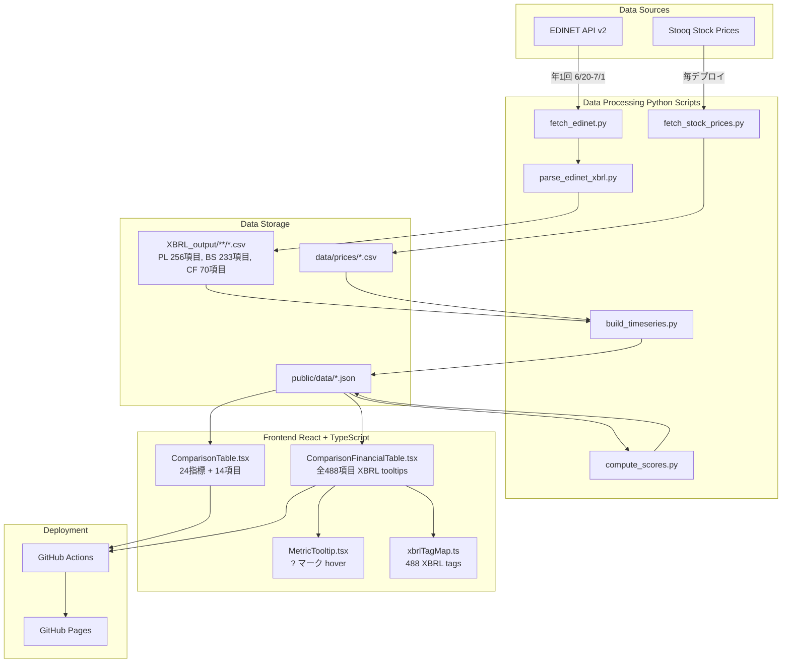
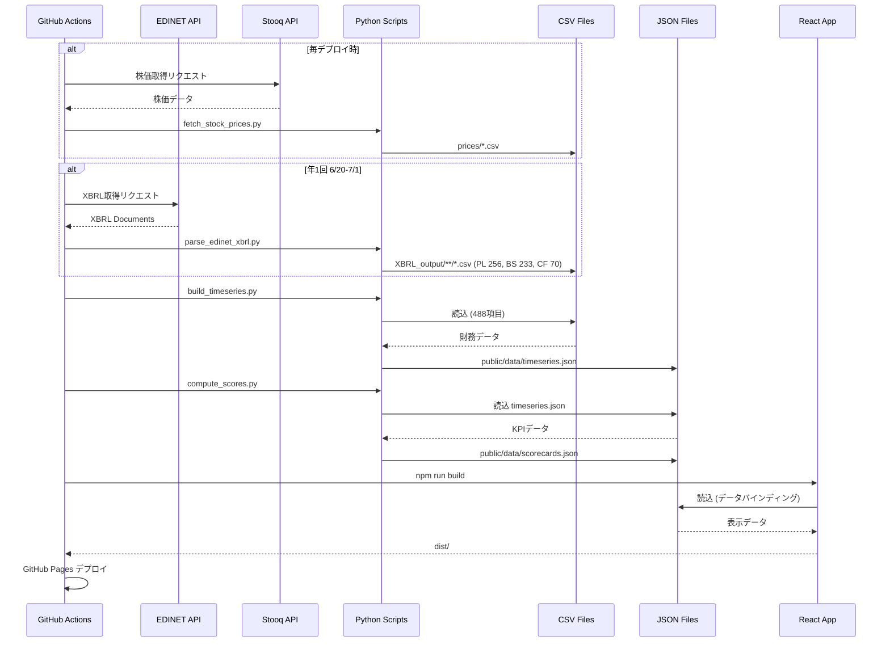

# 機能仕様書: ValueScope - 企業価値分析ダッシュボード

**Feature Branch**: `main`
**Created**: 2025-12-15
**Status**: Production
**バージョン**: 1.0.0
**リポジトリ**: https://github.com/J1921604/ValueScope

---

## システムアーキテクチャ

---

## データフロー詳細

---

## ユーザーシナリオとテスト

### ユーザーストーリー 1 - 企業価値指標の可視化（14項目拡張版） (優先度: P1)

**概要**:
投資家や経営分析者が、東京電力HD・中部電力・JERAの企業価値指標を包括的に把握できるダッシュボードを提供する。従来の6指標に加え、PL/BS/CFの主要項目とROICを含む14項目を表示する。

**優先度の理由**:
企業価値分析の核心機能であり、MVPとして最も重要。投資判断の基礎となる指標を正確に表示することで、アプリケーションの価値を提供する。

**14項目の内訳**:

**損益計算書（PL）項目**（5項目）:

1. 売上高（営業収益）: jpcrp_cor:OperatingRevenue
2. 営業利益: jpcrp_cor:OperatingIncome
3. 経常利益: jpcrp_cor:OrdinaryIncome
4. 当期純利益: jpcrp_cor:ProfitLoss
5. 親会社株主に帰属する当期純利益: jpcrp_cor:ProfitLossAttributableToOwnersOfParent

**貸借対照表（BS）項目**（4項目）:
6. 総資産: jpcrp_cor:Assets
7. 純資産: jpcrp_cor:NetAssets
8. 自己資本: jpcrp_cor:Equity
9. 有利子負債: jpcrp_cor:InterestBearingDebt

**キャッシュフロー計算書（CF）項目**（3項目）:
10. 営業活動によるキャッシュフロー: jpcrp_cor:CashFlowsFromOperatingActivities
11. 投資活動によるキャッシュフロー: jpcrp_cor:CashFlowsFromInvestingActivities
12. 財務活動によるキャッシュフロー: jpcrp_cor:CashFlowsFromFinancingActivities

**計算指標**（2項目）:
13. EBITDA: 営業利益 + 減価償却費
14. ROIC: NOPAT ÷ 投下資本 × 100

**ツールチップ機能**:

- 各指標名の隣に「?」マーク（○で囲む）を配置
- マウスオーバーで指標の説明とXBRLタグを表示
- 計算指標の場合は計算式を表示

**独立したテスト**:
企業価値指標テーブルを表示し、3社（TEPCO/CHUBU/JERA）の14項目とEV関連指標が正しく計算・表示されることを確認できる。

**受入基準**:

1. **Given** ダッシュボードを開いた時、**When** 企業価値指標テーブルを表示する、**Then** 3社のPL 5項目、BS 4項目、CF 3項目、計算指標2項目、EV関連指標が表示される
2. **Given** データが存在する項目、**When** テーブルを描画する、**Then** 実際の値が億円単位で表示される
3. **Given** データが存在しない項目、**When** テーブルを描画する、**Then** その行は非表示または「N/A」と表示される
4. **Given** 指標名の「?」マークにマウスオーバーした時、**When** ツールチップを表示する、**Then** 指標の説明とXBRLタグまたは計算式が表示される
5. **Given** 時価総額データが取得できない場合（JERAなど非上場企業）、**When** 指標を計算する、**Then** 時価総額およびそれに依存する指標（EV、PER、PBR、EV/EBITDA）は `null`として表示される
6. **Given** 最新年度のデータを選択した時、**When** 企業価値指標を計算する、**Then** XBRL実データのみを使用し、推定値・補完値は一切含まれない
7. **Given** 分母がゼロの計算が発生した場合、**When** 指標を計算する、**Then** 結果を `null`として返し、エラーを発生させない

---

### ユーザーストーリー 2 - KPIスコアカードの信号機評価（電力業界特化） (優先度: P1)

**概要**:
財務健全性を一目で判断できるよう、電力業界特化のKPI（ROIC、WACC、EBITDAマージン、FCFマージン）を信号機方式（緑/黄/赤）で評価する。

**優先度の理由**:
投資家が財務健全性を迅速に判断するために不可欠な機能。電力業界特性（設備投資大、低金利環境、安定収益）を反映した定量的な閾値に基づく自動評価により、意思決定を支援する。

**独立したテスト**:
KPIスコアカードを表示し、ROIC、WACC、EBITDAマージン、FCFマージンの実績値と信号機評価（緑/黄/赤）が正しく表示されることを確認できる。

**受入基準**:

1. **Given** ダッシュボードを開いた時、**When** KPIスコアカードを表示する、**Then** 3社のROIC、WACC、EBITDAマージン、FCFマージンが実績値と信号機評価（緑/黄/赤）とともに表示される
2. **Given** ROICが5%以上の場合、**When** スコアを評価する、**Then** 緑と表示される
3. **Given** ROICが3%以上5%未満の場合、**When** スコアを評価する、**Then** 黄と表示される
4. **Given** ROICが3%未満の場合、**When** スコアを評価する、**Then** 赤と表示される
5. **Given** WACCが4%未満の場合、**When** スコアを評価する、**Then** 緑と表示される（低いほど良い）
6. **Given** WACCが4%以上5%未満の場合、**When** スコアを評価する、**Then** 黄と表示される
7. **Given** WACCが5%以上の場合、**When** スコアを評価する、**Then** 赤と表示される
8. **Given** EBITDAマージンが15%以上の場合、**When** スコアを評価する、**Then** 緑と表示される
9. **Given** EBITDAマージンが10%以上15%未満の場合、**When** スコアを評価する、**Then** 黄と表示される
10. **Given** EBITDAマージンが10%未満の場合、**When** スコアを評価する、**Then** 赤と表示される
11. **Given** FCFマージンが5%以上の場合、**When** スコアを評価する、**Then** 緑と表示される
12. **Given** FCFマージンが0%以上5%未満の場合、**When** スコアを評価する、**Then** 黄と表示される
13. **Given** FCFマージンが0%未満の場合、**When** スコアを評価する、**Then** 赤と表示される
14. **Given** KPIゲージチャートを表示した時、**When** ゲージの最大値を確認する、**Then** ROIC max 15%、WACC max 6%、EBITDAマージン max 30%、FCFマージン max 25%が設定されている（実績最大値に基づく）

---

### ユーザーストーリー 3 - 過去10年間のKPI推移グラフ表示 (優先度: P2)

**概要**:
時系列でKPIの推移を可視化し、企業の財務健全性の変化を分析できるようにする。

**優先度の理由**:
トレンド分析は企業の成長性や安定性を評価するために重要だが、静的な指標表示（US1、US2）に次ぐ優先度。

**独立したテスト**:
推移グラフを表示し、過去10年間のROE、自己資本比率、DSCRの推移が折れ線グラフで正しく描画されることを確認できる。

**受入基準**:

1. **Given** 推移グラフタブを選択した時、**When** グラフを描画する、**Then** 過去10年間のROE、自己資本比率、DSCRの推移が折れ線グラフで表示される
2. **Given** 年度フィルタを選択した時、**When** データをフィルタリングする、**Then** 選択した年度のデータのみが表示される
3. **Given** グラフを操作した時、**When** 再描画が発生する、**Then** 200ms以内に再描画が完了する（パフォーマンス要件 PR-004）

---

### ユーザーストーリー 4 - 従業員情報の可視化 (優先度: P2)

**概要**:
投資家や経営分析者が、東京電力HD・中部電力・JERAの従業員情報（平均年間給与、平均勤続年数、平均年齢、従業員数）を全年度にわたって確認できる。

**優先度の理由**:
企業の人的資本や組織文化を理解するための補足的な指標であり、財務指標に次ぐ重要性。

**独立したテスト**:
従業員情報ページを表示し、3社の比較テーブルと4指標の推移グラフが正しく描画されることを確認できる。

**受入基準**:

1. **Given** 従業員情報ページを開いた時、**When** 比較テーブルを表示する、**Then** 最新年度の3社（TEPCO/CHUBU/JERA）の平均年間給与、平均勤続年数、平均年齢、従業員数が表形式で表示され、**各項目名に「○囲み？マーク」のMetricTooltipが実装される**
2. **Given** 従業員情報ページを開いた時、**When** 推移グラフを表示する、**Then** 全年度（2021年～最新年度）の4指標それぞれの推移が折れ線グラフで表示される
3. **Given** XBRL `従業員の状況` セクションからデータを取得した時、**When** データを表示する、**Then** 実データのみを使用し、推定値・補完値は一切含まれない
4. **Given** データが欠損している年度がある場合、**When** グラフを描画する、**Then** 欠損期間は線が途切れた状態で表示される（補完しない）
5. **Given** 従業員情報の各項目名にカーソルをホバーした時、**When** MetricTooltipを表示する、**Then** XBRLタグ名と説明が表示される（例: `jpcrp_cor:AverageAnnualSalaryInformationAboutReportingCompanyInformationAboutEmployees` - 提出会社の従業員情報における平均年間給与）

---

### ユーザーストーリー 5 - 財務諸表（PL/BS/CF）の3社比較テーブル (優先度: P2)

**概要**:
損益計算書（PL 256項目）、貸借対照表（BS 233項目）、キャッシュフロー計算書（CF 70項目）の全項目を3社横並びで比較できるテーブルを提供し、**全488項目に「?」マーク付きXBRLツールチップ**を実装する。電力業界特化KPI（ROIC、WACC、EBITDAマージン、FCFマージン）計算の根拠となる財務データを確認できるようにする。

**優先度の理由**:
KPI分析の根拠となる財務データの透明性を確保し、詳細な財務分析を可能にする。EBIT、EBITDA、営業CF等、電力業界特化KPI計算に必要な項目を網羅。**全項目にXBRLタグを記載したツールチップを実装することで、データの出所を完全に追跡可能にする。**

**XBRL tooltips実装詳細**:

| 財務諸表               | 項目数            | XBRL tag形式                | tooltip表示内容                                                                                                                                 |
| ---------------------- | ----------------- | --------------------------- | ----------------------------------------------------------------------------------------------------------------------------------------------- |
| PL（損益計算書）       | 256項目           | `jpcrp_cor:FieldName`     | 項目名の英語 → XBRL tag``例: `OperatingIncome` → `jpcrp_cor:OperatingIncome`                                                       |
| BS（貸借対照表）       | 233項目           | `jpcrp_cor:FieldName`     | 項目名の英語 → XBRL tag``例: `Assets` → `jpcrp_cor:Assets`                                                                         |
| CF（キャッシュフロー） | 70項目            | `jpcrp_cor:FieldName`     | 項目名の英語 → XBRL tag``例: `NetCashProvidedByUsedInOperatingActivities` → `jpcrp_cor:NetCashProvidedByUsedInOperatingActivities` |
| **合計**         | **559項目** | **重複排除後488項目** | 全項目に「?」マーク hover でXBRLタグ表示                                                                                                        |

**計算指標の特殊処理**:

- `EBITDA`: `計算値: 営業利益 + 減価償却費`
- `NetDebt`: `計算値: 有利子負債 - 現金及び預金`
- `Equity`: `計算値: 資本金 + 資本剰余金 + 利益剰余金 - 自己株式`
- `InterestBearingDebt`: `計算値: BondsPayable + LongTermLoansPayable + ShortTermLoansPayable`

**実装方法**:

1. `scripts/generate_xbrl_map.py` でCSV全項目から自動生成
2. `src/components/xbrlTagMap.ts` に488項目のマッピング格納
3. `src/components/ComparisonFinancialTable.tsx` でインポート
4. `src/components/MetricTooltip.tsx` で「?」マーク hover 表示

**独立したテスト**:
財務諸表タブを選択し、PL/BS/CFの3社比較テーブルが正しく表示され、**全項目に「?」マークが表示され、hover時にXBRLタグが表示される**ことを確認できる。

**受入基準**:

1. **Given** 財務諸表タブを選択した時、**When** テーブルを表示する、**Then** PL/BS/CFの3社比較テーブルが表示される
2. **Given** 年度フィルタを選択した時、**When** データをフィルタリングする、**Then** 選択した年度（FY2015～FY2024）のデータが表示される
3. **Given** XBRL_output/からCSVデータを読み込む時、**When** データを解析する、**Then** 全項目が日本語ラベルで表示される
4. **Given** PLタブを表示した時、**When** 項目をカウントする、**Then** 256項目すべてに「?」マークが表示される
5. **Given** BSタブを表示した時、**When** 項目をカウントする、**Then** 233項目すべてに「?」マークが表示される
6. **Given** CFタブを表示した時、**When** 項目をカウントする、**Then** 70項目すべてに「?」マークが表示される
7. **Given** 任意の項目の「?」マークにマウスオーバーした時、**When** ツールチップを表示する、**Then** `jpcrp_cor:FieldName` 形式のXBRLタグまたは計算式が表示される
8. **Given** `xbrlTagMap.ts` をインポートした時、**When** マップサイズを確認する、**Then** 488項目のマッピングが存在する
9. **Given** E2Eテストを実行した時、**When** 財務諸表ページをテストする、**Then** PL 256項目、BS 233項目、CF 70項目の全てにXBRLツールチップ「?」マークが存在する

---

### エッジケース

- XBRLデータに発行済株式数が含まれない場合、時価総額および依存指標（EV、PER、PBR、EV/EBITDA）は `null`とする
- 分母がゼロの計算（ROIC、WACC、EBITDAマージン、FCFマージン、EV/EBITDA、PER、PBR）が発生した場合、結果を `null`とする
- 非上場企業（JERA）の株価データが存在しない場合、時価総額を `null`とする
- データ取得APIエラーが発生した場合、既存のキャッシュデータを表示し、エラーメッセージをログに記録する
- GitHub Actionsでのデータ更新が失敗した場合、GitHub Issueを自動起票する

## 要件

### 機能要件

- **FR-001**: システムは東京電力HD、中部電力、JERAの企業価値指標（時価総額、純有利子負債、企業価値、EV/EBITDA、PER、PBR）を計算し、表示しなければならない
- **FR-002**: システムは電力業界特化KPI（ROIC、WACC、EBITDAマージン、FCFマージン）を計算し、信号機方式（緑/黄/赤）で評価しなければならない
- **FR-003**: システムは過去10年間のKPI推移を折れ線グラフで表示しなければならない
- **FR-004**: システムは従業員情報（平均年間給与、平均勤続年数、平均年齢、従業員数）を比較テーブルと推移グラフで表示しなければならない
- **FR-005**: システムは財務諸表（PL/BS/CF）を3社横並びで比較表示しなければならない
- **FR-006**: システムはEDINET API v2から有価証券報告書（書類種別コード120）のXBRLデータを取得しなければならない
- **FR-007**: システムは訂正報告書（コード130）を除外しなければならない
- **FR-008**: システムはStooq API（pandas_datareader経由）から株価データを取得しなければならない
- **FR-009**: システムはすべての財務指標計算にXBRL実データのみを使用し、推定値・補完値・仮定値を一切含めてはならない
- **FR-010**: システムはデータ欠損時に `null`または `0`を返し、推定による補完を行ってはならない
- **FR-011**: システムは分母がゼロの計算をスキップし、結果を `null`としなければならない
- **FR-012**: システムはJSONスキーマ検証を実施し、不正なデータ構造を検出した場合はデプロイを中止しなければならない
- **FR-013**: システムは年度フィルタボタン（FY2015～FY2024）を提供し、ユーザーが任意の年度を選択できるようにしなければならない
- **FR-014**: システムは会計年度ラベルを決算日の1年繰り下げたFY表記（例: 2025/03/31 → FY2024）で表示しなければならない

### 主要エンティティ

- **ValuationData**: 企業価値指標データ（時価総額、純有利子負債、企業価値、EV/EBITDA、PER、PBR、配当利回り）
- **Scorecard**: KPIスコアカードデータ（ROE、自己資本比率、DSCRの実績値、評価、前期比変動）
- **TimeSeriesDataPoint**: 時系列データポイント（年度、ROE、自己資本比率、DSCR、営業CF）
- **EmployeeData**: 従業員情報データ（年度、企業名、平均年間給与、平均勤続年数、平均年齢、従業員数）
- **FinancialStatement**: 財務諸表データ（PL/BS/CFの全項目）
- **KPITargets**: KPI閾値定義（ROE、自己資本比率、DSCRの緑/黄閾値）

## 成功基準

### 測定可能な成果

- **SC-001**: ユーザーはダッシュボードにアクセスしてから2.5秒以内に企業価値指標を確認できる（LCP < 2.5秒）
- **SC-002**: ユーザーはダッシュボードにアクセスしてから2.0秒以内に操作可能になる（TTI < 2.0秒）
- **SC-003**: システムは1000人の同時アクセスユーザーに対してパフォーマンス劣化なくサービスを提供できる（GitHub Pages CDN対応）
- **SC-004**: データ更新失敗率は5%未満である（EDINET APIおよび株価API取得の成功率95%以上）
- **SC-005**: ユーザーは初回訪問時に90%以上の確率で企業価値指標とKPIスコアカードを正しく理解できる（UIツールチップ、説明文の明確性）
- **SC-006**: システムはXBRL/CSV解析を60秒以内、企業価値計算を10秒以内、データ検証を5秒以内に完了できる
- **SC-007**: ユニットテストカバレッジは80%以上、E2E主要フローは100%カバーできている
- **SC-008**: Lighthouseスコアは90点以上を維持できている
- **SC-009**: 初期バンドルサイズはgzip圧縮後200KB未満である
- **SC-010**: チャート再描画は200ms以内に完了する
