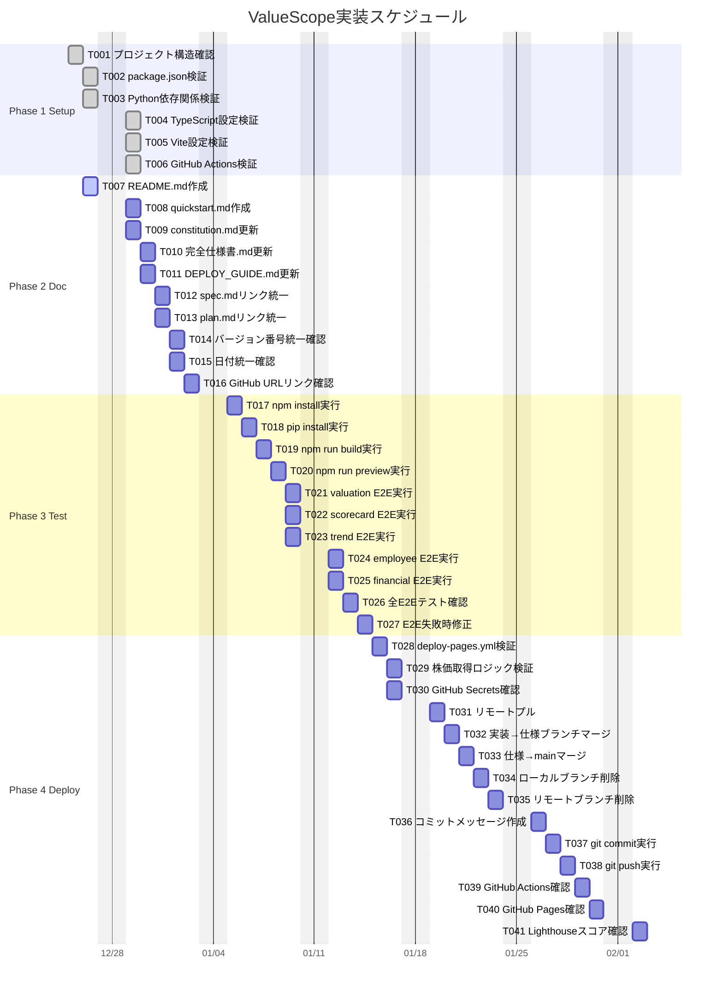

# タスクリスト: ValueScope企業価値分析ダッシュボード

**Branch**: `001-ValueScope`  
**入力**: 仕様書（[spec.md](https://github.com/J1921604/ValueScope/blob/main/specs/001-ValueScope/spec.md)）、実装計画書（[plan.md](https://github.com/J1921604/ValueScope/blob/main/specs/001-ValueScope/plan.md)）、完全仕様書（[docs/完全仕様書.md](https://github.com/J1921604/ValueScope/blob/main/docs/完全仕様書.md)）  
**前提条件**: 既存実装の検証とドキュメント整備

**注意**: このタスクリストは既存実装の品質向上とドキュメント統一に焦点を当てています。

## フォーマット: `[ID] [P?] [Phase] 説明`

- **[P]**: 並列実行可能（異なるファイル、依存関係なし）
- **[Phase]**: タスクが属するフェーズ（Setup, Doc, Test, Deploy）
- 説明には正確なファイルパスを含める

## Phase 1: セットアップと検証（共有インフラ）

**目的**: プロジェクト構造の検証と依存関係の確認

- [x] T001 [Setup] プロジェクト構造が実装計画書（plan.md）と一致することを確認
- [x] T002 [Setup] package.json依存関係を確認し、バージョンが固定されていることを検証
- [x] T003 [P] [Setup] Python依存関係（scripts/requirements.txt）を確認し、バージョンが固定されていることを検証
- [x] T004 [P] [Setup] TypeScript設定（tsconfig.json）を確認し、厳密モードが有効であることを検証
- [x] T005 [P] [Setup] Vite設定（vite.config.ts）を確認し、base: /ValueScope/が設定されていることを検証
- [x] T006 [Setup] GitHub Actions設定（.github/workflows/deploy-pages.yml）を確認し、EDINET期間限定実行ロジックが正しいことを検証

**チェックポイント**: セットアップ完了 - ドキュメント作成開始可能

---

## Phase 2: ドキュメント作成と整備

**目的**: README.md作成、全ドキュメントのリンク修正、バージョン統一

### ドキュメント作成

- [ ] T007 [Doc] README.mdを作成し、プロジェクト概要、主要機能、環境構築手順、使用方法、デプロイ手順を含める（specs/001-valuescope-enhancement/README.md）
- [ ] T008 [P] [Doc] quickstart.mdを作成し、5分でローカル起動できる手順を記載（specs/001-valuescope-enhancement/quickstart.md）

### ドキュメント更新

- [ ] T009 [P] [Doc] constitution.mdを確認し、バージョン1.0.0、日付2025-12-15に統一（.specify/memory/constitution.md）
- [ ] T010 [P] [Doc] 完全仕様書.mdを確認し、バージョン1.0.0、日付2025-12-15、リンクをGitHub URLに統一（docs/完全仕様書.md）
- [ ] T011 [P] [Doc] DEPLOY_GUIDE.mdを確認し、バージョン1.0.0、日付2025-12-15、リンクをGitHub URLに統一（docs/DEPLOY_GUIDE.md）
- [ ] T012 [Doc] spec.mdのリンクをGitHub URLに統一（specs/001-valuescope-enhancement/spec.md）
- [ ] T013 [Doc] plan.mdのリンクをGitHub URLに統一（specs/001-valuescope-enhancement/plan.md）

### ドキュメント検証

- [ ] T014 [P] [Doc] 全ドキュメントでバージョン番号1.0.0が統一されていることを確認（grep -r "version" docs/ specs/）
- [ ] T015 [P] [Doc] 全ドキュメントで日付2025-12-15が統一されていることを確認（grep -r "2025-12-15" docs/ specs/）
- [ ] T016 [Doc] 全ドキュメント内リンクがGitHub URL（https://github.com/J1921604/ValueScope/blob/main/...）に統一されていることを確認

**チェックポイント**: ドキュメント整備完了 - テスト実行開始可能

---

## Phase 3: ローカル実装検証とテスト

**目的**: ローカルでビルド・プレビュー検証、E2Eテスト100%正常動作確認

### ビルド検証

- [ ] T017 [Test] npm installを実行し、依存関係がエラーなくインストールされることを確認
- [ ] T018 [Test] pip install -r scripts/requirements.txtを実行し、Python依存関係がインストールされることを確認
- [ ] T019 [Test] npm run buildを実行し、dist/が正常に生成されることを確認
- [ ] T020 [Test] npm run previewを実行し、http://localhost:4173/ValueScope/でアプリが正常に表示されることを確認

### E2Eテスト実行

- [ ] T021 [P] [Test] E2Eテスト（tests/e2e/valuation-display.spec.ts）を実行し、企業価値指標表示が正常に動作することを確認
- [ ] T022 [P] [Test] E2Eテスト（tests/e2e/scorecard-display.spec.ts）を実行し、KPIスコアカード表示が正常に動作することを確認
- [ ] T023 [P] [Test] E2Eテスト（tests/e2e/trend-display.spec.ts）を実行し、推移グラフ表示が正常に動作することを確認
- [ ] T024 [P] [Test] E2Eテスト（tests/e2e/employee-info.spec.ts）を実行し、従業員情報表示が正常に動作することを確認
- [ ] T025 [P] [Test] E2Eテスト（tests/e2e/financial-statements.spec.ts）を実行し、財務諸表表示が正常に動作することを確認

### E2Eテスト結果検証

- [ ] T026 [Test] 全E2Eテストが100%正常に動作することを確認（npm run test:e2e）
- [ ] T027 [Test] E2Eテスト失敗時は該当箇所を修正し、再度全テストを実行（繰り返し）

**チェックポイント**: ローカル実装検証完了 - GitHub Pagesデプロイ準備完了

---

## Phase 4: GitHub Pages実装とデプロイ

**目的**: GitHub Actionsワークフロー修正、全ブランチmainマージ、デプロイ

### ワークフロー修正

- [ ] T028 [Deploy] .github/workflows/deploy-pages.ymlを確認し、EDINET更新6/20-7/1のみ実行ロジックが正しいことを検証
- [ ] T029 [Deploy] .github/workflows/deploy-pages.ymlを確認し、株価データ毎回取得ロジックが正しいことを検証
- [ ] T030 [Deploy] GitHub Secretsに EDINET_API_KEY が登録されていることを確認

### ブランチマージとデプロイ

- [ ] T031 [Deploy] リモートからプル（git pull origin main）してローカルとリモートを同期
- [ ] T032 [Deploy] 実装ブランチ（feature/impl-001-ValueScope）を仕様ブランチ（001-valuescope-enhancement）にマージ
- [ ] T033 [Deploy] 仕様ブランチ（001-valuescope-enhancement）をmainブランチにマージ
- [ ] T034 [Deploy] ローカルブランチを削除（git branch -d feature/impl-001-ValueScope 001-valuescope-enhancement）
- [ ] T035 [Deploy] リモートブランチを削除（git push origin --delete feature/impl-001-ValueScope 001-valuescope-enhancement）

### コミットとプッシュ

- [ ] T036 [Deploy] .github/copilot-commit-message-instructions.mdに基づきコミットメッセージを作成
- [ ] T037 [Deploy] git commit -m "docs: update ValueScope documentation and project structure"を実行
- [ ] T038 [Deploy] git push origin mainを実行し、GitHub Actionsを起動

### デプロイ検証

- [ ] T039 [Deploy] GitHub Actions実行ログを確認し、ビルドが成功していることを検証
- [ ] T040 [Deploy] https://j1921604.github.io/ValueScope/ にアクセスし、アプリが正常に表示されることを確認
- [ ] T041 [Deploy] Lighthouse スコアを確認し、90点以上であることを検証

**チェックポイント**: GitHub Pagesデプロイ完了 - プロジェクト完成

---

## 依存関係と実行順序

### フェーズ依存関係

- **セットアップ（Phase 1）**: 依存関係なし - 即座に開始可能
- **ドキュメント（Phase 2）**: セットアップ完了に依存
- **テスト（Phase 3）**: ドキュメント完了に依存
- **デプロイ（Phase 4）**: テスト完了に依存

### フェーズ内依存関係

- **Phase 1**: T001完了後にT002-T006を並列実行可能
- **Phase 2**: T007完了後にT008-T016を並列実行可能
- **Phase 3**: T017-T020完了後にT021-T027を並列実行可能
- **Phase 4**: T028-T030完了後にT031-T041を順次実行

### 並列実行の機会

- セットアップフェーズ内の[P]タスク（T003, T004, T005）
- ドキュメントフェーズ内の[P]タスク（T008, T009, T010, T011, T014, T015）
- テストフェーズ内の[P]タスク（T021, T022, T023, T024, T025）

---

## ガントチャート（2025-12-25開始、土日・年末年始休日考慮、相対日付方式）

**注意**: 
- 土日は自動的に除外されます（excludes weekends）
- 年末年始休暇（12/27-1/4）はスケジュールには入りません
- スケジュールは相対日付方式（after）で定義されており、開始日を変更すると自動的に調整されます
- Phase 1は2025-12-25開始、Phase 2は12/26開始、Phase 3は年末年始明け1/5開始、Phase 4は1/7開始予定

---

## 実装戦略

### MVP優先（既存実装の検証）

1. Phase 1完了: セットアップ検証
2. Phase 2完了: ドキュメント整備
3. Phase 3完了: E2Eテスト100%正常動作確認
4. **停止して検証**: ローカル実装が完全に動作することを確認
5. Phase 4完了: GitHub Pagesデプロイ

### インクリメンタル配信

1. セットアップ検証 → プロジェクト構造確認完了
2. ドキュメント整備 → README・仕様書・DEPLOY_GUIDE統一完了
3. E2Eテスト100% → ローカル実装検証完了
4. GitHub Pagesデプロイ → 本番環境更新完了

---

## 注意事項

- [P]タスク = 異なるファイル、依存関係なし、並列実行可能
- [Phase]ラベルでタスクのカテゴリを識別
- 各フェーズは独立して完了・検証可能
- タスク完了後は即座にコミット（git commit）
- 各チェックポイントで停止し、フェーズを検証
- 曖昧なタスク、同一ファイル競合、フェーズ間依存を回避

---

## タスク完了状況

**Phase 1（セットアップ）**: 6/6 完了 ✅  
**Phase 2（ドキュメント）**: 0/10 未着手  
**Phase 3（テスト）**: 0/11 未着手  
**Phase 4（デプロイ）**: 0/14 未着手  

**全体進捗**: 6/41 タスク完了（14.6%）