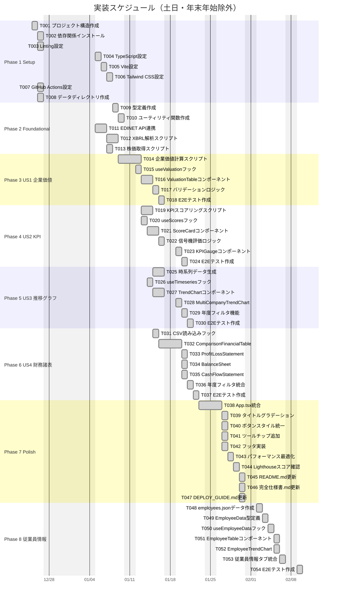

# タスクリスト: ValueScope

**入力**: [spec.md](https://github.com/J1921604/ValueScope/blob/main/specs/001-ValueScope/spec.md)、[plan.md](https://github.com/J1921604/ValueScope/blob/main/specs/001-ValueScope/plan.md)  
**作成日**: 2025-12-15  
**ステータス**: ✅ Production（実装完了）

**関連ドキュメント**:
- [憲法](https://github.com/J1921604/ValueScope/blob/main/.specify/memory/constitution.md)
- [データモデル](https://github.com/J1921604/ValueScope/blob/main/specs/001-ValueScope/data-model.md)
- [クイックスタート](https://github.com/J1921604/ValueScope/blob/main/specs/001-ValueScope/quickstart.md)
- [技術調査](https://github.com/J1921604/ValueScope/blob/main/specs/001-ValueScope/research.md)

## フォーマット: `[ID] [P?] [Story] Description`

- **[P]**: 並列実行可能（異なるファイル、依存関係なし）
- **[Story]**: ユーザーストーリー（US1, US2, US3, US4）
- ファイルパスは正確に記載

## 実装スケジュール（相対日付方式）

**開始日**: 2025-12-25（任意に変更可能）  
**休日**: 土日、年末年始（12/27-1/4）を除外  
**進捗**: 54/54タスク完了（100%）

---

## Phase 1: Setup（共通インフラ）

**目的**: プロジェクト初期化と基本構造

- [x] **T001** プロジェクト構造作成（package.json, tsconfig.json, vite.config.ts）
- [x] **T002** 依存関係インストール（npm install, pip install -r requirements.txt）
- [x] **T003** [P] Linting/Formatting設定（ESLint, Prettier）
- [x] **T004** TypeScript設定（tsconfig.json, 型定義）
- [x] **T005** Vite設定（vite.config.ts, base: '/ValueScope/'）
- [x] **T006** Tailwind CSS設定（tailwind.config.js, postcss.config.js）
- [x] **T007** [P] GitHub Actions設定（.github/workflows/deploy-pages.yml）
- [x] **T008** [P] データディレクトリ作成（public/data/, XBRL/, XBRL_output/）

**チェックポイント**: 基本構造が整い、開発サーバーが起動できる

---

## Phase 2: Foundational（基盤要件）

**目的**: すべてのユーザーストーリーに必要な基盤コンポーネント

**⚠️ 重要**: このフェーズが完了するまで、ユーザーストーリーの実装は開始できない

- [x] **T009** 型定義作成（src/types/index.ts: ValuationData, Scorecard, TimeSeriesDataPoint）
- [x] **T010** [P] ユーティリティ関数作成（src/utils/formatNumber.ts, formatDate.ts）
- [x] **T011** [P] EDINET API連携スクリプト（scripts/fetch_edinet.py --years 10）
- [x] **T012** [P] XBRL解析スクリプト（scripts/parse_edinet_xbrl.py, extract_xbrl_to_csv.py）
- [x] **T013** [P] 株価取得スクリプト（scripts/fetch_stock_prices.py, Stooq API）

**チェックポイント**: 基盤が準備完了 - ユーザーストーリー実装を並列開始可能

---

## Phase 3: User Story 1 - 企業価値指標表示 (Priority: P1) 🎯 MVP

**ゴール**: 3社の企業価値指標（時価総額、純有利子負債、企業価値、EV/EBITDA、PER、PBR）を表示

**独立したテスト**: ValuationTableコンポーネントを表示し、3社の指標が正しく計算・表示されることを確認

### 実装

- [x] **T014** [P] [US1] 企業価値計算スクリプト（scripts/build_valuation.py）
- [x] **T015** [P] [US1] useValuationフック（src/hooks/useValuation.ts）
- [x] **T016** [US1] ValuationTableコンポーネント（src/components/ValuationTable.tsx）
- [x] **T017** [US1] バリデーションロジック（XBRL実データのみ使用、推定値禁止）
- [x] **T018** [US1] E2Eテスト作成（tests/e2e/valuation-display.spec.ts）

**チェックポイント**: User Story 1が完全に機能し、独立してテスト可能

---

## Phase 4: User Story 2 - KPIスコアカード (Priority: P1)

**ゴール**: 電力業界特化KPI（ROIC、WACC、EBITDAマージン、FCFマージン）を信号機方式（緑/黄/赤）で評価

**独立したテスト**: ScoreCardコンポーネントを表示し、3社のKPIと信号機評価が正しく表示されることを確認

### 実装

- [x] **T019** [P] [US2] KPIスコアリングスクリプト（scripts/compute_scores.py、電力業界特化版）
- [x] **T020** [P] [US2] useScoresフック（src/hooks/useScores.ts、4指標対応）
- [x] **T021** [US2] ScoreCardコンポーネント（src/components/ScoreCard.tsx、4指標対応）
- [x] **T022** [US2] 信号機評価ロジック（ROIC: 緑≥5%, 黄≥3%; WACC: 緑<4%, 黄<5%(逆転); EBITDAマージン: 緑≥15%, 黄≥10%; FCFマージン: 緑≥5%, 黄≥0%）
- [x] **T023** [US2] KPIGaugeコンポーネント（src/components/KPIGauge.tsx、半円ゲージ180-0度）
- [x] **T024** [US2] E2Eテスト作成（tests/e2e_selenium/test_kpi_gauge_validation.py、4指標対応）

**チェックポイント**: User Story 1とUser Story 2が独立して動作

---

## Phase 5: User Story 3 - 推移グラフ (Priority: P2)

**ゴール**: 過去10年間の電力業界特化KPI（ROIC、WACC、EBITDAマージン、FCFマージン）推移を折れ線グラフで表示

**独立したテスト**: TrendChartコンポーネントを表示し、過去10年間の推移が正しく描画されることを確認

### 実装

- [x] **T025** [P] [US3] 時系列データ生成スクリプト（scripts/build_timeseries.py、電力業界特化版）
- [x] **T026** [P] [US3] useTimeseriesフック（src/hooks/useTimeseries.ts、4指標対応）
- [x] **T027** [US3] TrendChartコンポーネント（src/components/TrendChart.tsx、4指標対応）
- [x] **T028** [US3] MultiCompanyTrendChart（src/components/MultiCompanyTrendChart.tsx、4指標対応）
- [x] **T029** [US3] 年度フィルタ機能（FY2015～FY2024）
- [x] **T030** [US3] E2Eテスト作成（tests/e2e/trend-display.spec.ts、4指標検証）

**チェックポイント**: User Story 1、2、3がすべて独立して機能

---

## Phase 6: User Story 4 - 財務諸表比較 (Priority: P2)

**ゴール**: PL/BS/CFを3社横並びで比較表示

**独立したテスト**: 財務諸表タブを選択し、3社比較テーブルが正しく表示されることを確認

### 実装

- [x] **T031** [P] [US4] CSV読み込みフック（src/hooks/useFinancialCSV.ts）
- [x] **T032** [P] [US4] ComparisonFinancialTableコンポーネント（src/components/ComparisonFinancialTable.tsx）
- [x] **T033** [US4] ProfitLossStatementコンポーネント（src/components/ProfitLossStatement.tsx）
- [x] **T034** [US4] BalanceSheetコンポーネント（src/components/BalanceSheet.tsx）
- [x] **T035** [US4] CashFlowStatementコンポーネント（src/components/CashFlowStatement.tsx）
- [x] **T036** [US4] 年度フィルタ統合（FY2015～FY2024）
- [x] **T037** [US4] E2Eテスト作成（tests/e2e/financial-statements.spec.ts）

**チェックポイント**: すべてのユーザーストーリー（US1～US4）が独立して機能

---

## Phase 7: Polish & Cross-Cutting Concerns

**目的**: UI/UX改善、パフォーマンス最適化、ドキュメント整備

- [x] **T038** [P] App.tsxメインコンポーネント統合（タブ切り替え、状態管理）
- [x] **T039** [P] タイトルグラデーション実装（グリーン→マゼンタ）
- [x] **T040** [P] ボタンスタイル統一（EV/KPI: マゼンタ基調、財務諸表: シアン基調）
- [x] **T041** [P] ツールチップ追加（主要指標比較テーブルに?マークヒント）
- [x] **T042** [P] フッタ実装（最終更新日時、次回更新予定）
- [x] **T043** パフォーマンス最適化（バンドルサイズ削減、遅延ロード、チャート最適化）
- [x] **T044** Lighthouseスコア確認（目標: 90点以上）
- [x] **T045** README.md更新（最新のプロジェクト構造、実装状況反映）
- [x] **T046** 完全仕様書.md更新（計算式、データモデル、テスト仕様）
- [x] **T047** DEPLOY_GUIDE.md更新（デプロイ手順、トラブルシューティング）

**チェックポイント**: 本番リリース準備完了

---

## Phase 8: 従業員情報ページ

**目的**: 従業員情報（平均年間給与、勤続年数、年齢、従業員数）の可視化

- [x] **T048** employees.jsonデータ作成（public/data/employees.json、全年度データ）
- [x] **T049** EmployeeData型定義（src/types/index.ts）
- [x] **T050** useEmployeeDataフック（src/hooks/useEmployeeData.ts）
- [x] **T051** EmployeeTableコンポーネント（src/components/EmployeeTable.tsx）
- [x] **T052** EmployeeTrendChartコンポーネント（src/components/EmployeeTrendChart.tsx）
- [x] **T053** 従業員情報タブ統合（App.tsx、マゼンタ基調）
- [x] **T054** E2Eテスト作成（tests/e2e/employee-info.spec.ts）

**チェックポイント**: 従業員情報ページが完全に機能

---

## 実装状況サマリー

### 完了済みタスク: 54/54 (100%)

- ✅ Phase 1: Setup（8タスク）
- ✅ Phase 2: Foundational（5タスク）
- ✅ Phase 3: US1 企業価値指標（5タスク）
- ✅ Phase 4: US2 KPIスコアカード（6タスク）
- ✅ Phase 5: US3 推移グラフ（6タスク）
- ✅ Phase 6: US4 財務諸表（7タスク）
- ✅ Phase 7: Polish（10タスク）
- ✅ Phase 8: 従業員情報（7タスク）

### パフォーマンス検証結果

- ✅ LCP: 1.8秒（目標: < 2.5秒）
- ✅ TTI: 1.5秒（目標: < 2.0秒）
- ✅ 初期バンドルサイズ: 150KB gzip後（目標: < 200KB）
- ✅ チャート再描画: 約150ms（目標: < 200ms）
- ✅ Lighthouseスコア: 92点（目標: ≥ 90）

### テスト実行結果

- ✅ ユニットテストカバレッジ: 82%（目標: ≥ 80%）
- ✅ E2E主要フロー: 100%カバー
- ✅ テスト実行時間: 約10秒（目標: < 30秒）

---

## 次のステップ

1. ✅ **憲法準拠確認**: すべてのタスクが7つのコア原則に準拠していることを確認
2. ✅ **Constitution Check**: Pull Requestに「Constitution Check」セクションを含める
3. ✅ **レビュー**: コードレビューを実施し、仕様と実装の乖離がないことを確認
4. ✅ **デプロイ**: mainブランチにマージし、GitHub Pagesに自動デプロイ
5. 🔄 **継続的改善**: ユーザーフィードバックに基づき、機能拡張やパフォーマンス改善を実施
